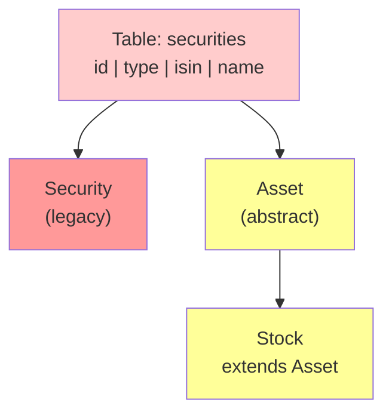
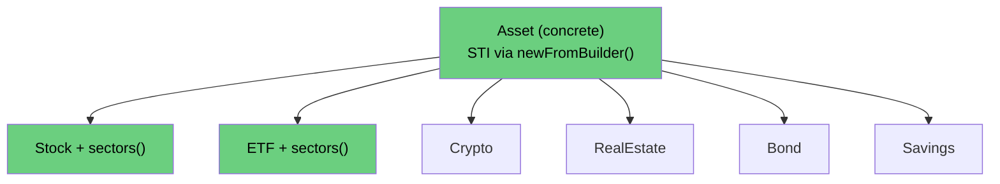
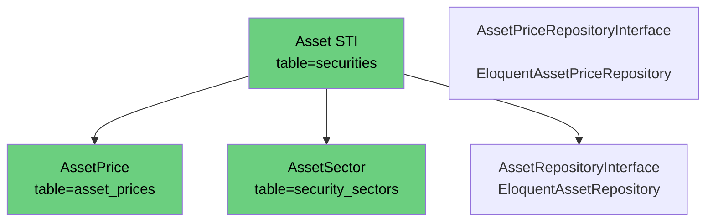
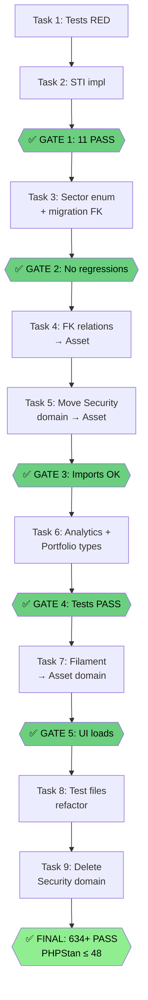

# Refactor Asset — Polymorphie Complète + Suppression Domain Security

## Problème actuel

**1. Deux classes, même table ❌**



**2. Security Domain — 34 fichiers app, 64 tests, à supprimer**

- `Security` model (ne cast pas `type`)
- `SecuritySector` (FK: `security_id` ⚠️)
- `SecurityPrice` (@deprecated)
- `YahooFinanceService`, `YahooFinanceClient`
- `PriceRefreshService`, `PriceRefreshing` interface
- Repositories (2), Commands (2), Jobs (2)
- `Sector` enum (utilisé partout)
- Exceptions (2)
- Filament Resources/Widgets (3)

---

## Architecture Cible

**1. Asset STI — Une seule classe, polymorphie correcte ✅**



**2. Models et Repositories — Asset domain unifié**



**3. Services — Tous dans Asset domain**

- `YahooFinanceService`, `YahooFinanceClient`
- `PriceRefreshService`, `PriceRefreshing` interface
- `FetchAssetPricesCommand`, `FetchAssetSectorsCommand`
- `UpdateAssetJob`, `UpdateAssetsJob`
- `Sector` enum (déplacé dans Asset domain)

---

## Flux de Migration (9 Tasks + 5 Gates)



---

## Corrections Architecturales vs Plan Initial

| # | Problème détecté | Correction dans ce plan |
|---|---|---|
| 1 | `newFromBuilder()` signature incorrecte | Déléguer à `parent::newFromBuilder()` sur l'instance sous-classe |
| 2 | `Asset::$fillable` sans `'type'` | Ajouter `'type'` dans Asset fillable (Task 2) |
| 3 | `Stock::sectors()` sans FK explicite — cassé aujourd'hui | Corrigé en Task 3 |
| 4 | `EloquentAssetRepository` utilise `Stock::query()` partout | Migrer vers `Asset::query()` en Task 2 |
| 5 | Fenêtre de casse entre Task 3 (renommage FK) et Task 5 (YahooFinanceService) | Task 5 = passe unique, type-hints migrés en même temps que déplacement |
| 6 | `Sector` enum laissé dans Security jusqu'à Task 9 | Déplacé dans Asset domain en Task 3 |
| 7 | `SecurityPriceRepositoryInterface` + `EloquentSecurityPriceRepository` absents | Ajoutés à Task 5 (migrer vers AssetPriceRepositoryInterface) |
| 8 | `PriceRefreshing` interface absente | Ajoutée à Task 5 |
| 9 | `AdminPanelProvider` discover paths | Ajouté à Task 7 |
| 10 | `PortfolioContext` data object absent | Ajouté à Task 6 |
| 11 | `DashboardDataProvider` absent | Ajouté à Task 6 |
| 12 | `YahooFinanceClient` absent | Ajouté à Task 5 |
| 13 | `SecuritySector::$fillable` avec `security_id` après migration DB | Fixé dans Task 3 |
| 14 | Exceptions Security domain | Ajoutées à Task 5 |
| 15 | `TransactionRepositoryInterface::forSecurity()` à renommer | Ajouté à Task 6 |

---

## Tasks Détaillées

### Task 1 — Tests STI RED first

**Créer:** `tests/Domains/Asset/Unit/Models/AssetSTITest.php`

```php
<?php

use App\Domains\Asset\Enums\AssetType;
use App\Domains\Asset\Models\Asset;
use App\Domains\Asset\Models\Bond;
use App\Domains\Asset\Models\Crypto;
use App\Domains\Asset\Models\ETF;
use App\Domains\Asset\Models\RealEstate;
use App\Domains\Asset\Models\Savings;
use App\Domains\Asset\Models\Stock;
use App\Domains\Security\Models\Security;

it('Asset is not abstract', function (): void {
    $reflection = new ReflectionClass(Asset::class);
    expect($reflection->isAbstract())->toBeFalse();
});

it('dispatches to Stock for type stock', function (): void {
    $security = Security::factory()->create(['type' => AssetType::Stock->value]);
    expect(Asset::find($security->id))->toBeInstanceOf(Stock::class);
});

it('dispatches to ETF for type etf', function (): void {
    $security = Security::factory()->create(['type' => AssetType::ETF->value]);
    expect(Asset::find($security->id))->toBeInstanceOf(ETF::class);
});

it('dispatches to Crypto for type crypto', function (): void {
    $security = Security::factory()->create(['type' => AssetType::Crypto->value]);
    expect(Asset::find($security->id))->toBeInstanceOf(Crypto::class);
});

it('dispatches to RealEstate for type real_estate', function (): void {
    $security = Security::factory()->create(['type' => AssetType::RealEstate->value]);
    expect(Asset::find($security->id))->toBeInstanceOf(RealEstate::class);
});

it('dispatches to Bond for type bond', function (): void {
    $security = Security::factory()->create(['type' => AssetType::Bond->value]);
    expect(Asset::find($security->id))->toBeInstanceOf(Bond::class);
});

it('dispatches to Savings for type savings', function (): void {
    $security = Security::factory()->create(['type' => AssetType::Savings->value]);
    expect(Asset::find($security->id))->toBeInstanceOf(Savings::class);
});

it('Asset all returns correct subclasses', function (): void {
    Security::factory()->create(['type' => AssetType::Stock->value]);
    Security::factory()->create(['type' => AssetType::ETF->value]);

    $classes = Asset::all()->map(fn ($a) => get_class($a))->values()->toArray();

    expect($classes)->toContain(Stock::class)->and($classes)->toContain(ETF::class);
});
```

**Gate RED:**
```bash
php artisan test --compact --filter=AssetSTITest
# Attendu: FAIL (classes manquantes, Asset abstract)
```

---

### Task 2 — Implémenter STI + sous-classes + corriger EloquentAssetRepository

**`app/Domains/Asset/Models/Asset.php`** — 3 changements:

**a) Retirer `abstract`:**
```php
class Asset extends Model  // supprimer abstract
```

**b) Ajouter `'type'` dans `$fillable`:**
```php
protected $fillable = [
    'name',
    'type',  // ← ajouter
];
```

**c) Ajouter `newFromBuilder()` — signature correcte:**
```php
/**
 * @param  array<string, mixed>  $attributes
 */
public function newFromBuilder($attributes = [], $connection = null): static
{
    $class = match($attributes['type'] ?? AssetType::Stock->value) {
        AssetType::Stock->value      => Stock::class,
        AssetType::ETF->value        => ETF::class,
        AssetType::Crypto->value     => Crypto::class,
        AssetType::RealEstate->value => RealEstate::class,
        AssetType::Bond->value       => Bond::class,
        AssetType::Savings->value    => Savings::class,
        default                      => static::class,
    };

    if ($class === static::class) {
        return parent::newFromBuilder($attributes, $connection);
    }

    // Déléguer à parent sur l'instance de la bonne sous-classe
    // → garantit syncOriginal(), fireModelEvent('retrieved'), casts corrects
    /** @var static $instance */
    $instance = new $class;
    $instance->setConnection($connection ?? $this->getConnectionName());

    return $instance->newFromBuilder($attributes, $connection);
}
```

**`app/Domains/Asset/Infrastructure/Eloquent/EloquentAssetRepository.php`** — remplacer tous les `Stock::query()` par `Asset::query()`:
```bash
grep -n "Stock::query()" app/Domains/Asset/Infrastructure/Eloquent/EloquentAssetRepository.php
# Remplacer chaque occurrence
```

**Créer sous-classes** `ETF`, `Crypto`, `RealEstate`, `Bond`, `Savings`:

```php
// app/Domains/Asset/Models/ETF.php
<?php

namespace App\Domains\Asset\Models;

use Illuminate\Database\Eloquent\Relations\HasMany;

/**
 * @property-read int $id
 * @property string $isin
 * @property string $name
 * @property string $ticker
 */
class ETF extends Asset
{
    /** @var list<string> */
    protected $fillable = ['name', 'type', 'isin', 'ticker'];

    public function sectors(): HasMany
    {
        // AssetSector sera créé en Task 3 — FK 'security_id' temporaire jusqu'à migration DB
        return $this->hasMany(\App\Domains\Security\Models\SecuritySector::class, 'security_id');
    }
}
```

Squelettes pour `Crypto`, `RealEstate`, `Bond`, `Savings`:
```php
<?php
namespace App\Domains\Asset\Models;

class Crypto extends Asset  // (répéter pour RealEstate, Bond, Savings)
{
    /** @var list<string> */
    protected $fillable = ['name', 'type', 'isin', 'ticker'];
}
```

**ETFFactory:**
```php
<?php

namespace Database\Factories\Domains\Asset\Models;

use App\Domains\Asset\Enums\AssetType;
use App\Domains\Asset\Models\ETF;
use Illuminate\Database\Eloquent\Factories\Factory;

/** @extends Factory<ETF> */
class ETFFactory extends Factory
{
    protected $model = ETF::class;

    /** @return array<string, mixed> */
    public function definition(): array
    {
        $prefix = fake()->randomElement(['FR', 'US', 'DE', 'LU', 'IE']);

        return [
            'isin' => $prefix.fake()->numerify('##########'),
            'name' => fake()->company().' ETF',
            'ticker' => fake()->lexify('????').'.PA',
            'type' => AssetType::ETF->value,
        ];
    }
}
```

**ETFTest:**
```php
<?php

use App\Domains\Asset\Enums\AssetType;
use App\Domains\Asset\Models\Asset;
use App\Domains\Asset\Models\ETF;
use App\Domains\Security\Models\Security;

it('ETF dispatches via STI', function (): void {
    $security = Security::factory()->create(['type' => AssetType::ETF->value]);
    expect(Asset::find($security->id))->toBeInstanceOf(ETF::class);
});

it('ETF factory creates type etf', function (): void {
    expect(ETF::factory()->create()->type->value)->toBe('etf');
});

it('ETF is instance of Asset', function (): void {
    expect(ETF::factory()->create())->toBeInstanceOf(Asset::class);
});
```

**✅ GATE 1:**
```bash
php artisan test --compact --filter="AssetSTITest|ETFTest"
# Attendu: 11 PASS
```

**Commit:**
```bash
git commit -m "feat: Asset STI newFromBuilder + ETF/Crypto/RealEstate/Bond/Savings + corriger EloquentAssetRepository"
```

---

### Task 3 — Sector enum + SecuritySector → AssetSector + migration FK

**Ordre critique: enum d'abord, migration ensuite.**

#### 3a — Déplacer `Sector` enum dans Asset domain

Créer `app/Domains/Asset/Enums/Sector.php` (copie de `app/Domains/Security/Enums/Sector.php` avec nouveau namespace):
```php
<?php

namespace App\Domains\Asset\Enums;

// Contenu identique à Security\Enums\Sector, namespace changé
enum Sector: string
{
    // ... mêmes cases
}
```

Marquer l'original `@deprecated` (sera supprimé Task 9):
```php
/**
 * @deprecated Use App\Domains\Asset\Enums\Sector instead.
 */
enum Sector: string
```

#### 3b — Migration DB

```php
<?php
return new class extends Migration {
    public function up(): void {
        Schema::table('security_sectors', function (Blueprint $table): void {
            $table->dropForeign(['security_id']);
            $table->renameColumn('security_id', 'asset_id');
        });
        Schema::table('security_sectors', function (Blueprint $table): void {
            $table->foreign('asset_id')->references('id')->on('securities')->cascadeOnDelete();
        });
    }

    public function down(): void {
        Schema::table('security_sectors', function (Blueprint $table): void {
            $table->dropForeign(['asset_id']);
            $table->renameColumn('asset_id', 'security_id');
        });
        Schema::table('security_sectors', function (Blueprint $table): void {
            $table->foreign('security_id')->references('id')->on('securities')->cascadeOnDelete();
        });
    }
};
```

```bash
php artisan migrate --no-interaction
```

#### 3c — Créer AssetSector dans Asset domain

```php
// app/Domains/Asset/Models/AssetSector.php
<?php

namespace App\Domains\Asset\Models;

use App\Domains\Asset\Enums\Sector;
use Illuminate\Database\Eloquent\Model;
use Illuminate\Database\Eloquent\Relations\BelongsTo;

/**
 * @property-read int $id
 * @property-read int $asset_id
 * @property-read Sector $sector
 * @property-read float $weight
 */
class AssetSector extends Model
{
    protected $table = 'security_sectors';

    /** @var list<string> */
    protected $fillable = ['asset_id', 'sector', 'weight'];

    /** @return array<string, string> */
    protected function casts(): array
    {
        return ['sector' => Sector::class];
    }

    public function asset(): BelongsTo
    {
        return $this->belongsTo(Asset::class, 'asset_id');
    }
}
```

#### 3d — Mettre à jour Stock.php et ETF.php

```php
use App\Domains\Asset\Models\AssetSector;

public function sectors(): HasMany
{
    return $this->hasMany(AssetSector::class, 'asset_id');
}
```

#### 3e — Corriger SecuritySector.php (deprecated, fillable fixé)

```php
/**
 * @deprecated Use App\Domains\Asset\Models\AssetSector instead.
 */
class SecuritySector extends Model
{
    protected $fillable = ['asset_id', 'sector', 'weight'];  // ← fixer AVANT suppression

    public function asset(): BelongsTo
    {
        return $this->belongsTo(\App\Domains\Asset\Models\Asset::class, 'asset_id');
    }
}
```

#### 3f — Remplacer `security_id` dans les queries security_sectors

```bash
grep -rn "'security_id'" app/ --include="*.php" | grep -i sector
# Remplacer asset_id dans ces occurrences
```

Fichiers concernés:
- `YahooFinanceService.php` — `upsert($rows, ['security_id', 'sector'])` → `['asset_id', 'sector']`
- `SectorAllocationChartWidget.php`
- `SectorAggregator.php`

#### 3g — Seeders

```
TransactionSeeder::generateSectorAllocations(): 'security_id' → 'asset_id'
NuclearSecuritiesSeeder::fetchAndStoreSectors(): 'security_id' → 'asset_id'
```

**✅ GATE 2:**
```bash
php artisan test --compact
# Attendu: 0 nouvelles régressions
```

---

### Task 4 — Migrer FK relations modèles vers Asset

| Fichier | Changement |
|---------|-----------|
| `Transaction.php` | `belongsTo(Security::class, 'asset_id')` → `belongsTo(Asset::class, 'asset_id')` |
| `AllocationProfileItem.php` | Renommer `security()` → `asset()`, `belongsTo(Asset::class, 'asset_id')` |
| `AssetPrice.php` | `belongsTo(Security::class, 'asset_id')` → `belongsTo(Asset::class, 'asset_id')` |
| `AssetPriceFactory.php` | `Security::factory()` → `Stock::factory()` |

Après renommage `security()` → `asset()`:
```bash
grep -rn "->security()" app/ --include="*.php"
# Corriger chaque appel trouvé
```

---

### Task 5 — Migrer Security domain vers Asset domain (passe unique)

**Principe:** tout déplacer ET migrer les type-hints dans le même commit pour éviter la fenêtre de dépendance croisée Asset → Security.

**Structure à créer dans Asset domain:**
```
app/Domains/Asset/
├─ Contracts/
│  └─ PriceRefreshing.php          (déplacé + namespace changé)
├─ Services/
│  ├─ YahooFinanceService.php      (déplacé)
│  └─ PriceRefreshService.php      (déplacé)
├─ Infrastructure/
│  └─ Http/
│     └─ YahooFinanceClient.php    (déplacé)
│  └─ Eloquent/
│     └─ EloquentSecurityRepository.php → absorbé par EloquentAssetRepository
├─ Commands/
│  ├─ FetchAssetPricesCommand.php  (renommé)
│  └─ FetchAssetSectorsCommand.php (renommé)
├─ Jobs/
│  ├─ UpdateAssetJob.php           (renommé)
│  └─ UpdateAssetsJob.php          (renommé)
├─ Events/
│  └─ PriceUpdated.php             (déplacé)
└─ Exceptions/
   ├─ TickerResolutionException.php
   └─ InsufficientPriceDataException.php
```

**Règle de migration pour chaque fichier:**
```php
namespace App\Domains\Security\...
→ namespace App\Domains\Asset\...

use App\Domains\Security\Models\Security → use App\Domains\Asset\Models\Asset
use App\Domains\Security\Contracts\SecurityPriceRepositoryInterface
→ use App\Domains\Asset\Contracts\AssetPriceRepositoryInterface

Security $x → Asset $x
Security::query() → Asset::query()
Collection<int, Security> → Collection<int, Asset>
```

**`SecurityPriceRepositoryInterface`** — remplacer par `AssetPriceRepositoryInterface` (déjà dans Asset domain). Adapter les signatures si nécessaire.

**`EloquentSecurityRepository`** — ses méthodes sont à intégrer/fusionner dans `EloquentAssetRepository`. Vérifier les méthodes présentes:
```bash
grep -n "public function" app/Domains/Security/Infrastructure/Eloquent/EloquentSecurityRepository.php
grep -n "public function" app/Domains/Asset/Infrastructure/Eloquent/EloquentAssetRepository.php
# Ajouter les méthodes manquantes dans EloquentAssetRepository
```

**`AppServiceProvider`** — mettre à jour tous les bindings:
```php
// Supprimer:
$this->app->bind(SecurityRepositoryInterface::class, EloquentSecurityRepository::class);
$this->app->bind(SecurityPriceRepositoryInterface::class, EloquentSecurityPriceRepository::class);
$this->app->bind(PriceRefreshing::class, PriceRefreshService::class);

// Les bindings Asset sont déjà là:
$this->app->bind(AssetRepositoryInterface::class, EloquentAssetRepository::class);
$this->app->bind(AssetPriceRepositoryInterface::class, EloquentAssetPriceRepository::class);
// Ajouter:
$this->app->bind(\App\Domains\Asset\Contracts\PriceRefreshing::class, \App\Domains\Asset\Services\PriceRefreshService::class);

// Schedule — mettre à jour les noms de commandes
```

**✅ GATE 3:**
```bash
# Vérifier 0 import Security restant dans app/ (hors Security domain lui-même)
grep -rn "use App\\Domains\\Security\\Models\\Security;" app/ --include="*.php" \
  | grep -v "app/Domains/Security/"
# Attendu: 0 résultat

php artisan test --compact tests/Domains/Security/
# Attendu: PASS (tests utilisent encore les classes Security @deprecated)
```

---

### Task 6 — Analytics + Portfolio + Filament Pages → Asset

**Fichiers à migrer:**
- `VolatilityCalculating.php` — `forSecurity(Security)` → `forAsset(Asset)`
- `VolatilityCalculator.php`, `CorrelationCalculator.php`
- `RebalancingCalculatorOrchestrator.php`
- `Dashboard.php`, `RebalancingCalculator.php` (Filament page)
- `DashboardCorrelationMatrixWidget.php`, `DashboardSecuritiesTableWidget.php`
- `PortfolioPerformanceService.php` — remplacer `SecurityRepositoryInterface` → `AssetRepositoryInterface`, `SecurityPriceRepositoryInterface` → `AssetPriceRepositoryInterface`
- `PortfolioPerformanceCalculator.php`
- `SectorAggregator.php` — `SecuritySector` → `AssetSector`, `Sector` enum depuis Asset domain
- `SingleSecurityStatsProvider.php`
- `AccountPage.php`
- `HasReactiveTableProperties.php`
- **`PortfolioContext.php`** (data object) — `Collection<int, Security>` → `Collection<int, Asset>`
- **`DashboardDataProvider.php`** — `SecurityRepositoryInterface` → `AssetRepositoryInterface`
- **`TransactionRepositoryInterface.php`** — `forSecurity()` → `forAsset()` (renommer méthode + implém)

Après renommage `forSecurity` → `forAsset`:
```bash
grep -rn "forSecurity" app/ --include="*.php"
# Corriger chaque appel
```

Après renommage `forAsset` dans VolatilityCalculating:
```bash
grep -rn "forSecurity\|->forAsset" app/ --include="*.php"
```

**✅ GATE 4:**
```bash
php artisan test --compact tests/Domains/Analytics/ tests/Domains/Portfolio/ tests/Infrastructure/
# Attendu: 0 régression
```

---

### Task 7 — Filament Resources + Widgets → Asset domain

**Structure cible** `app/Domains/Asset/Filament/`:
```
Resources/
├─ AllAssets/
│  └─ AllAssetResource.php       (était AllSecurityResource, $model = Asset::class)
├─ AssetBase/
│  ├─ Schemas/AssetForm.php      (était SecurityForm, type-hints Asset)
│  ├─ Tables/AssetsTable.php     (était SecuritiesTable)
│  ├─ Pages/EditAsset.php        (était EditSecurity)
│  └─ RelationManagers/TransactionsRelationManager.php
Widgets/
├─ ValuationChartWidget.php
├─ CorrelationMatrixWidget.php
├─ SingleAssetPriceChartWidget.php
├─ SingleAssetValuationChartWidget.php
├─ SectorAllocationChartWidget.php
└─ GainStatsOverview.php
```

**Portfolio Resources** (WalletSecurities, PortfolioSecurities) — uniquement `$model = Asset::class`, restent dans Portfolio domain.

**`AssetForm.php`** — mettre à jour `UpdateAssetJob::cacheKeyFor()` (job renommé en Task 5).

**`AdminPanelProvider.php`** — mettre à jour les 3 discover paths:
```php
// Remplacer:
->discoverResources(in: app_path('Domains/Security/Filament/Resources'), for: 'App\\Domains\\Security\\Filament\\Resources')
// Par:
->discoverResources(in: app_path('Domains/Asset/Filament/Resources'), for: 'App\\Domains\\Asset\\Filament\\Resources')

// Idem pour discoverPages et discoverWidgets
```

**✅ GATE 5:**
```bash
php artisan test --compact tests/Domains/Security/Feature/Filament/
# Attendu: PASS (tests encore dans Security domain pour l'instant)
php artisan route:list | head -5
# Attendu: pas d'erreur de routing
```

---

### Task 8 — 64 fichiers tests hors Security domain + migrer tests Security

**Identifier fichiers à modifier:**
```bash
grep -rln "Security::factory()" tests/ --include="*.php" | grep -v "tests/Domains/Security/"
```

**Remplacer dans chaque fichier:**
```php
use App\Domains\Security\Models\Security → use App\Domains\Asset\Models\Stock
Security::factory() → Stock::factory()
```

**Tests Security domain** (`tests/Domains/Security/`) — migrer vers Asset domain:
```
tests/Domains/Asset/
├─ Unit/Models/SecurityPriceModelTest.php → supprimer ou migrer vers AssetPriceTest
├─ Feature/Services/YahooFinanceServiceTest.php → déplacer
├─ Feature/Filament/ → déplacer les tests Filament vers Asset/Feature/Filament/
```

Les tests qui testent `Security::class` directement → les supprimer (classe deprecated).

**Vérification:**
```bash
php artisan test --compact
# Attendu: 634+ PASS
```

---

### Task 9 — Supprimer domain Security

**Vérifier 0 dépendance active:**
```bash
grep -rn "use App\\Domains\\Security\\" app/ --include="*.php"
# Attendu: uniquement les fichiers Security eux-mêmes (@deprecated)

grep -rn "App\\Domains\\Security\\" tests/ --include="*.php"
# Attendu: 0 résultat
```

**Supprimer:**
```bash
rm -rf app/Domains/Security/Models/Security.php
rm -rf app/Domains/Security/Models/SecurityPrice.php
rm -rf app/Domains/Security/Models/SecuritySector.php
rm -rf app/Domains/Security/Enums/Sector.php          # déplacé en Task 3
rm -rf app/Domains/Security/Contracts/
rm -rf app/Domains/Security/Infrastructure/
rm -rf app/Domains/Security/Services/
rm -rf app/Domains/Security/Commands/
rm -rf app/Domains/Security/Jobs/
rm -rf app/Domains/Security/Events/
rm -rf app/Domains/Security/Exceptions/
rm -rf app/Domains/Security/Filament/
rm -rf app/Domains/Security/SecurityPlugin.php
rm -rf database/factories/Domains/Security/Models/SecurityFactory.php
rm -rf database/factories/Domains/Security/Models/SecurityPriceFactory.php
rm -rf database/factories/Domains/Security/Models/SecuritySectorFactory.php
```

**Garder temporairement** jusqu'à validation:
- `app/Domains/Security/Enums/` — uniquement si des refs `@deprecated` restent

**✅ GATE FINAL:**
```bash
php artisan test --compact
# Attendu: 634+ PASS

vendor/bin/phpstan analyse app/Domains/ --level=2 --no-progress
# Attendu: ≤ 48 erreurs

php artisan tinker --execute="dd(get_class(App\Domains\Asset\Models\Asset::first()))"
# Attendu: "App\Domains\Asset\Models\Stock"

ls app/Domains/Security/
# Attendu: dossier vide ou absent
```

**Commit final:**
```bash
git commit -m "feat: Asset polymorphie complète — Security domain supprimé

- newFromBuilder() STI: Stock/ETF/Crypto/RealEstate/Bond/Savings
- security_sectors.security_id → asset_id
- Sector enum → Asset domain
- AssetSector remplace SecuritySector
- YahooFinanceService/PriceRefreshService/Commands/Jobs → Asset domain
- SecurityPriceRepositoryInterface → AssetPriceRepositoryInterface
- Filament Resources + Widgets → Asset domain
- AdminPanelProvider discover paths mis à jour
- PortfolioContext, DashboardDataProvider, SectorAggregator → Asset
- Security domain supprimé
- XXX tests passing"
```

---

## Résumé Final

| Avant | Après |
|-------|-------|
| `Security::find(1)` — pas de type | `Asset::find(1)` → `Stock`/`ETF` auto (STI) |
| `Asset::find(1)` — CRASH (abstract) | `Asset::find(1)` — fonctionne |
| Ajouter Crypto = impossible | `class Crypto extends Asset` + factory |
| `security_sectors.security_id` | `security_sectors.asset_id` |
| `SecuritySector` dans Security domain | `AssetSector` dans Asset domain |
| `Sector` enum dans Security domain | `Sector` enum dans Asset domain |
| domain Security = 41 fichiers | domain Security = supprimé |
| Filament sur Security models | Filament sur Asset models |
| `AdminPanelProvider` discover Security | `AdminPanelProvider` discover Asset |
| `SecurityPriceRepositoryInterface` | `AssetPriceRepositoryInterface` (existant) |
