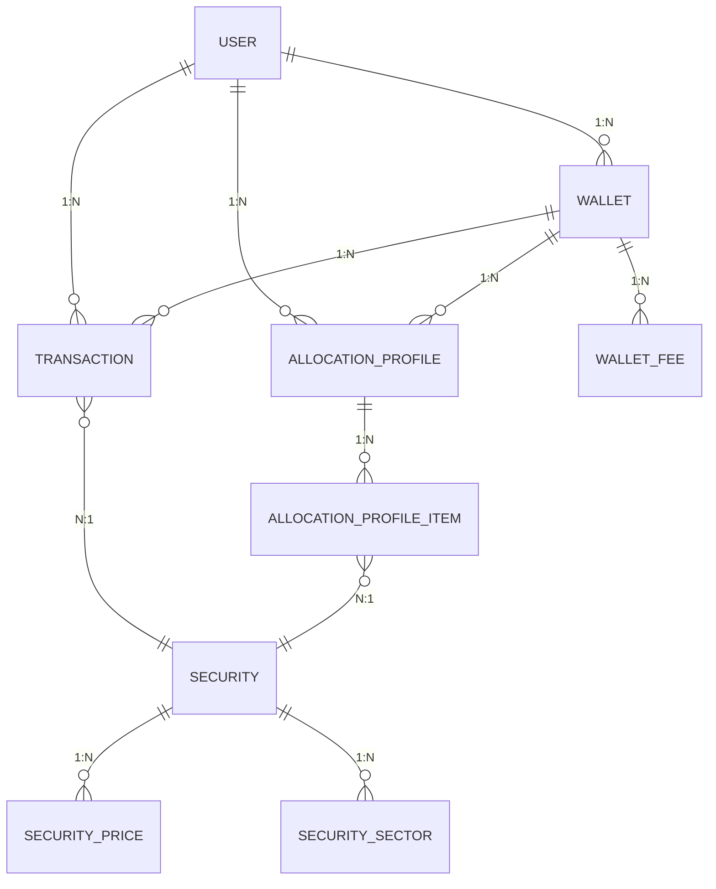
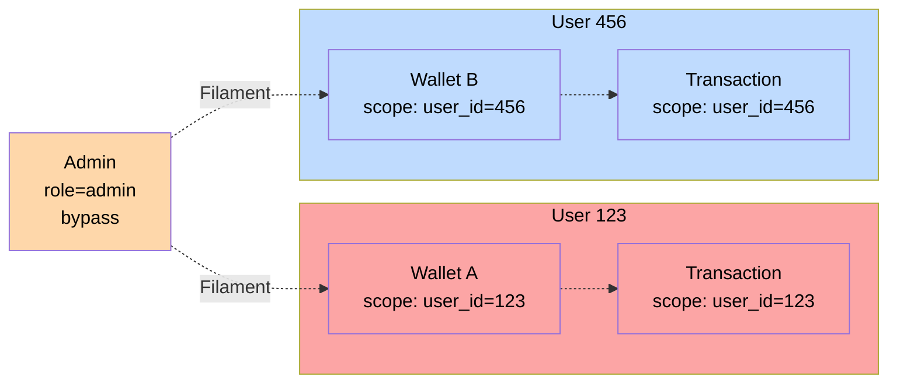

# Core Models - Argent

11 entities. User → Wallet → Transaction → Security → Price.

---

## 📊 Entity Relationship Diagram

---

## 🔵 User
**Root entity. Auth + identity.**

| Field | Type | Scope |
|-------|------|-------|
| id | int | PK |
| email | string | unique, login |
| name | string | display |
| password | string | hashed |
| role | Admin\|User | Filament gates |

**Global scope:** All queries filtered by `auth()->id()`

---

## 💼 Wallet
**Container for transactions. Logical grouping.**

| Field | Type | Purpose |
|-------|------|---------|
| id | int | PK |
| user_id | int | FK (scope) |
| name | string | Label (e.g., "Growth") |

**Scope:** `where('user_id', auth()->id())`

---

## 📍 Transaction
**Buy/Sell record. Position source of truth.**

| Field | Type | Purpose |
|-------|------|---------|
| id | int | PK |
| user_id | int | Scope |
| wallet_id | int | Container |
| security_id | int | Which security |
| type | Buy\|Sell | Direction |
| date | date | Settlement |
| quantity | decimal(4) | Shares |
| unit_price | decimal(4) | Price/share |
| fees | decimal(2) | Commission |
| realized_gain | decimal(2) | Sell only (computed) |

**Observer:** `TransactionObserver` ← On save
- If type=Sell: compute realized_gain
- If type=Buy: realized_gain = null

**Scope:** `where('user_id', auth()->id())`

---

## 🔐 Security
**Global catalogue. Shared across users.**

| Field | Type | Purpose |
|-------|------|---------|
| id | int | PK |
| isin | string | unique, identifier |
| name | string | Full name |
| ticker | string | Trading symbol |

**Scopes (compute-time):**
- `forAuth()` → User positions + metrics
- `forWallet()` → Wallet positions + metrics

---

## 💹 SecurityPrice
**OHLCV history. Valuation source.**

| Field | Type | Purpose |
|-------|------|---------|
| id | int | PK |
| security_id | int | FK |
| date | date | UK + index |
| open | decimal(4) | OHLC |
| high | decimal(4) | OHLC |
| low | decimal(4) | OHLC |
| close | decimal(4) | **Valuation ref** |
| volume | int | Trading vol |

**Refresh:** Daily scheduled (incremental) OR Manual (5-year backfill)

---

## 💰 WalletFee
**Recurring/fixed fees. Impact on net performance.**

| Field | Type | Purpose |
|-------|------|---------|
| id | int | PK |
| wallet_id | int | FK |
| name | string | Label |
| value | decimal(4) | Amount or % |
| unit | €\|% | Interpretation |
| scope | All\|PercentageOfValue | Application |
| frequency | Monthly\|Yearly\|OneTime | Period |

---

## 🎯 AllocationProfile
**Target allocation. Guide rebalancing.**

| Field | Type | Purpose |
|-------|------|---------|
| id | int | PK |
| user_id | int | Ownership |
| wallet_id | int | Which wallet |
| name | string | Label |

**Items:** AllocationProfileItem[] (1 security = X%)

---

## 📊 AllocationProfileItem
**Single line in allocation.**

| Field | Type | Purpose |
|-------|------|---------|
| id | int | PK |
| allocation_profile_id | int | FK |
| security_id | int | Which security |
| target_percentage | decimal(2) | % of portfolio |

---

## 🏢 SecuritySector
**Sector classification. Risk analysis.**

| Field | Type | Purpose |
|-------|------|---------|
| id | int | PK |
| security_id | int | FK |
| sector | enum | Category |
| weight | decimal | % composition |

**Refresh:** Daily scheduled (if outdated >7d) OR Manual

---

## 💌 Invitation
**User signup via invite.**

| Field | Type | Purpose |
|-------|------|---------|
| id | int | PK |
| created_by | int | Admin |
| token | string | Validation |
| email | string | Target |
| used_at | timestamp | Activation |

---

## 🔒 Security Isolation

**Implementation:** Global scope filter on Wallet, Transaction, AllocationProfile

---

## 🔄 Entity Lifecycle

| Entity | Created | Updated | Deleted |
|--------|---------|---------|---------|
| User | Register | Edit profile | Leave app |
| Wallet | User action | Rename | User action |
| Transaction | User form | Edit | User action |
| Security | Admin import | UpdateSecurityJob | Never |
| SecurityPrice | Refresh command | Upsert | Prune old |
| WalletFee | User action | Edit | User action |
| AllocationProfile | User action | Edit | User action |
| SecuritySector | Refresh command | Upsert | Prune |
| Invitation | Admin action | — | Expire |
