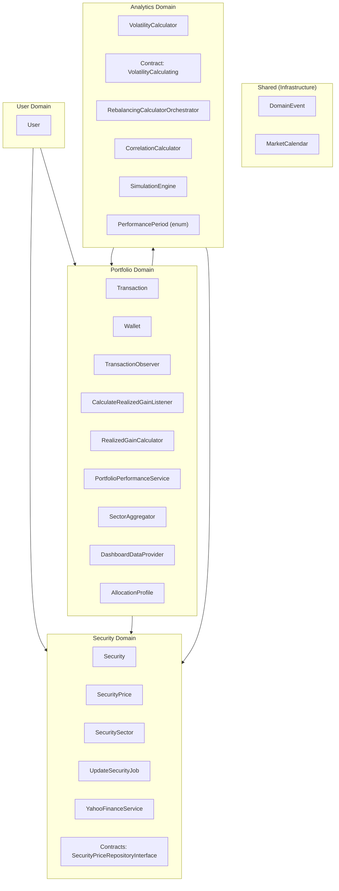
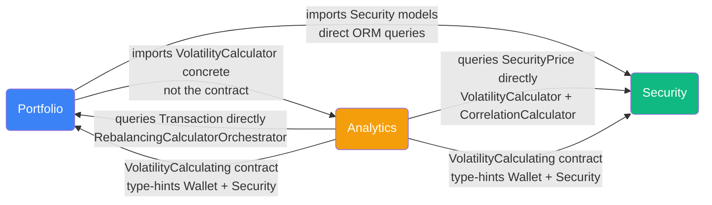
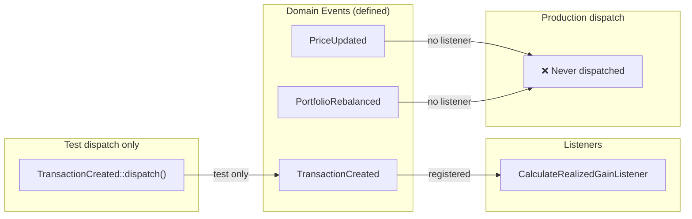
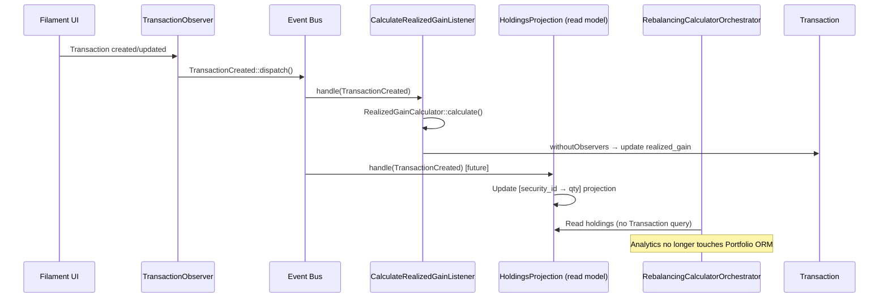

# Domain Boundaries & Cross-Domain Coupling

## Bounded Contexts Overview

## Dependency Direction Map

## Detailed Coupling: Who Imports What

### Portfolio → Security (heavy coupling)

| Caller | Imported | Operation | Severity |
|--------|----------|-----------|----------|
| `PortfolioPerformanceService` | `Security`, `SecurityPrice` | `Security::forWallet()` + `SecurityPrice` visibility check | ⚠️ Read-only, synchronous |
| `PortfolioPerformanceCalculator` | `Security`, `SecurityPrice` | TWR calculation, price time-series | ⚠️ Read-only, synchronous |
| `SectorAggregator` | `Security`, `SecuritySector`, `Sector` enum | Sector label formatting | ⚠️ `Sector` enum in wrong domain |
| `DashboardDataProvider` | `Security` | Dashboard securities query | ⚠️ Read-only, synchronous |
| `Transaction` model | `Security` | FK `belongsTo` relation | ✅ Schema-level, acceptable |
| `AccountPage` (UI) | `Security`, `PriceRefreshService`, `UpdateSecuritiesJob` | Dispatch update job, embed widgets | ⚠️ Job dispatch = event candidate |

### Portfolio → Analytics (wrong direction)

| Caller | Imported | Operation | Severity |
|--------|----------|-----------|----------|
| `PortfolioPerformanceService` | `VolatilityCalculator` (concrete) | `computePortfolioVolatility()` | 🔴 Should use `VolatilityCalculating` contract |
| `WalletPage` (UI) | `SimulationSectionWidget` | Embed simulation widget | ⚠️ UI composition |

### Analytics → Portfolio (most harmful coupling)

| Caller | Imported | Operation | Severity |
|--------|----------|-----------|----------|
| `RebalancingCalculatorOrchestrator` | `Transaction` | `Transaction::query()->groupBy('security_id')` to get holdings quantities | 🔴 Analytics queryies Portfolio ORM directly |
| `RebalancingCalculatorOrchestrator` | `Wallet` | `?Wallet $wallet` param for scoping | 🟡 Replace with `?int $walletId` |
| `VolatilityCalculator` | `Wallet` | `forWallet(Wallet $wallet)` param | 🟡 Replace with `int $walletId` |
| `VolatilityCalculating` (contract) | `Wallet`, `Security` | Interface type-hints foreign models | 🔴 Contract leaks coupling |
| `RebalancingCalculator` (page) | `AllocationProfile`, `Wallet` | Load allocation profiles + wallet list | ⚠️ UI read, acceptable |

### Analytics → Security (medium coupling)

| Caller | Imported | Operation | Severity |
|--------|----------|-----------|----------|
| `VolatilityCalculator` | `Security`, `SecurityPrice` | `Security::forWallet()` + historical closes bulk query | 🟡 `SecurityPriceRepositoryInterface` exists but unused |
| `CorrelationCalculator` | `SecurityPrice` | Historical closes for log-return correlation | 🟡 Same: use existing repository contract |
| `RebalancingCalculatorOrchestrator` | `Security` | `Security::with('latestPrice')->whereIn()` | 🟡 Use repository contract |

## Current Event System (Production = Nothing)

## Ideal State: Event-Driven Decoupling

## Decoupling Roadmap

### Via Events (side-effect delegation)

| Event | Where to dispatch | Who listens | Benefit |
|-------|-------------------|-------------|---------|
| `TransactionCreated` | `TransactionObserver::created/updated` | `CalculateRealizedGainListener` (existing) | Observer becomes thin, business logic isolated |
| `TransactionCreated` | same | `UpdateHoldingsProjectionListener` (future) | Eliminates `Analytics → Portfolio.Transaction` ORM query |
| `PriceUpdated` | `UpdateSecurityJob` after fetch | *(none yet)* | Correct lifecycle signal for future listeners |
| `PortfolioRebalanced` | `RebalancingCalculator::calculate()` | *(none yet)* | Audit/notification hook for future |

### Via Contract/Interface (synchronous reads)

| Coupling | Fix | Contract exists? |
|----------|-----|-----------------|
| `PortfolioPerformanceService` → `VolatilityCalculator` concrete | Use `VolatilityCalculating` interface | ✅ Yes |
| `VolatilityCalculator` param `Wallet` | Replace with `int $walletId` | N/A (primitive) |
| `RebalancingCalculatorOrchestrator` param `Wallet` | Replace with `?int $walletId` | N/A (primitive) |
| `VolatilityCalculator` queries `SecurityPrice` direct | Use `SecurityPriceRepositoryInterface` | ✅ Yes |
| `CorrelationCalculator` queries `SecurityPrice` direct | Use `SecurityPriceRepositoryInterface` | ✅ Yes |
| `VolatilityCalculating` contract type-hints `Wallet`/`Security` | Refactor to primitives | — |

### Enum in wrong domain

| Enum | Current location | Move to |
|------|-----------------|---------|
| `PerformancePeriod` | `Analytics/Enums` (imported by Portfolio) | `Shared/Enums` or `Portfolio/Enums` |
| `Sector` | `Security/Enums` (imported by Portfolio) | `Shared/Enums` |
