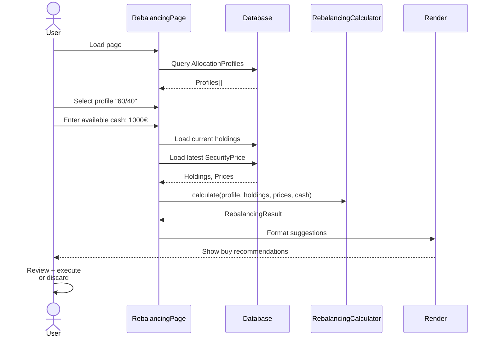

# Rebalancing Flow - Argent

AllocationProfile → Calculator → Buy suggestions.

---

## 🎯 User Journey



---

## 🎯 AllocationProfile Structure

**Definition:** Target allocation % per security

**Example:**

```json
{
  "id": 1,
  "wallet_id": 1,
  "name": "60/40 Equities/Bonds",
  "items": [
    {
      "security_id": 123,
      "target_percentage": 60.0,
      "security": {
        "id": 123,
        "name": "S&P 500 ETF",
        "ticker": "SPY"
      }
    },
    {
      "security_id": 456,
      "target_percentage": 40.0,
      "security": {
        "id": 456,
        "name": "US Treasury Bond ETF",
        "ticker": "BND"
      }
    }
  ]
}
```

**Constraint:** Sum of target_percentage ≤ 100%

---

## 📊 Current Holdings

**Query:**

```sql
SELECT 
  s.id,
  s.name,
  s.ticker,
  SUM(CASE 
    WHEN t.type = 'Buy' THEN t.quantity 
    WHEN t.type = 'Sell' THEN -t.quantity 
  END) as quantity_held,
  sp.close as current_price
FROM transactions t
JOIN securities s ON t.security_id = s.id
LEFT JOIN security_prices sp ON s.id = sp.security_id
WHERE t.user_id = ? AND t.wallet_id = ?
GROUP BY s.id, s.name, s.ticker, sp.close
```

**Result:**

```json
{
  "SPY": {
    "id": 123,
    "quantity_held": 5,
    "current_price": 480.50,
    "current_value": 2402.50,
    "current_percentage": 22.3
  },
  "BND": {
    "id": 456,
    "quantity_held": 25,
    "current_price": 84.30,
    "current_value": 2107.50,
    "current_percentage": 19.5
  },
  "AAPL": {
    "id": 789,
    "quantity_held": 10,
    "current_price": 185.64,
    "current_value": 1856.40,
    "current_percentage": 17.2
  }
}
```

**Portfolio total:** 10,750€

---

## 🧮 Rebalancing Algorithm

**Input:**
- Profile: {SPY: 60%, BND: 40%, AAPL: 0%}
- Holdings: {SPY: 2402.50€ (22.3%), BND: 2107.50€ (19.5%), AAPL: 1856.40€ (17.2%)}
- Available cash: 1,000€
- Portfolio value: 10,750€

**Algorithm:**

```
For each allocation item:
  target_value = portfolio_value × target%
  current_value = quantity_held × price
  shortfall = target_value - current_value
  
  If shortfall > 0:
    shares_to_buy = floor(shortfall / price)
    buy_cost = shares_to_buy × price
    residual = shortfall % price (remainder)
    
    Add to BUY suggestions

Greedy allocation:
  Sort by shortfall DESC (most underweighted first)
  remaining_cash = available_cash
  for each item in sorted_list:
    if remaining_cash >= item.buy_cost:
      Execute buy
      remaining_cash -= buy_cost
    else:
      Skip (insufficient cash)
```

---

## 📤 Calculation Output

**RebalancingResult:**

```json
{
  "items": [
    {
      "security_id": 123,
      "name": "S&P 500 ETF",
      "ticker": "SPY",
      "price": 480.50,
      "quantity_held": 5,
      "current_value": 2402.50,
      "current_percentage": 22.3,
      "target_percentage": 60.0,
      "shortfall": 4023.50,
      "shares_to_buy": 8,
      "buy_cost": 3844.00,
      "new_value": 6246.50,
      "new_percentage": 58.1
    },
    {
      "security_id": 456,
      "name": "US Treasury Bond ETF",
      "ticker": "BND",
      "price": 84.30,
      "quantity_held": 25,
      "current_value": 2107.50,
      "current_percentage": 19.5,
      "target_percentage": 40.0,
      "shortfall": 2178.50,
      "shares_to_buy": 25,
      "buy_cost": 2107.50,
      "new_value": 4215.00,
      "new_percentage": 39.2
    }
  ],
  "remainder": 0.00,
  "total_invested": 10750.00,
  "execution_plan": {
    "total_to_invest": 1000.00,
    "allocation": [
      {
        "security_id": 123,
        "action": "BUY",
        "shares": 2,
        "cost": 961.00,
        "cash_after": 39.00
      }
    ],
    "final_remainder": 39.00
  }
}
```

---

## 🎯 Greedy Allocation Example

**Available:** 1,000€

**Sorted by shortfall:**
1. SPY: 4023.50€ shortfall, 8 shares needed, 3844€ cost
2. BND: 2178.50€ shortfall, 25 shares needed, 2107.50€ cost

**Allocation steps:**

```
Step 1: Can afford SPY (3844€ < 1000€)? NO
        Check if partial: (1000€ / 480.50€) = 2.08 shares → BUY 2 shares
        Spend: 2 × 480.50 = 961€
        Remaining: 1000€ - 961€ = 39€

Step 2: Can afford BND (2107.50€ < 39€)? NO
        Partial: (39€ / 84.30€) = 0.46 shares → BUY 0 shares
        
Final: BUY 2 SPY @ 961€, remainder 39€
```

---

## 📋 Display Layer

```
╔═══════════════════════════════════╗
║ REBALANCING SUGGESTIONS            ║
╠═══════════════════════════════════╣
║                                    ║
║ Profile: 60/40 Equities/Bonds     ║
║ Portfolio: 10,750€                 ║
║ Available Cash: 1,000€             ║
║                                    ║
╠═══════════════════════════════════╣
║ SPY - S&P 500 ETF                 ║
║ Current: 22.3% (2402.50€)         ║
║ Target:  60.0% (6450.00€)         ║
║ Shortfall: 4047.50€               ║
║ → BUY 8 shares @ 480.50€          ║
║    Cost: 3844.00€                 ║
║    New %: 58.1%                   ║
║                                    ║
╠═══════════════════════════════════╣
║ BND - US Treasury Bond ETF        ║
║ Current: 19.5% (2107.50€)         ║
║ Target:  40.0% (4300.00€)         ║
║ Shortfall: 2192.50€               ║
║ → BUY 26 shares @ 84.30€          ║
║    Cost: 2191.80€                 ║
║    New %: 39.9%                   ║
║                                    ║
╠═══════════════════════════════════╣
║ Remaining Cash: 0.20€             ║
║ Total Investment: 1,000.00€       ║
║                                    ║
║ [Execute] [Discard] [Adjust Cash] ║
╚═══════════════════════════════════╝
```

---

## 🔄 Execution (UI-only, no auto-trade)

**User reviews** → Decides to execute → Browser records transactions manually

**Why:** No direct broker API (financial regulation, liability)

**Flow:**
1. Page shows suggestions
2. User clicks [Execute]
3. Each suggested buy → Pre-filled transaction form
4. User confirms + submits
5. TransactionObserver recalculates realized_gain

---

## ⚡ Algorithm Performance

| Step | Time |
|------|------|
| Load holdings (query) | 10-20ms |
| Load prices (query) | 5-10ms |
| Greedy allocation | <1ms |
| Format output | <1ms |
| **Total** | **20-35ms** |

---

## 🔒 Scope Isolation

**Wallet check:** Verify allocation profile belongs to user
```sql
SELECT * FROM allocation_profiles 
WHERE wallet_id = ? AND user_id = ?
```

**Holdings check:** Transaction query scoped by user_id
```sql
WHERE user_id = ? AND wallet_id = ?
```

**Result:** User can only rebalance own portfolios

---

## ✅ Edge Cases

| Case | Behavior |
|------|----------|
| No holdings for profile item | Start from 0, calculate shares needed |
| Insufficient cash | Show full requirement, allow review |
| Single security (100%) | Buy that security only |
| Zero allocation (0%) | No suggestion (or sell existing) |
| No profile created | Show form to create first |
| Price missing | Use oldest available |
| Cash < minimum order | Show (e.g., "Need 500€ minimum") |
