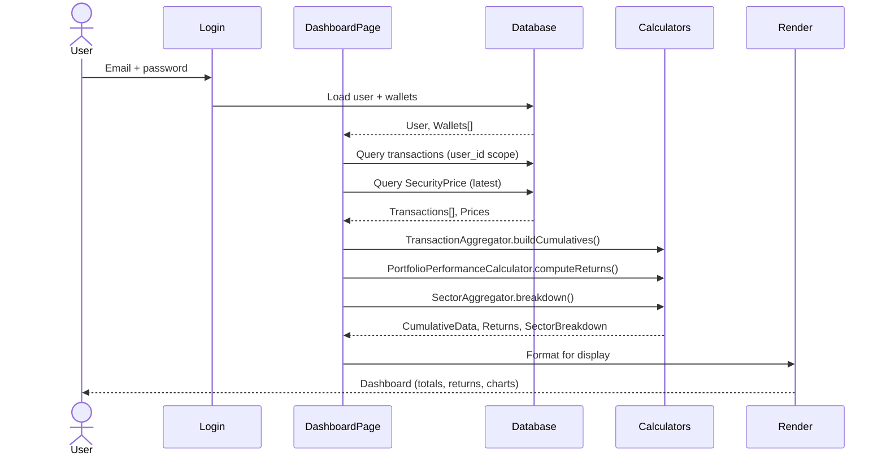
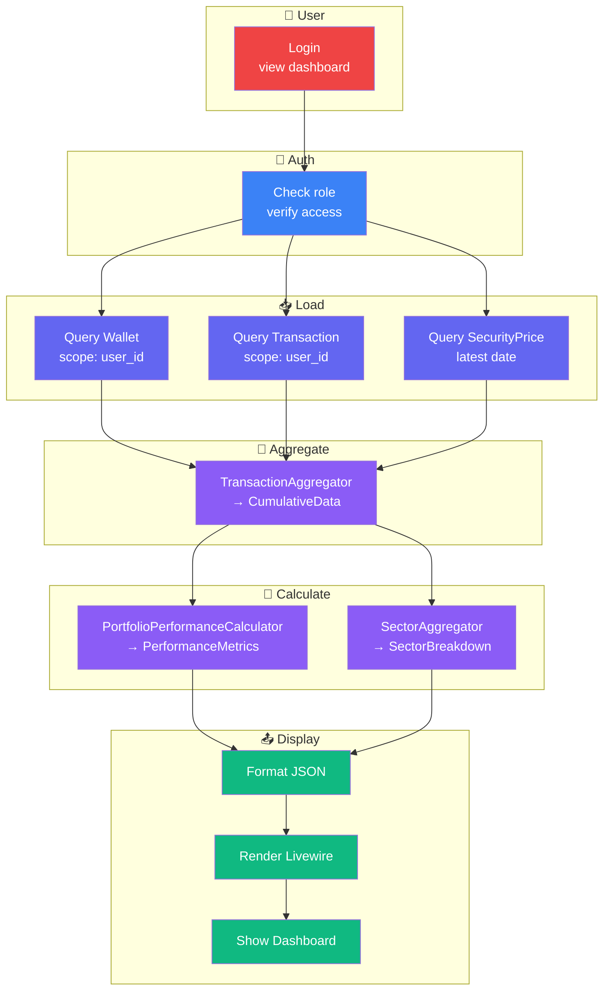

# Dashboard Flow - Argent

User login → Load wallets → Calculate metrics → Display.

---

## 🎯 User Journey



---

## 📥 Data Loading

### Step 1: Authenticate

**Query:**
```sql
SELECT * FROM users WHERE email = ? AND password = hash(?)
```

**Scope:** Global (any user)
**Result:** User object with role

---

### Step 2: Load Wallets

**Query (filtered by user):**
```sql
SELECT * FROM wallets 
WHERE user_id = ?
ORDER BY created_at DESC
```

**Scope:** `where('user_id', auth()->id())`
**Result:** Wallet[] with names, create dates

---

### Step 3: Load Transactions

**Query (all wallets, user scoped):**
```sql
SELECT t.*, s.name, s.ticker
FROM transactions t
JOIN securities s ON t.security_id = s.id
WHERE t.user_id = ?
ORDER BY t.date DESC
```

**Scope:** `where('user_id', auth()->id())`
**Result:** Transaction[] with security details

---

### Step 4: Load Prices

**Query (latest price per security):**
```sql
SELECT DISTINCT ON (security_id) 
  security_id, date, close
FROM security_prices
WHERE security_id IN (...)
ORDER BY security_id, date DESC
```

**Scope:** None (Security shared, but filtered by user's holdings)
**Result:** SecurityPrice[] with today's close

---

## 🧮 Compute Metrics

### Phase 1: Aggregation

**TransactionAggregator.buildCumulatives()**

Input: Transactions[]
```
Buy 10 AAPL @ 150€ on 2024-01-15
Buy 5 AAPL @ 155€ on 2024-02-01
Sell 3 AAPL @ 160€ on 2024-03-15
```

Output: CumulativeData
```json
{
  "quantities": {
    "AAPL": [
      {"date": "2024-01-15", "value": 10},
      {"date": "2024-02-01", "value": 15},
      {"date": "2024-03-15", "value": 12}
    ]
  },
  "invested": [
    {"date": "2024-01-15", "value": 1500},
    {"date": "2024-02-01", "value": 2275},
    {"date": "2024-03-15", "value": 2275}
  ],
  "realizedGains": 15.00
}
```

---

### Phase 2: Calculate Returns

**PortfolioPerformanceCalculator.computeReturns()**

Input: CumulativeData + SecurityPrice
```
Current: 12 AAPL × 185€ = 2220€
Invested: 2275€
Realized gains: 15€
```

Output: PerformanceMetrics
```json
{
  "day": 0.5,
  "week": 2.3,
  "month": 5.1,
  "quarter": 12.4,
  "year": 25.6,
  "ytd": 15.2,
  "all_time": -2.4
}
```

**Formula:**
```
return% = ((current_value + realized_gains) - invested) / invested × 100
        = ((2220 + 15) - 2275) / 2275 × 100
        = -2.4%
```

---

### Phase 3: Calculate Sector Breakdown

**SectorAggregator.breakdown()**

Input: Holdings + SecuritySector

Output: SectorBreakdown
```json
{
  "Technology": {
    "weight": 0.65,
    "value": 1443€
  },
  "Utilities": {
    "weight": 0.35,
    "value": 777€
  }
}
```

---

## 📤 Display Layer

### Dashboard Card Layout

```
┌─────────────────────────────────┐
│ 💰 Portfolio Value              │
│ 2,220€ (+15€ realized)          │
└─────────────────────────────────┘

┌─────────────────────────────────┐
│ 📈 Returns by Period            │
│ Day: +0.5% | Week: +2.3%        │
│ Month: +5.1% | YTD: +15.2%      │
│ All-time: -2.4%                 │
└─────────────────────────────────┘

┌─────────────────────────────────┐
│ 🏢 Sector Breakdown             │
│ Technology: 65% (1443€)         │
│ Utilities: 35% (777€)           │
└─────────────────────────────────┘

┌─────────────────────────────────┐
│ 📊 Holdings by Wallet           │
│ Growth: 1800€ | Safe: 420€      │
└─────────────────────────────────┘
```

---

## 🔄 Data Flow Diagram



---

## ⚡ Performance

| Step | Time | Notes |
|------|------|-------|
| Auth | <5ms | Database lookup |
| Load wallets | <10ms | Single query |
| Load transactions | 20-100ms | Depends on volume |
| Load prices | 10-50ms | Depends on # securities |
| Aggregation | 5-20ms | Per wallet |
| Returns calc | 5-10ms | Per wallet |
| Sector agg | 5-15ms | Per wallet |
| Render | 50-200ms | Frontend |
| **Total** | **100-500ms** | Page load |

---

## 💾 Caching

**What's cached:**
- PerformanceMetrics (1 hour)
- SectorBreakdown (1 hour)
- SecurityPrice (last close daily)

**When invalidated:**
- On transaction create/edit
- On SecurityPrice refresh
- On WalletFee change

---

## 🔒 Security

| Step | Check |
|------|-------|
| Auth | Verify password hash |
| Load | Global scope `user_id` filter |
| Aggregate | No sensitive data in output |
| Display | Escape HTML (Livewire default) |

---

## ✅ Edge Cases

| Case | Behavior |
|------|----------|
| No transactions | Show 0€, no metrics |
| Price missing | Use oldest available or zero |
| Multi-wallet | Aggregate across all wallets |
| No access (different user) | Scope filter prevents visibility |
| Admin user | Bypass scope, see all data |
