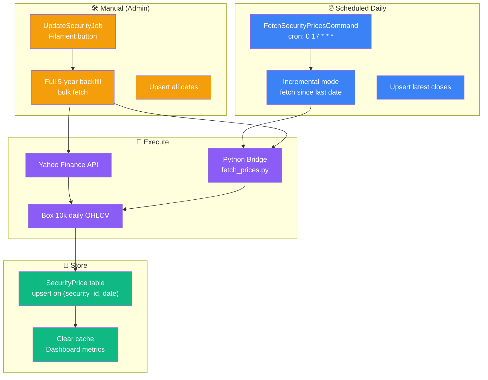
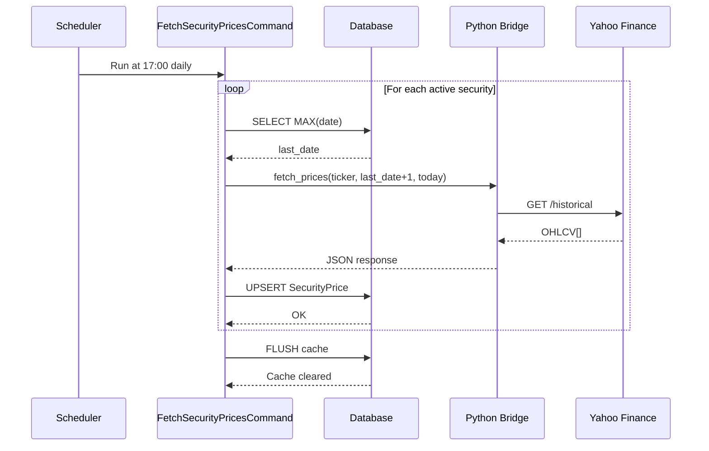
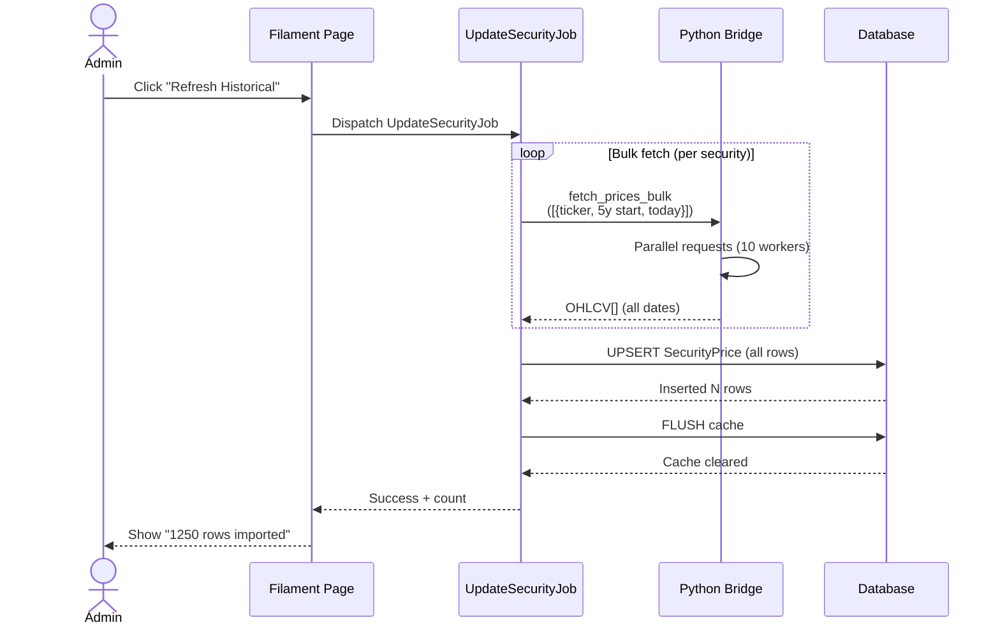

# SecurityPrice Refresh Flow - Argent

Scheduled daily + Manual. Bulk vs sequential. Incremental vs backfill.

---

## 🎯 Refresh Modes



---

## ⏰ Scheduled Daily Refresh

**Cron:** `0 17 * * *` (5 PM daily after market close)

**Command:** `FetchSecurityPricesCommand`

### Mode: Incremental

**Purpose:** Fetch only new data since last refresh

**Query:** What's the latest date in SecurityPrice for this security?
```sql
SELECT MAX(date) FROM security_prices 
WHERE security_id = ?
```

**Fetch:** From max_date + 1 to today

**Example:**
```
Last stored: 2024-04-29
Today: 2024-04-30

Fetch: 2024-04-30 only (1 request per security)
```

**Benefit:** Fast, minimal data transfer

---

### Execution Flow



---

## 🛠️ Manual Refresh (Admin)

**Location:** Filament Security edit page

**Button:** "Refresh Historical Data (5 years)"

### Mode: Full Backfill

**Purpose:** Populate complete 5-year history for new/updated security

**Fetch:** Today - 5 years to today

**Example:**
```
Today: 2024-04-30
Fetch: 2019-04-30 to 2024-04-30 (5 years)

Number of rows: ~1250 trading days
```

**Benefit:** Complete historical data, enables accurate performance metrics

---

### Execution Flow



---

## 🌉 Python Bridge Integration

**Service:** YahooFinanceService (PHP)

**Scripts:** `fetch_prices.py`, `fetch_prices_bulk.py`

### Single Ticker

**PHP calls:**
```php
YahooFinanceService::fetchPrices(
  ticker: "AAPL",
  start_date: "2024-04-29",
  end_date: "2024-04-30"
)
```

**Python executes:**
```python
# fetch_prices.py
yfinance.download("AAPL", start="2024-04-29", end="2024-04-30")
```

**Output:**
```json
{
  "status": "ok",
  "data": [
    {
      "date": "2024-04-29",
      "open": 184.50,
      "high": 185.80,
      "low": 183.90,
      "close": 185.64,
      "volume": 42000000
    }
  ]
}
```

---

### Bulk (Multiple Tickers)

**PHP calls:**
```php
YahooFinanceService::fetchPricesBulk([
  ['ticker' => "AAPL", 'start_date' => "2019-04-30", 'end_date' => "2024-04-30"],
  ['ticker' => "MSFT", 'start_date' => "2019-04-30", 'end_date' => "2024-04-30"],
  ...
])
```

**Python executes (parallel, 10 workers):**
```python
# fetch_prices_bulk.py
def fetch_many(tickers):
  with ThreadPoolExecutor(max_workers=10) as executor:
    futures = [executor.submit(yfinance.download, ticker, ...) 
               for ticker in tickers]
    return {ticker: result for ticker, result in zip(...)}
```

**Output:**
```json
{
  "status": "ok",
  "data": {
    "AAPL": [
      {"date": "2024-04-29", "close": 185.64, ...},
      {...}
    ],
    "MSFT": [
      {"date": "2024-04-29", "close": 421.30, ...},
      {...}
    ]
  }
}
```

---

## 💾 Database Upsert

**Table:** security_prices

**Unique constraint:** (security_id, date)

**SQL:**
```sql
INSERT INTO security_prices 
  (security_id, date, open, high, low, close, volume)
VALUES 
  (123, '2024-04-30', 184.50, 185.80, 183.90, 185.64, 42000000)
ON CONFLICT (security_id, date) DO UPDATE SET
  open = EXCLUDED.open,
  high = EXCLUDED.high,
  low = EXCLUDED.low,
  close = EXCLUDED.close,
  volume = EXCLUDED.volume,
  updated_at = NOW()
```

**Idempotent:** Re-running the same refresh doesn't duplicate rows

---

## 🔒 Locking & Concurrency

**Issue:** Prevent duplicate/concurrent fetches

**Solution:** Cache lock
```php
Cache::lock("security_refresh:{$security_id}", timeout: 60)->block();
  // Fetch from API
Cache::lock("security_refresh:{$security_id}")->release();
```

**Timeout:** 60 seconds (prevents hanging locks)

---

## 📊 Error Handling

| Error | Recovery |
|-------|----------|
| API down (503) | Retry exponentially (3 attempts) |
| Invalid ticker | Log warning, skip security |
| Network timeout | Defer to next scheduled run |
| Database locked | Retry with exponential backoff |
| Partial batch failure | Log failed tickers, continue others |

**Retry policy:**
```
Attempt 1: Immediate
Attempt 2: After 10 seconds
Attempt 3: After 30 seconds
Fail: Log + alert
```

---

## 📈 Performance

### Scheduled (Incremental)

| Metric | Value |
|--------|-------|
| Active securities | 100-200 |
| Per-security request | 1 (1 day) |
| Total API calls | 100-200 |
| Duration | 2-5 minutes |
| Data volume | ~5KB |

---

### Manual (Backfill)

| Metric | Value |
|--------|-------|
| Active securities | 100-200 |
| Per-security request | 1 (bulk) |
| Total API calls | 1 (parallel) |
| Duration | 30-60 seconds |
| Data volume | 10MB (compressed) |

---

## 💾 Caching

**Cache key:** `portfolio.{wallet_id}.metrics`

**TTL:** 1 hour (or until invalidated)

**Invalidated on:**
- SecurityPrice refresh
- Transaction create/edit
- WalletFee change

---

## 🔄 Complete Flow Example

**Daily scheduled refresh:**

```
[17:00] Cron triggers FetchSecurityPricesCommand

[17:00:05] Query active securities (100 total)

[17:00:10] For each security:
  - Query last stored date (e.g., 2024-04-29)
  - Fetch 2024-04-30 only
  - Upsert 1 row per security
  
[17:03] Call Python Bridge: fetch_prices(100 tickers)
  
[17:04] Receive OHLCV for all 100 securities

[17:05] UPSERT 100 rows into security_prices

[17:05:01] Flush cache:
  Cache::tags(['portfolio', '*'])->flush()

[17:05:02] Done. Dashboard now shows latest prices.

Next refresh: [17:00] tomorrow
```

---

## ✅ Edge Cases

| Case | Behavior |
|------|----------|
| Weekends/holidays | No data from Yahoo, skip (no error) |
| Stock splits | Close price adjusted, OHLC unchanged (Yahoo handles) |
| New security (no data) | Backfill 5 years on manual refresh |
| Missing date (data gap) | Use most recent available |
| Duplicate request | Upsert prevents duplicates |
