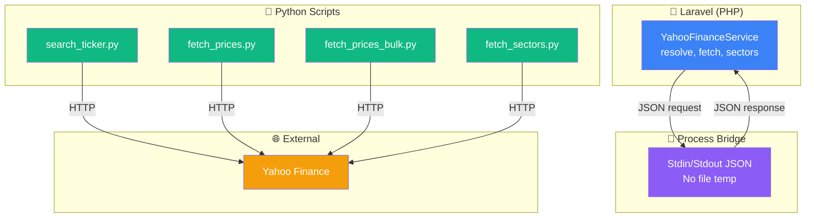

# Python Bridge - Argent

PHP↔Python IPC. Ticker resolution, price fetch, sector lookup.

---

## 🎯 Architecture



---

## 📁 File Structure

```
├── app/Services/YahooFinanceService.php
├── python/
│   ├── search_ticker.py
│   ├── fetch_prices.py
│   ├── fetch_prices_bulk.py
│   ├── fetch_sectors.py
│   ├── requirements.txt
│   └── config.py
└── tests/
    └── Feature/YahooFinanceBridgeTest.php
```

---

## 🔗 IPC Protocol

**Method:** stdin/stdout JSON

**Advantages:**
- No temp files (no cleanup risk)
- No socket files (platform-agnostic)
- Process auto-cleanup
- Streaming response

**Flow:**

```
PHP → Python: Write JSON to process stdin
Python → PHP: Read from stdin, parse JSON
Python ← API: Fetch data
Python → PHP: Write JSON to stdout
PHP → Python: Read response, parse JSON
Process exits
```

---

## 📝 search_ticker.py

**Purpose:** Resolve ISIN → Ticker via Yahoo Finance symbol lookup

### Input

```json
{
  "query": "FR0011871110",
  "fallback_query": "TotalEnergies"
}
```

- **query:** ISIN code (primary)
- **fallback_query:** Company name if ISIN fails

### Output

```json
{
  "status": "ok",
  "data": [
    {
      "symbol": "TTEF",
      "name": "TotalEnergies SE",
      "exchange": "EURONEXT PARIS",
      "type": "Equity"
    }
  ]
}
```

**Error response:**
```json
{
  "status": "error",
  "error": "No symbol found for ISIN: FR0011871110"
}
```

### Algorithm

```python
def search_ticker(query, fallback_query=None):
  try:
    ticker = yfinance.Ticker(query)
    info = ticker.info
    return {
      "symbol": info.get('symbol'),
      "name": info.get('longName'),
      "exchange": info.get('exchange'),
      "type": "Equity"
    }
  except:
    if fallback_query:
      return search_by_name(fallback_query)
    return {"status": "error", "error": "..."}
```

**Fallback:** If ISIN doesn't work, search by company name

---

## 📊 fetch_prices.py

**Purpose:** Single ticker historical OHLCV

### Input

```json
{
  "ticker": "AAPL",
  "start_date": "2024-01-01",
  "end_date": "2024-12-31"
}
```

### Output

```json
{
  "status": "ok",
  "data": [
    {
      "date": "2024-01-02",
      "open": 185.64,
      "high": 186.39,
      "low": 184.85,
      "close": 185.64,
      "volume": 52000000
    },
    {...}
  ]
}
```

### Algorithm

```python
def fetch_prices(ticker, start_date, end_date):
  df = yfinance.download(ticker, start=start_date, end=end_date)
  return [
    {
      "date": date.strftime('%Y-%m-%d'),
      "open": row['Open'],
      "high": row['High'],
      "low": row['Low'],
      "close": row['Close'],
      "volume": row['Volume']
    }
    for date, row in df.iterrows()
  ]
```

**Timing:** ~2-5 seconds per ticker

---

## 🚀 fetch_prices_bulk.py

**Purpose:** Multiple tickers in parallel (10 workers)

### Input

```json
{
  "tickers": [
    {"ticker": "AAPL", "start_date": "2024-01-01", "end_date": "2024-12-31"},
    {"ticker": "MSFT", "start_date": "2024-01-01", "end_date": "2024-12-31"},
    {...}
  ]
}
```

### Output

```json
{
  "status": "ok",
  "data": {
    "AAPL": [
      {"date": "2024-01-02", "open": 185.64, ...},
      {...}
    ],
    "MSFT": [
      {"date": "2024-01-02", "open": 380.10, ...},
      {...}
    ]
  }
}
```

### Algorithm

```python
def fetch_prices_bulk(tickers):
  with ThreadPoolExecutor(max_workers=10) as executor:
    futures = {
      executor.submit(fetch_prices, t['ticker'], 
                     t['start_date'], t['end_date']): t['ticker']
      for t in tickers
    }
    
    results = {}
    for future in as_completed(futures):
      ticker = futures[future]
      results[ticker] = future.result()
    
    return results
```

**Performance:** 100 tickers in ~15-30 seconds (parallel vs ~500s sequential)

---

## 🏢 fetch_sectors.py

**Purpose:** Sector breakdown for a security

### Input

```json
{
  "ticker": "AAPL"
}
```

### Output

```json
{
  "status": "ok",
  "data": {
    "software": 0.45,
    "consumer_discretionary": 0.25,
    "hardware": 0.30
  }
}
```

**Keys:** Sector names (normalized)

### Algorithm

```python
def fetch_sectors(ticker):
  info = yfinance.Ticker(ticker).info
  
  # Extract sector breakdown
  sectors = {
    'Technology': info.get('sector', 0),
    'Healthcare': info.get('healthcareSector', 0),
    ...
  }
  
  # Normalize to sum = 1.0
  total = sum(sectors.values())
  return {k: v/total for k, v in sectors.items() if v > 0}
```

---

## 🔌 PHP Integration

**Service:** `app/Services/YahooFinanceService.php`

### resolveTickerFromIsin()

```php
public function resolveTickerFromIsin(string $isin, ?string $name = null): string
{
  $process = new Process([
    'python',
    storage_path('app/python/search_ticker.py')
  ]);
  
  $process->setInput(json_encode([
    'query' => $isin,
    'fallback_query' => $name
  ]));
  
  $process->run();
  $response = json_decode($process->getOutput(), true);
  
  if ($response['status'] === 'ok') {
    return $response['data'][0]['symbol'];
  }
  
  throw new Exception("Failed to resolve ticker: {$response['error']}");
}
```

### fetchPrices()

```php
public function fetchPrices(
  string $ticker,
  string $startDate,
  string $endDate
): Collection
{
  $process = new Process([
    'python',
    storage_path('app/python/fetch_prices.py')
  ]);
  
  $process->setInput(json_encode([
    'ticker' => $ticker,
    'start_date' => $startDate,
    'end_date' => $endDate
  ]));
  
  $process->run();
  $response = json_decode($process->getOutput(), true);
  
  return collect($response['data']);
}
```

### fetchPricesBulk()

```php
public function fetchPricesBulk(array $requests): array
{
  $process = new Process([
    'python',
    storage_path('app/python/fetch_prices_bulk.py')
  ]);
  
  $process->setInput(json_encode(['tickers' => $requests]));
  $process->run();
  $response = json_decode($process->getOutput(), true);
  
  return $response['data'];
}
```

---

## ⚠️ Error Handling

| Error | Recovery |
|-------|----------|
| Process timeout | Retry with longer timeout (60s default) |
| Invalid JSON | Log + return error response |
| API rate limit | Exponential backoff + queue for retry |
| Process crash | Return error, log stack trace |
| Missing Python | Fail with helpful message |

**Retry policy:**
```php
for ($i = 0; $i < 3; $i++) {
  try {
    return $this->executeProcess(...);
  } catch (ProcessFailedException $e) {
    sleep(2 ** $i);  // 1s, 2s, 4s
  }
}
throw new Exception("Max retries exceeded");
```

---

## 🔒 Security

**Process isolation:**
- No shell execution (Array arguments)
- No user input in command
- JSON parsing only (no eval)

**Data validation:**
- Whitelist ticker format (A-Z0-9, max 6 chars)
- Validate date format (YYYY-MM-DD)
- Validate ISIN (13 alphanumeric)

---

## 📈 Performance

| Operation | Time | Notes |
|-----------|------|-------|
| search_ticker | 2-5s | Single HTTP request |
| fetch_prices (1 ticker, 1 year) | 3-5s | Download + parse |
| fetch_prices_bulk (100 tickers) | 15-30s | 10 workers parallel |
| fetch_sectors (1 ticker) | 2-3s | Single HTTP request |

**Caching:** SecurityPrice results cached daily (avoid redundant API calls)

---

## ✅ Testing

**Test file:** `tests/Feature/YahooFinanceBridgeTest.php`

```php
public function test_search_ticker_by_isin()
{
  $ticker = YahooFinanceService::resolveTickerFromIsin('FR0011871110');
  $this->assertEquals('TTEF', $ticker);
}

public function test_fetch_prices_returns_collection()
{
  $prices = YahooFinanceService::fetchPrices(
    'AAPL',
    '2024-01-01',
    '2024-01-31'
  );
  
  $this->assertGreaterThan(0, $prices->count());
  $this->assertTrue($prices->first()->has('close'));
}
```

**Mock for tests:**
```php
YahooFinanceService::shouldReceive('fetchPrices')
  ->andReturn(collect([
    ['date' => '2024-01-02', 'close' => 185.64]
  ]));
```

---

## 🔄 Upgrade Path

**Future:** Direct broker API (Alpaca, IB)
- Replace Python bridge with broker SDK
- Handle live trading (currently UI-only)
- Real-time quotes vs daily close

---

## ✅ Edge Cases

| Case | Behavior |
|------|----------|
| Ticker delisted | API returns error, catch + fallback |
| Holiday/weekend | No data, normal (not error) |
| New security (IPO) | Limited history, fetch what's available |
| Stock split | Prices adjusted by Yahoo (transparent) |
| Timeout | Retry up to 3 times, then fail |
