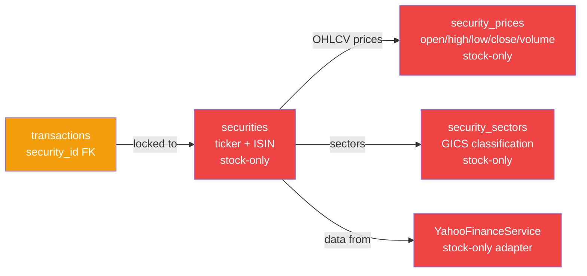
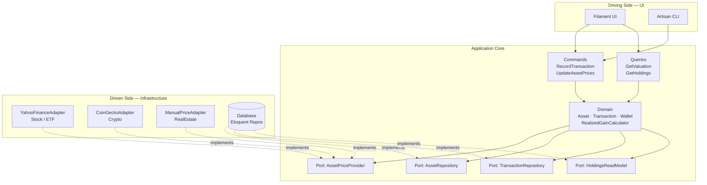
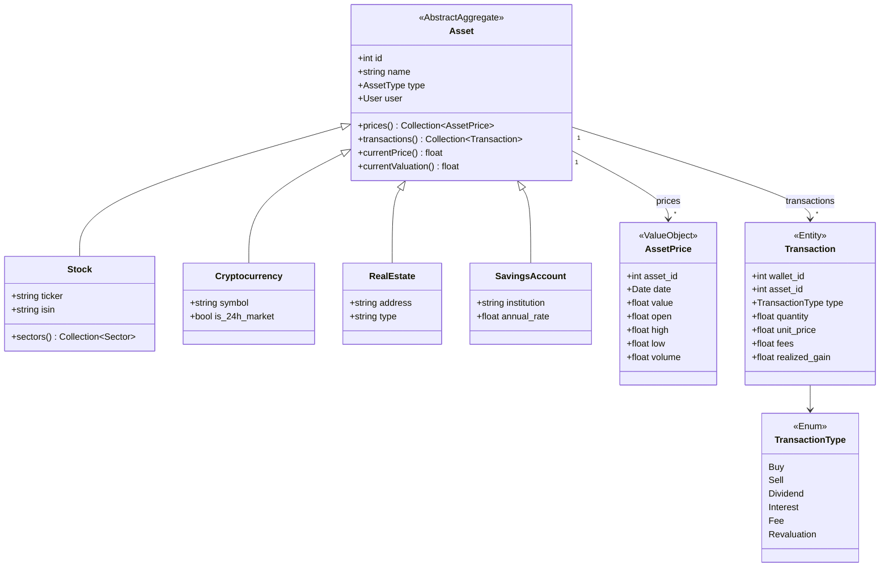
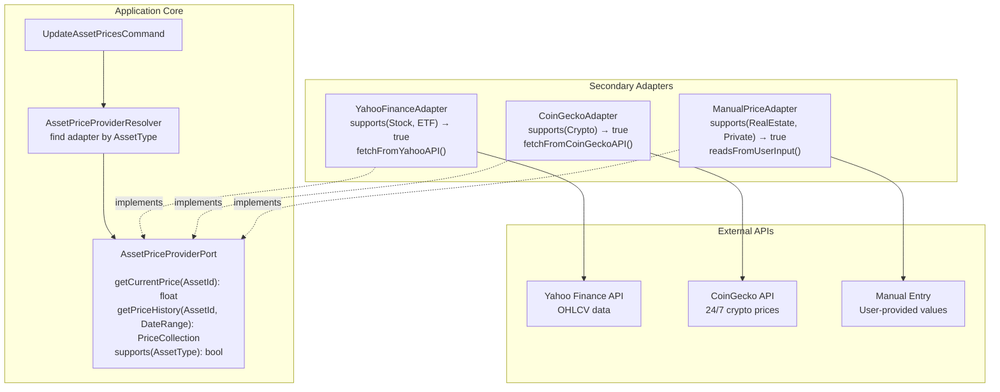
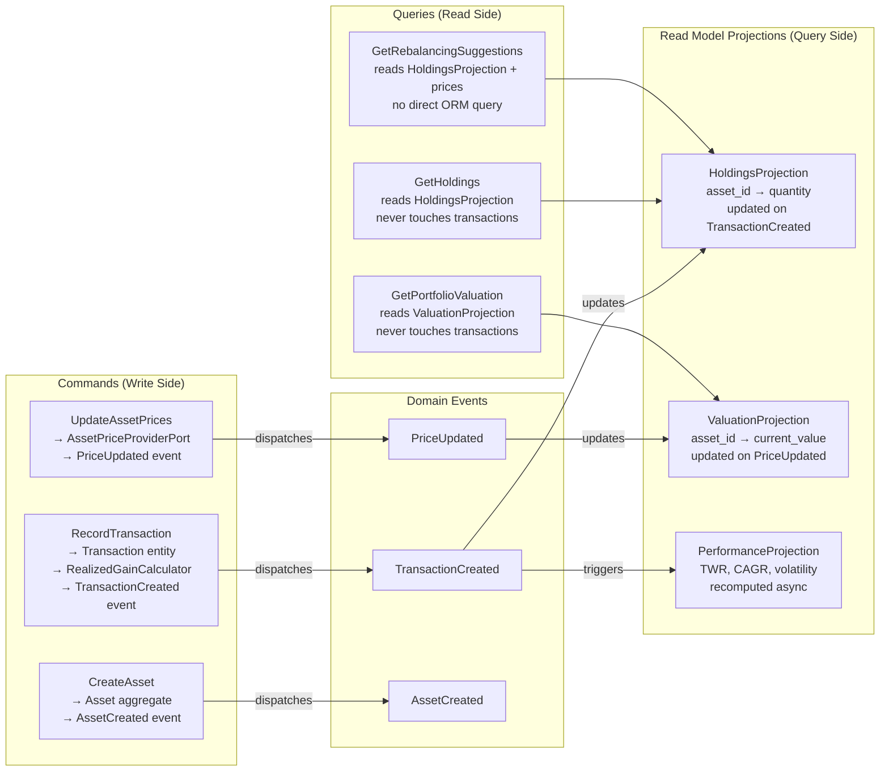
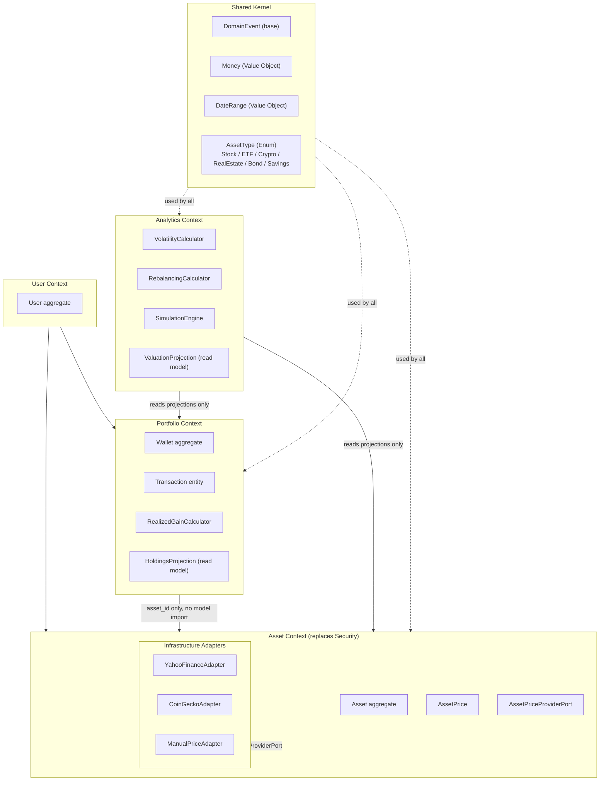
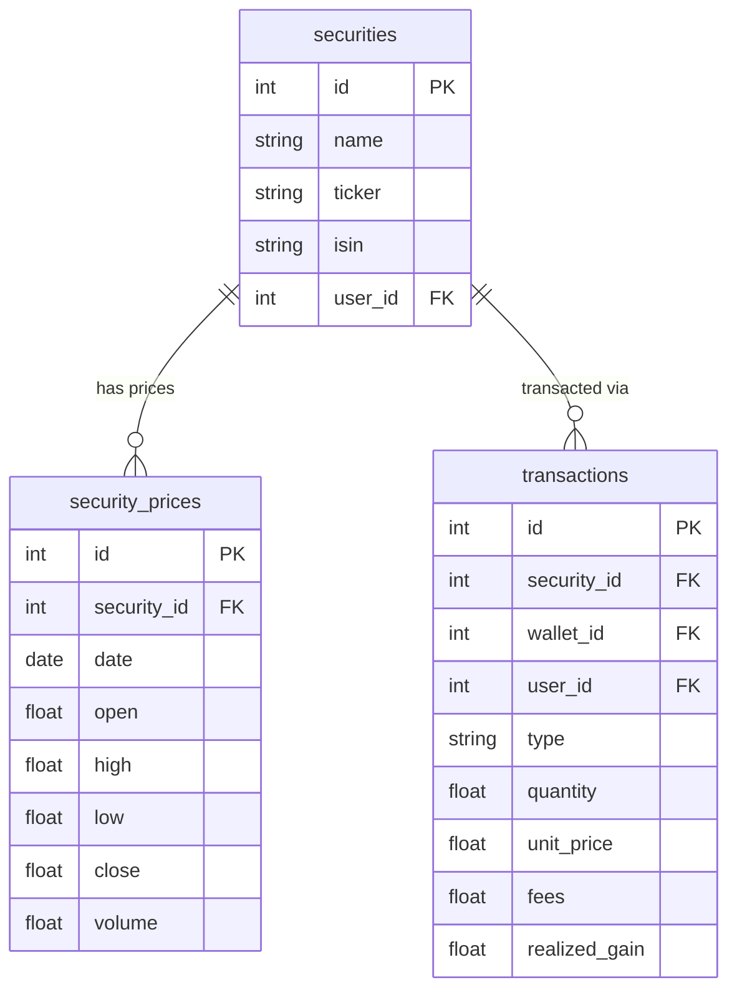
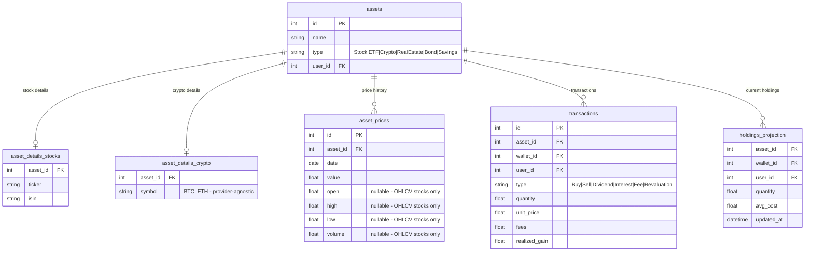
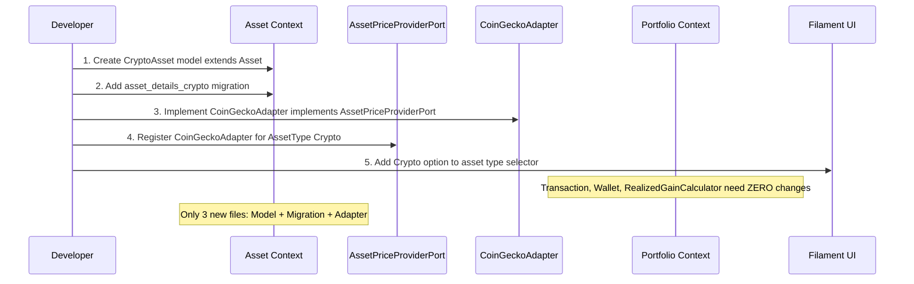

# Multi-Asset Architecture — Explicit Architecture for Extensible Investment Types

> Référence: https://herbertograca.com/2017/11/16/explicit-architecture-01-ddd-hexagonal-onion-clean-cqrs-how-i-put-it-all-together/

## 1. Problème actuel — le verrou `security_id`

Tout le système tourne autour de `securities`. Un seul FK `transactions.security_id` verrouille
l'architecture sur les actions/ETFs cotés en bourse. Pour ajouter Bitcoin, il faudrait modifier
la table `transactions` ET tous les services qui queryent par `security_id`.



## 2. Architecture cible — Explicit Architecture (Hexagonal + DDD + CQRS)



## 3. Domain Model — `Asset` abstraction



## 4. Port/Adapter — Price Provider par type d'actif



## 5. CQRS — Séparation Command / Query



## 6. Bounded Contexts cibles



## 7. Schema DB — migration vers multi-asset

### AS-IS (stock-locked)



### TO-BE (multi-asset)



## 8. Ajout d'un nouveau type — exemple Bitcoin

Pour ajouter Bitcoin (Cryptocurrency), avec la cible architecture:



**Fichiers à créer (uniquement):**
1. `app/Domains/Asset/Models/CryptoAsset.php` — extends `Asset`
2. `database/migrations/xxxx_create_asset_details_crypto_table.php`
3. `app/Domains/Asset/Infrastructure/Adapters/CoinGeckoAdapter.php` — implements `AssetPriceProviderPort`

**Fichiers à modifier (zéro ou minime):**
- `AppServiceProvider` — enregistrer `CoinGeckoAdapter` pour `AssetType::Crypto`
- `AssetType` enum — ajouter `Crypto` case
- `MarketCalendar` — remplacer par logique par-adapter (crypto = 24/7, stocks = Mon-Fri)

## 9. Roadmap de migration incrémentale

> **Règle TDD appliquée à chaque phase** — Red → Green → Refactor.
> Chaque étape se termine uniquement quand les 3 gates passent (voir section 9.1).

```mermaid
graph TD
    subgraph Phase6["Phase 6 — Events"]
        P6A["Wire TransactionCreated dispatch"]
        P6B["Wire PriceUpdated dispatch"]
        P6C["Wire PortfolioRebalanced dispatch"]
    end

    G6{"Gate 6\nPest + PHPStan + Pint"}

    subgraph Phase7["Phase 7 — Contrats"]
        P7A["Binder SecurityRepositoryInterface\nSecurityPriceRepositoryInterface\nTransactionRepositoryInterface"]
        P7B["Remplacer appels ORM directs\npar contrats dans services"]
        P7C["Fixer VolatilityCalculating\nWallet to int walletId"]
    end

    G7{"Gate 7\nPest + PHPStan + Pint"}

    subgraph Phase8["Phase 8 — Asset abstraction"]
        P8A["Extraire Asset aggregate\ndu Security domain"]
        P8B["Migration asset_prices\nremplace security_prices"]
        P8C["Migration transactions\nsecurity_id vers asset_id"]
    end

    G8{"Gate 8\nPest + PHPStan + Pint"}

    subgraph Phase9["Phase 9 — Ports & Projections"]
        P9A["AssetPriceProviderPort\nYahooFinanceAdapter stocks"]
        P9B["HoldingsProjection read model\nmis a jour via TransactionCreated"]
        P9C["RebalancingOrchestrator\nlit projection, plus ORM Transaction"]
    end

    G9{"Gate 9\nPest + PHPStan + Pint"}

    subgraph Phase10["Phase 10 — Bitcoin"]
        P10A["CoinGeckoAdapter\nimplements AssetPriceProviderPort"]
        P10B["CryptoAsset model\nasset_details_crypto migration"]
    end

    Phase6 --> G6 --> Phase7 --> G7 --> Phase8 --> G8 --> Phase9 --> G9 --> Phase10

    style Phase6 fill:#3b82f6,color:#fff
    style Phase7 fill:#6366f1,color:#fff
    style Phase8 fill:#8b5cf6,color:#fff
    style Phase9 fill:#a855f7,color:#fff
    style Phase10 fill:#10b981,color:#fff
    style G6 fill:#f59e0b,color:#fff
    style G7 fill:#f59e0b,color:#fff
    style G8 fill:#f59e0b,color:#fff
    style G9 fill:#f59e0b,color:#fff
```



### 9.1 Gate de validation — obligatoire entre chaque phase

Aucune phase suivante ne démarre tant que les 3 commandes ne passent pas en vert.

```bash
# 1. Tests Pest — tous les tests du domaine modifié + régressions globales
php artisan test --compact

# 2. PHPStan niveau 2 — aucun type error, aucune propriété non typée
vendor/bin/phpstan analyse app/Domains/ --level=2

# 3. Pint — formatage propre
vendor/bin/pint --dirty --format agent
```

**TDD par étape:**
- Écrire le test Pest **avant** d'implémenter (Red)
- Implémenter jusqu'à ce que le test passe (Green)
- Refactorer sans casser les tests (Refactor)
- Committer uniquement quand Gate passe

**Commandes utiles par scope:**

| Scope | Commande |
|-------|----------|
| Portfolio uniquement | `php artisan test --compact tests/Feature/Domains/Portfolio/` |
| Analytics uniquement | `php artisan test --compact tests/Feature/Domains/Analytics/` |
| Filtre sur un test | `php artisan test --compact --filter=NomDuTest` |
| PHPStan domaine précis | `vendor/bin/phpstan analyse app/Domains/Portfolio/ --level=2` |

## 10. Contrats existants à étendre (pas réécrire)

| Contrat existant | Statut | Action Phase 7 |
|-----------------|--------|---------------|
| `SecurityRepositoryInterface` | ✅ Défini, ✅ bindé (Phase 7A) | Utilisable en Phase 7B+ |
| `SecurityPriceRepositoryInterface` | ✅ Défini, ✅ bindé (Phase 7A) | Utilisable en Phase 7B+ |
| `TransactionRepositoryInterface` | ✅ Défini, ✅ bindé (Phase 7A) | Utilisable en Phase 7B+ |
| `PriceRefreshing` | ✅ Défini, ✅ bindé | Renommer `AssetPriceProviderPort`, ajouter `supports(AssetType)` |
| `VolatilityCalculating` | ✅ Défini, ✅ bindé | Signature change `Wallet → int walletId` (TBD Phase 7C) |
| `Rebalancing` | ✅ Défini, ✅ bindé | Aucun changement nécessaire (pure math) |

## 11. Phase 7 — Résultats et blockers

### Phase 7A ✅ Complète
- Bindings ajoutés pour SecurityRepository, SecurityPriceRepository, TransactionRepository
- Status: Tous les tests passent, prêt pour Phase 7B+

### Phase 7B ⏸️ Blocker: Contexte utilisateur
Refactoriser 7 services vers injection repository révèle **problème critique**:
- `forWallet(walletId, userId)` et `forSecurity(securityId, userId)` requièrent `userId`
- Services comme VolatilityCalculator, PortfolioPerformanceService reçoivent wallet mais pas userId
- `auth()->id()` retourne `null` en tests → binde crash

**Services affectés:**
1. RealizedGainCalculator — **résolu** (transaction.user_id disponible)
2. SingleSecurityStatsProvider — **complexe** (besoin userId pour forSecurity)
3. VolatilityCalculator — **blocké** (pas userId context, signature change TBD)
4. PortfolioPerformanceCalculator — **blocké** (idem)
5. PortfolioPerformanceService — **blocké**
6. DashboardDataProvider — **blocké**
7. YahooFinanceService — **peut rester ORM** (aucun userId needed)

### Solution recommandée Phase 7B
**Option 1 (Pragmatique)**: Garder ORM directs pour services sans userId context
- Services purs (VolatilityCalculator, PortfolioPerformanceCalculator) → queryBuilder direct
- Services avec transaction context (RealizedGainCalculator) → repository injection
- Phase 7 focus: RealizedGainCalculator seulement

**Option 2 (Refactor majeur)**: Restructurer services pour passer userId explicitement
- Requires: Modifier signature tous les services
- Impact: Cascading changes à Filament pages, commands, tests
- Timeline: Phase 8+

**Option 3 (À explorer)**: Request-scoped UserId service
- `UserId $userId` service injectable, fallback auth()->id() en production
- Permet test fixture override
- Moins intrusif que Option 2

### Décision Phase 8
Recommandation: **Option 1** court-terme (complète Phase 7 partiel)
- Phase 7B.1: RealizedGainCalculator + tests ✅
- Phase 7B.2: Pause, marker pour Phase 8 avec Option 2 ou 3
- Phase 8: Addresser Commands (FetchSecurityPricesCommand, etc) — plus simples que services
