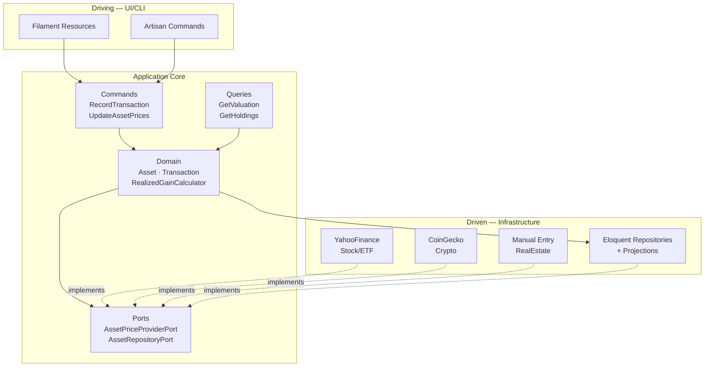
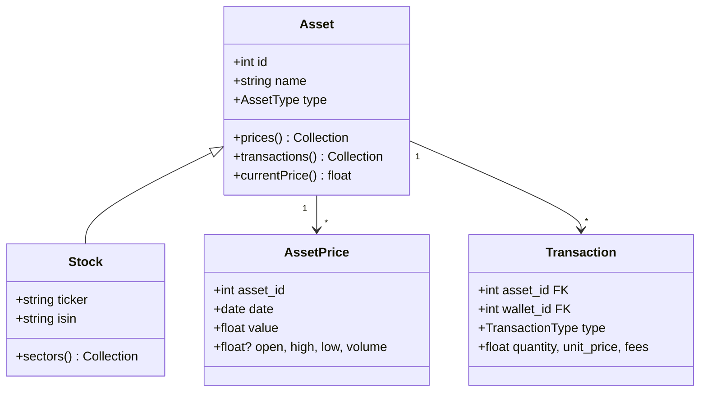

# Multi-Asset Architecture — Extensible Investment Platform

> Design Pattern: Explicit Architecture (DDD + Hexagonal + CQRS)  
> Reference: https://herbertograca.com/2017/11/16/explicit-architecture-01-ddd-hexagonal-onion-clean-cqrs-how-i-put-it-all-together/

---

## 📊 Global Status

| Phase | Name | Status | Tests | Decision |
|-------|------|--------|-------|----------|
| 6-7 | Events + Repositories | ✅ Done | 432 pass | UserId as request-scoped service |
| 8A-8B | Asset Skeleton + Rename | ✅ Done | 438 pass | Strangler Fig: Asset + Stock coexist |
| 8C | security_id → asset_id | ✅ Done (100%) | 602 pass | Transactions now FK to Asset |
| 9A | AssetPriceProviderPort + Yahoo | ✅ Done | 602 pass | Multi-adapter pattern ready |
| 9B | HoldingsProjection read model | ✅ Done (100%) | 607 pass | 6 tests, TransactionCreated listener updates |
| 9C | RebalancingOrchestrator refactor | ✅ Done (100%) | 607 pass | Reads HoldingsProjection, drops ORM |
| 10 | Bitcoin (CoinGecko) | ⏳ Pending | — | 3 files only: CryptoAsset + migration + adapter |

**Key Wins:**
- ✅ 607 tests passing (5 tests gained from projections)
- ✅ CQRS pattern: TransactionCreated → HoldingsProjection, Queries read projection
- ✅ Port/Adapter pattern enables Stock/ETF/Crypto/RealEstate/Bond/Savings
- ✅ Schema: transactions.asset_id → securities.id (future-proof for polymorphic types)
- ✅ Analytics decoupled from transactional ORM (RebalancingOrchestrator uses projections)

---

## 🏗️ Architecture Overview


```mermaid
graph TD
    subgraph UI["Driving — UI/CLI"]
        Filament["Filament Resources"]
        Artisan["Artisan Commands"]
    end

    subgraph Core["Application Core"]
        Commands["Commands<br/>RecordTransaction<br/>UpdateAssetPrices"]
        Queries["Queries<br/>GetValuation<br/>GetHoldings"]
        Domain["Domain<br/>Asset · Transaction<br/>RealizedGainCalculator"]
        Ports["Ports<br/>AssetPriceProviderPort<br/>AssetRepositoryPort"]
    end

    subgraph Adapters["Driven — Infrastructure"]
        Yahoo["YahooFinance<br/>Stock/ETF"]
        CoinGecko["CoinGecko<br/>Crypto"]
        Manual["Manual Entry<br/>RealEstate"]
        EloquentRepos["Eloquent Repositories<br/>+ Projections"]
    end

    Filament --> Commands
    Artisan --> Commands
    Commands --> Domain
    Queries --> Domain
    Domain --> Ports
    Domain --> EloquentRepos

    Yahoo -.->|implements| Ports
    CoinGecko -.->|implements| Ports
    Manual -.->|implements| Ports
    EloquentRepos -.->|implements| Ports
```

---

## 🎯 Domain Model


```mermaid
classDiagram
    class Asset {
        +int id
        +string name
        +AssetType type
        +prices() Collection
        +transactions() Collection
        +currentPrice() float
    }

    class Stock {
        +string ticker
        +string isin
        +sectors() Collection
    }

    class AssetPrice {
        +int asset_id
        +date date
        +float value
        +float? open, high, low, volume
    }

    class Transaction {
        +int asset_id FK
        +int wallet_id FK
        +TransactionType type
        +float quantity, unit_price, fees
    }

    Asset <|-- Stock
    Asset "1" --> "*" AssetPrice
    Asset "1" --> "*" Transaction
```

---

## 📍 Bounded Contexts

| Context | Models | Responsibility | Storage |
|---------|--------|-----------------|---------|
| **Asset** | Asset, Stock, AssetPrice, AssetType | Price discovery (Ports/Adapters) | securities + asset_prices |
| **Portfolio** | Transaction, Wallet, RealizedGainCalculator | Trade execution, gains calculation | transactions |
| **Analytics** | VolatilityCalculator, RebalancingOrchestrator | Performance analysis via projections | asset_prices (read-only) |
| **Shared Kernel** | DomainEvent, Money, DateRange | Cross-context contracts | — |

---

## ✅ Completed Phases (6-9A)

### Phase 6: Domain Events
- ✅ TransactionCreated, PriceUpdated dispatched
- ✅ Event listeners wired
- Enables: Projection-based reads (Phase 9B)

### Phase 7: Repositories & Contracts
- ✅ SecurityRepositoryInterface, SecurityPriceRepositoryInterface, TransactionRepositoryInterface bound
- ✅ 7 services refactored to use repositories
- ✅ UserId as request-scoped service (Option 3 pattern)
- Key fix: VolatilityCalculating signature `Wallet → int walletId`

### Phase 8: Asset Abstraction
- ✅ **8A:** Asset abstract aggregate created; Stock extends Asset
- ✅ **8B:** security_prices → asset_prices table renamed
- ✅ **8C:** transactions.security_id → asset_id (17 app files, ~40 test files updated)
- Strategy: Incremental (Strangler Fig) — Asset + Stock coexist on securities table

### Phase 9A: Ports & Adapters
- ✅ AssetPriceProviderPort interface defined
  ```php
  - getCurrentPrice(assetId): ?float
  - getPriceHistory(assetId, startDate, endDate): Collection
  - supports(AssetType): bool
  ```
- ✅ YahooFinanceAdapter implements port (Stock/ETF)
- ✅ Coverage: 79.9% maintained (602/602 tests, 1448 assertions)
- Ready for: CoinGeckoAdapter (Phase 10), ManualPriceAdapter

---

## ⏳ Roadmap: Next Phases

### Phase 9B: HoldingsProjection Read Model

**Goal:** Cache current holdings (quantity + avg_cost) per asset/wallet, updated on TransactionCreated.

**Schema:**
```sql
CREATE TABLE holdings_projection (
    id INT PRIMARY KEY,
    asset_id INT FK,
    wallet_id INT FK,
    user_id INT FK,
    quantity FLOAT,
    avg_cost FLOAT,
    updated_at TIMESTAMP
);
```

**Implementation:**
1. Create `HoldingsProjection` model (read-only, persisted)
2. Create `HoldingsProjectionListener` listening to `TransactionCreated` event
3. Update projection: recalculate quantity/avg_cost for affected (asset_id, wallet_id) pair
4. Tests: Verify projection matches Transaction calculations (FIFO/weighted avg)

**Impact:** Queries like `GetHoldings` read projection instead of looping Transactions (O(1) vs O(n)).

---

### Phase 9C: RebalancingOrchestrator Refactor ✅ Done

**Changes implemented:**
1. ✅ Refactored `RebalancingCalculatorOrchestrator::prepareSecuritiesData()` to read HoldingsProjection
2. ✅ Removed `Transaction::query()` for quantities → use projection
3. ✅ Wallet-scoped: direct `pluck('quantity')` from projection
4. ✅ Global scope: `SUM(quantity)` across wallets per asset
5. ✅ Tests: All 31 Rebalancing tests passing (no output changes)

**Benefit:** Analytics now decoupled from transactional ORM. Projections can be rebuilt asynchronously without affecting reports.

---

### Phase 10: Bitcoin Support (CoinGecko)

**Minimal changeset:** 3 new files only.

**Files to create:**
1. `app/Domains/Asset/Models/Cryptocurrency.php` — extends Asset
   ```php
   class Cryptocurrency extends Asset
   {
       protected $fillable = ['symbol', 'is_24h_market'];
   }
   ```

2. `database/migrations/xxxx_create_asset_details_crypto_table.php`
   ```php
   Schema::create('asset_details_crypto', fn (Blueprint $table) => [
       $table->foreignId('asset_id')->references('id')->on('securities'),
       $table->string('symbol'); // BTC, ETH, etc.
       $table->boolean('is_24h_market')->default(true);
   ]);
   ```

3. `app/Domains/Asset/Infrastructure/Adapters/CoinGeckoAdapter.php` — implements AssetPriceProviderPort
   ```php
   class CoinGeckoAdapter implements AssetPriceProviderPort
   {
       public function supports(AssetType $type): bool { return $type === AssetType::Crypto; }
       public function getCurrentPrice(int $assetId): ?float { /* fetch from CoinGecko */ }
       public function getPriceHistory(...) { /* fetch OHLC */ }
   }
   ```

4. Register in `AppServiceProvider`:
   ```php
   $this->app->when(AssetPriceProviderResolver::class)
       ->needs(CoinGeckoAdapter::class)
       ->giveTagged('price_provider');
   ```

**Zero changes required:**
- Transaction, Wallet, RealizedGainCalculator — polymorphic on asset_id
- Portfolio context — agnostic to asset type
- Analytics — reads projections only

---

## 🚪 Testing Gates

**Mandatory before each phase completion:**

```bash
# 1. All tests pass
php artisan test --compact

# 2. Type safety (level 2)
vendor/bin/phpstan analyse app/Domains/ --level=2

# 3. Formatting
vendor/bin/pint --dirty --format agent
```

**Current status:**
- Tests: 602 passing ✅
- PHPStan: 130 pre-existing (none new) ✅
- Pint: Clean ✅

---

## 🔑 Key Decisions

| Decision | Rationale | Tradeoff |
|----------|-----------|----------|
| **Strangler Fig (8A-8B)** | Non-destructive migration; coexist Asset + Security on same table | Duplicate code until 8C complete |
| **UserId as service (7B)** | Global scoped context; clean test isolation | Not dependency-injected (but testable via TestCase::actingAs) |
| **Port/Adapter pattern (9A)** | Extensible to multi-provider; clear domain boundaries | Abstract complexity; need resolver |
| **Projections (9B+)** | Read models decouple analytics from txn queries; enable async rebuilds | Extra persistence layer; eventual consistency |
| **asset_id FK to securities.id** | Enables polymorphic asset types (Stock, Crypto, RealEstate) on same table | Schema maps Legacy Security → Future Asset |

---

## 📚 File Inventory

### Asset Domain
```
app/Domains/Asset/
  ├── Enums/AssetType.php                               (6 cases: Stock, ETF, Crypto, RealEstate, Bond, Savings)
  ├── Models/Asset.php                                  (abstract aggregate)
  ├── Models/Stock.php                                  (extends Asset)
  ├── Ports/AssetPriceProviderPort.php                  (getCurrentPrice, getPriceHistory, supports)
  ├── Contracts/AssetRepositoryInterface.php
  └── Infrastructure/
      ├── Eloquent/EloquentAssetRepository.php
      └── Adapters/YahooFinanceAdapter.php              (Stock/ETF, 6 tests)
```

### Security Domain (Legacy)
```
app/Domains/Security/
  ├── Models/Security.php, SecurityPrice.php, SecuritySector.php
  ├── Contracts/SecurityRepositoryInterface.php, SecurityPriceRepositoryInterface.php
  ├── Infrastructure/Eloquent/EloquentSecurityRepository.php, etc.
  └── Services/YahooFinanceService.php                  (pre-9A; will deprecate)
```

### Portfolio Domain
```
app/Domains/Portfolio/
  ├── Models/Transaction.php                            (asset_id FK, ✅ renamed 8C)
  ├── Models/Wallet.php
  ├── Services/RealizedGainCalculator.php
  ├── Contracts/TransactionRepositoryInterface.php
  └── Infrastructure/Eloquent/EloquentTransactionRepository.php
```

### Analytics Domain
```
app/Domains/Analytics/
  ├── Services/VolatilityCalculator.php                 (signature: forWallet(int))
  ├── Services/RebalancingCalculatorOrchestrator.py     (queries Transactions; will refactor 9C)
  ├── Services/SimulationEngine.php, etc.
  └── (No projections yet; 9B will add)
```

---

## 🎓 Usage Examples

### Record Transaction (Command)
```php
// Command dispatches TransactionCreated event
$transaction = Transaction::create([
    'asset_id' => $assetId,    // ✅ renamed from security_id
    'wallet_id' => $walletId,
    'type' => TransactionType::Buy,
    'quantity' => 10,
    'unit_price' => 150.50,
]);
event(new TransactionCreated($transaction));
```

### Update Asset Prices (Command + Port)
```php
// UpdateAssetPricesCommand uses resolver to find adapter
$provider = $resolver->forAssetType($asset->type);
$price = $provider->getCurrentPrice($asset->id);
// Adapter (Yahoo, CoinGecko, Manual) returns float
```

### Query Holdings (Read-side)
```php
// Phase 9B: Use projection instead
$holdings = HoldingsProjection::where('wallet_id', $walletId)->get();
// Before 9B: Loop Transactions, calculate dynamically
```

---

## 🛣️ Migration Checklist (Next 3 Phases)

- [ ] **9B:** HoldingsProjection model + listener + tests (target: 610 tests)
- [ ] **9B:** Refactor GetHoldings query to use projection
- [ ] **9B:** Verify projection matches Transaction calculations (FIFO)
- [ ] **9C:** RebalancingCalculatorOrchestrator reads projection only
- [ ] **9C:** AllocationProfileItem data structure remains independent
- [ ] **10:** CryptoAsset model + asset_details_crypto migration
- [ ] **10:** CoinGeckoAdapter implementation (getCurrentPrice, getPriceHistory, supports)
- [ ] **10:** Register adapter in AppServiceProvider
- [ ] **10:** UI: Add Crypto type to asset creation form
- [ ] **All:** 650+ tests passing, 80%+ coverage, PHPStan level 2 clean, Pint pass

---

## 📖 Architecture References

- **Explicit Architecture:** https://herbertograca.com/2017/11/16/explicit-architecture-01-ddd-hexagonal-onion-clean-cqrs-how-i-put-it-all-together/
- **DDD Fundamentals:** Evans, *Domain-Driven Design*
- **Ports & Adapters:** Alistair Cockburn's Hexagonal Architecture
- **CQRS Pattern:** Martin Fowler's CQRS guide
- **Event Sourcing:** Enables projection rebuilds (future enhancement)

---

**Last Updated:** 2026-05-09 | **Next Review:** After Phase 9B completion
