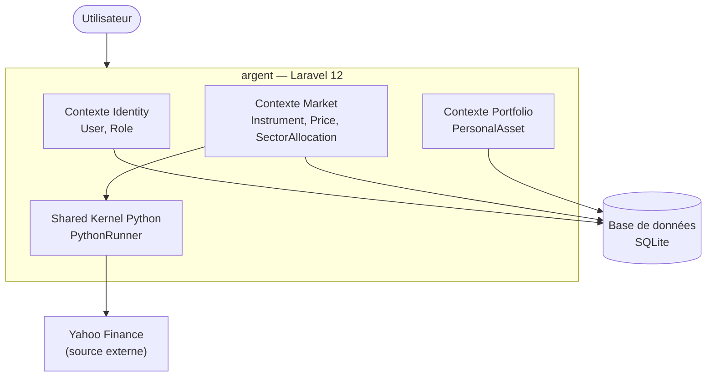
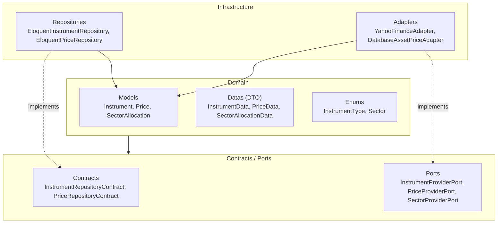

# argent — Documentation technique

Application personnelle de suivi de patrimoine et de finances. Elle agrège des
instruments financiers, leur historique de prix et leurs allocations
sectorielles.

Construite sur **Laravel 12**, l'application est en cours de refonte vers une
architecture **DDD** (Domain-Driven Design) organisée en *bounded contexts* avec
une approche hexagonale (ports & adapters). La couche UI a été retirée avec
Filament ; la racine sert une page d'accueil minimale en attendant une nouvelle
interface (Livewire Flux est disponible).

## Stack technique

| Couche | Technologie | Version | Rôle |
| --- | --- | --- | --- |
| Langage | PHP | `^8.2` | Backend |
| Framework | Laravel | `^12.0` | Socle applicatif |
| Composants réactifs | Livewire Flux | `^2.12` | UI interactive (disponible, non câblée) |
| Serveur applicatif | Laravel Octane | `^2.17` | Serveur haute-performance (Swoole/RoadRunner) |
| Build front | Vite | `^7.0.7` | Bundler, HMR |
| CSS | Tailwind CSS | `^4.2.1` | Styles utilitaires |
| Base de données | SQLite | — | Persistance par défaut (support MySQL/PostgreSQL) |
| Intégration Python | uv + `.venv` | — | Exécution des scripts Yahoo Finance |
| Tests | Pest | `^4.4` | Tests (+ plugins Laravel & Livewire) |
| Analyse statique | Larastan / PHPStan | `^3.0` / `^2.1` | Niveau 2 |
| Formatage | Laravel Pint | `^1.24` | Linting PHP |
| Logs | Pail, Log Viewer | `^1.2.2`, `^3.21` | Monitoring temps réel et viewer web |
| Outillage dev | Laravel Boost | `^2.0` | Assistant dev (MCP, guidelines) |

## Vue d'ensemble de l'architecture DDD

Le code métier est organisé sous `app/Contexts/` en trois *bounded contexts*,
complétés par un *shared kernel* sous `app/Shared/`.

- **Identity** (`app/Contexts/Identity/`) — Authentification et autorisation.
  Modèle `User` (Authenticatable), enum `Role` (Admin/User).
- **Market** (`app/Contexts/Market/`) — Cœur du domaine. Gère les instruments
  financiers (`Instrument`), l'historique de prix (`Price`) et les allocations
  sectorielles (`SectorAllocation`). Implémente l'architecture hexagonale
  complète (contracts, ports, adapters) et s'appuie sur Yahoo Finance comme
  source externe.
- **Portfolio** (`app/Contexts/Portfolio/`) — Actifs personnels non négociables
  (`PersonalAsset` : immobilier, épargne). Partage la table `assets` avec
  Market via un *global scope* sur la colonne `type`.
- **Shared Kernel Python** (`app/Shared/Python/`) — Exécution de scripts Python
  via l'interface `PythonRunner` (implémentation `ProcessPythonRunner`,
  `FakePythonRunner` pour les tests). Sérialisation JSON stdin/stdout,
  value object `PythonResult`.



## Architecture hexagonale d'un context

Le contexte Market illustre le découpage en couches avec inversion de
dépendance : le **Domain** (models, datas, enums) ne dépend que d'abstractions
(**Contracts** pour la persistance, **Ports** pour les sources externes), et
l'**Infrastructure** fournit les implémentations concrètes (**Repositories**,
**Adapters**). Le `MarketProvider` réalise le binding DI des abstractions vers
leurs implémentations.



## Table des matières

| Document | Contenu |
| --- | --- |
| [architecture.md](architecture.md) | Architecture DDD globale, contexts, wiring DI |
| [market-context.md](market-context.md) | Contexte Market : modèle, ports, adapters, intégration Yahoo Finance |
| [data-model.md](data-model.md) | Schéma de base de données et modèles Eloquent |
| [shared-kernel.md](shared-kernel.md) | Shared Kernel Python (PythonRunner, ProcessPythonRunner) |
| [refactor-status.md](refactor-status.md) | État de la refonte DDD et travaux restants |

## Démarrer

### Installation

Le script `setup` installe les dépendances, prépare l'environnement, lance les
migrations et compile les assets :

```bash
composer setup
```

Détail des étapes : `composer install`, copie de `.env` depuis `.env.example`,
`php artisan key:generate`, `php artisan migrate --force`, `npm install`,
`npm run build`.

> Le hook `post-install-cmd` installe `uv` (Astral), crée le `.venv` et installe
> les dépendances Python depuis `storage/python/requirements.txt`.

### Développement

Le script `dev` lance simultanément quatre processus via `concurrently`
(serveur Octane en watch, worker de queue, logs Pail, Vite) :

```bash
composer dev
```

### Tests

```bash
composer test
```

Exécute `php artisan config:clear` puis `php artisan test`. L'environnement de
test utilise SQLite en mémoire (`:memory:`).

### Vérification (lint + tests)

```bash
composer check
```

Lance Pint (`vendor/bin/pint --format agent`) puis la suite de tests en mode
compact.
