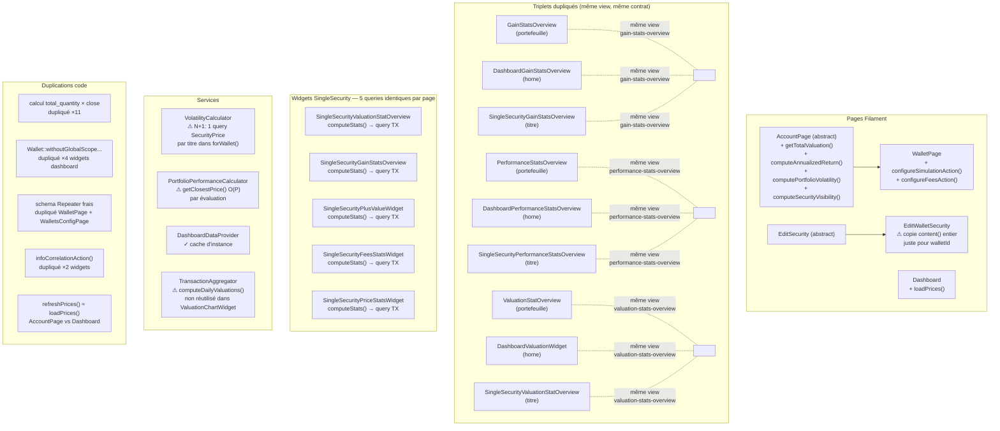
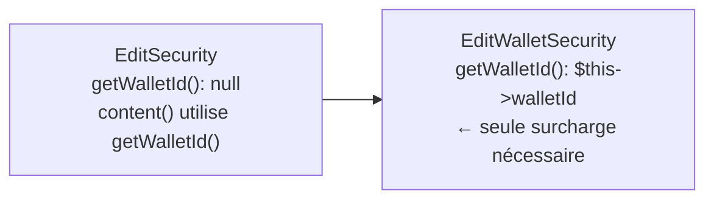
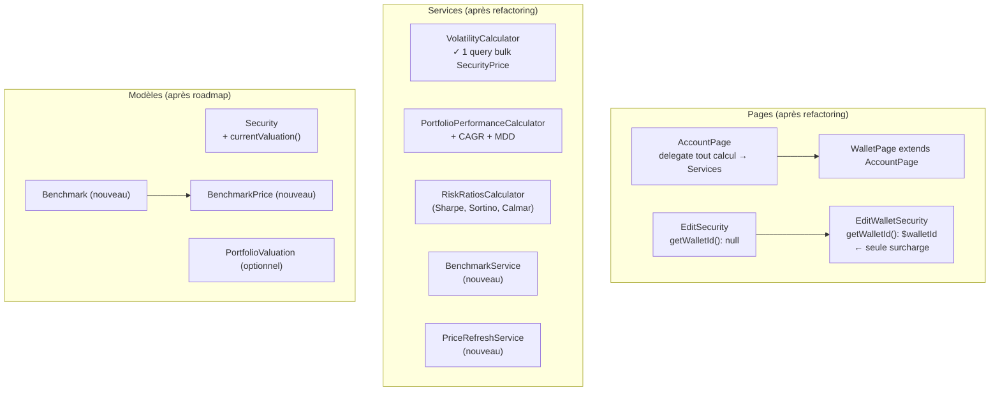

# Guide de Simplification — Architecture Actuelle

Ce document identifie les duplications et complexités à éliminer **avant** ou **pendant** l'implémentation de la roadmap. Travailler sur base saine évite de dupliquer les problèmes existants.

---

## Architecture actuelle



---

## Simplifications prioritaires

### S1 — Corriger le N+1 dans `VolatilityCalculator::forWallet()`

**Problème :** Pour chaque titre dans le portefeuille, une query `SecurityPrice` distincte est exécutée.

**Fichier :** `app/Services/VolatilityCalculator.php`, lignes 57–112

**Fix :**
```php
// Avant : N+1
foreach ($records as $record) {
    $prices = SecurityPrice::query()
        ->where('security_id', $record->id)  // ← une query par titre
        ->orderBy('date')
        ->pluck('close');
}

// Après : 1 query
$ids = $records->pluck('id')->all();
$allPrices = SecurityPrice::query()
    ->whereIn('security_id', $ids)
    ->orderBy('security_id')
    ->orderBy('date')
    ->get(['security_id', 'close'])
    ->groupBy('security_id')
    ->map(fn ($group) => $group->pluck('close')->map(fn ($v) => (float) $v)->values());

foreach ($records as $record) {
    $prices = $allPrices->get($record->id, collect());
    $sigma = $this->annualizedVolatility($prices);
    // ...
}
```

---

### S2 — Supprimer la surcharge de `EditWalletSecurity::content()`

**Problème :** `EditWalletSecurity` copie-colle `content()` en entier juste pour passer `walletId` non-null.

**Fichier :** `app/Filament/Resources/WalletSecurities/Pages/EditWalletSecurity.php`

**Fix :** Ajouter `protected function getWalletId(): ?int { return null; }` dans `EditSecurity`, overrider dans `EditWalletSecurity`, et utiliser `$this->getWalletId()` dans `content()` de la classe parente.



---

### S3 — Extraire `Security::currentValuation()` (duplication ×11)

**Problème :** Le pattern `total_quantity * close` avec null-checks est copié dans 11 fichiers.

**Fix :** Ajouter sur le modèle `Security` (après `scopeForWallet`) :
```php
public function currentValuation(): float
{
    $close = $this->latestPrice?->close;
    if ($close === null || $this->total_quantity === null) {
        return 0.0;
    }
    return (float) $this->total_quantity * (float) $close;
}
```
Puis remplacer les 11 occurrences par `$record->currentValuation()`.

---

### S4 — Uniformiser le chargement des wallets Dashboard (duplication ×4)

**Problème :** 4 widgets Dashboard rechargent les wallets indépendamment au lieu d'utiliser `DashboardDataProvider`.

**Fix :** Utiliser systématiquement `DashboardDataProvider::allSecurities()` partout dans les widgets Dashboard. La query `Wallet::withoutGlobalScope('user')->where('user_id', auth()->id())` ne doit exister qu'à l'intérieur de `DashboardDataProvider`.

---

### S5 — Consolider `computeStats()` dans les widgets SingleSecurity

**Problème :** Quand une page titre est chargée, `computeStats()` (qui query toutes les transactions) est appelée par chaque widget indépendamment — jusqu'à 5 fois pour la même page.

**Option A (simple) :** Utiliser `#[Computed]` de Livewire 4 sur `computeStats()` dans le trait `ComputesSingleSecurityStats` — le résultat sera mémoïsé pour le cycle de rendu.

```php
#[Computed]
protected function computeStats(): array { ... }
```

**Option B (propre) :** Extraire `SingleSecurityStatsService` injecté dans les widgets, avec cache par `security_id` + `wallet_id` sur la request.

---

### S6 — Extraire `PriceRefreshService`

**Problème :** `AccountPage::refreshPrices()` et `Dashboard::loadPrices()` font la même chose (check hasPriceless → fetchAndStorePricesBulk → dispatch `prices-updated`).

**Fix :** Nouveau service `PriceRefreshService::refreshForSecurities(Collection $securities): void`, appelé par les deux pages.

---

### S7 — Extraire le schema Repeater de frais

**Problème :** `WalletPage::configureFeesAction()` et `WalletsConfigPage` ont un schema Repeater identique.

**Fix :** Classe statique `App\Filament\Schemas\WalletFeesSchema::make(): array` retournant le schema Repeater, réutilisée dans les deux endroits.

---

## Plan de refactoring recommandé

```mermaid
gantt
    title Ordre d'exécution des simplifications
    dateFormat X
    axisFormat %s

    section Impact Haut
    S1 VolatilityCalculator N+1     :crit, s1, 0, 2
    S3 Security currentValuation    :s3, 0, 3

    section Impact Moyen
    S2 EditWalletSecurity           :s2, 2, 4
    S4 Wallets Dashboard            :s4, 2, 3
    S5 computeStats SingleSecurity  :s5, 3, 5

    section Impact Faible
    S6 PriceRefreshService          :s6, 4, 6
    S7 WalletFeesSchema             :s7, 4, 6
```



Faire S1 et S3 en priorité avant d'implémenter les features roadmap — elles réduisent le coût de chaque nouvelle feature.

---

## Architecture cible simplifiée


