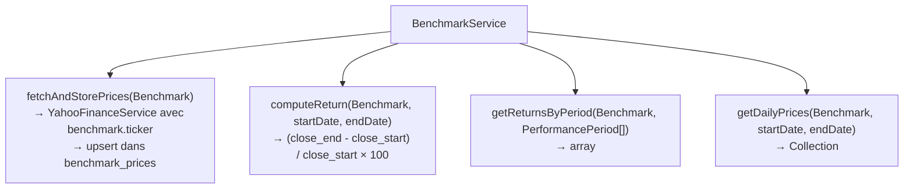
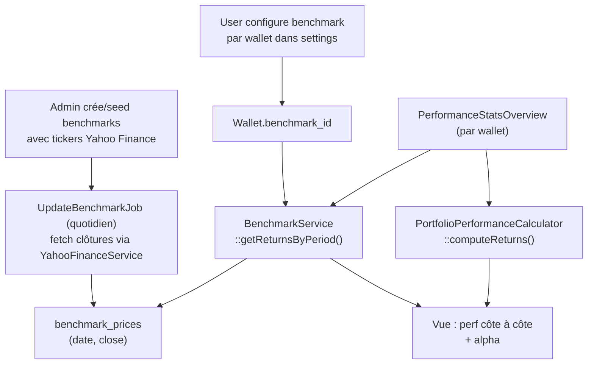

# Implémentation — Performance vs Benchmark

> **Tier 1** — Manque le plus criant  
> **Prérequis :** aucun — nouvelle feature complète  
> **Nouvelles tables :** `benchmarks`, `benchmark_prices` + colonne `benchmark_id` sur `wallets`

---

## Ce qu'on veut

```
Portefeuille vs MSCI World (1 an)

Portefeuille : +12.4 %
MSCI World   : +18.7 %
Alpha        : -6.3 %

[courbe portefeuille --- courbe benchmark sur mêmes périodes]
```

Périodes disponibles : 1M, 3M, 6M, 1Y, depuis ouverture.

---

## Architecture de données

### Nouvelles tables

```mermaid
erDiagram
    WALLETS {
        bigint id PK
        bigint user_id FK
        string name
        bigint benchmark_id FK "nullable — benchmark préféré"
    }

    BENCHMARKS {
        bigint id PK
        string symbol UK "SP500, CAC40, MSCI_WORLD, NASDAQ"
        string name
        string ticker "ticker Yahoo Finance ex: ^GSPC"
        created_at updated_at
    }

    BENCHMARK_PRICES {
        bigint id PK
        bigint benchmark_id FK
        date date
        decimal close
        UNIQUE "benchmark_id, date"
    }

    WALLETS ||--o| BENCHMARKS : "benchmark préféré"
    BENCHMARKS ||--{ BENCHMARK_PRICES : "prix historiques"
```

### Modèles Laravel à créer

**`app/Models/Benchmark.php`**
```php
class Benchmark extends Model
{
    protected $fillable = ['symbol', 'name', 'ticker'];

    public function prices(): HasMany { return $this->hasMany(BenchmarkPrice::class); }
    public function latestPrice(): HasOne { return $this->hasOne(BenchmarkPrice::class)->latestOfMany('date'); }

    public function priceAt(Carbon $date): ?BenchmarkPrice
    {
        return $this->prices()
            ->where('date', '<=', $date)
            ->orderBy('date', 'desc')
            ->first();
    }
}
```

**`app/Models/BenchmarkPrice.php`**
```php
class BenchmarkPrice extends Model
{
    protected $fillable = ['benchmark_id', 'date', 'close'];
    protected $casts = ['date' => 'date', 'close' => 'decimal:4'];

    public function benchmark(): BelongsTo { return $this->belongsTo(Benchmark::class); }
}
```

---

## Seeders — benchmarks par défaut

```php
// database/seeders/BenchmarkSeeder.php
$benchmarks = [
    ['symbol' => 'SP500',      'name' => 'S&P 500',         'ticker' => '^GSPC'],
    ['symbol' => 'MSCI_WORLD', 'name' => 'MSCI World',      'ticker' => 'URTH'],     // ETF proxy
    ['symbol' => 'CAC40',      'name' => 'CAC 40',          'ticker' => '^FCHI'],
    ['symbol' => 'STOXX600',   'name' => 'STOXX Europe 600','ticker' => '^STOXX'],
    ['symbol' => 'NASDAQ',     'name' => 'Nasdaq 100',      'ticker' => '^NDX'],
];
```

---

## Service à créer : `BenchmarkService`

**Fichier :** `app/Services/BenchmarkService.php`



Réutilise `YahooFinanceService` existant (`app/Services/YahooFinanceService.php`) — même interface pour ticker de benchmark que pour ticker de security.

### Calcul du rendement benchmark

```php
public function computeReturn(Benchmark $benchmark, Carbon $start, Carbon $end): ?float
{
    $startPrice = $benchmark->priceAt($start)?->close;
    $endPrice   = $benchmark->priceAt($end)?->close;

    if ($startPrice === null || $endPrice === null || $startPrice == 0) {
        return null;
    }

    return ((float) $endPrice - (float) $startPrice) / (float) $startPrice * 100;
}
```

---

## Job à créer : `UpdateBenchmarkJob`

**Fichier :** `app/Jobs/UpdateBenchmarkJob.php`

```php
class UpdateBenchmarkJob implements ShouldQueue
{
    public function __construct(public readonly Benchmark $benchmark) {}

    public function handle(BenchmarkService $benchmarkService): void
    {
        $benchmarkService->fetchAndStorePrices($this->benchmark);
    }
}
```

Planifier dans `routes/console.php` :
```php
Schedule::job(fn() => Benchmark::all()->each(fn ($b) => dispatch(new UpdateBenchmarkJob($b))))
    ->dailyAt('19:00')
    ->weekdays();
```

---

## UI — Sélection du benchmark

### Dans les settings du wallet (`WalletsConfigPage` ou `WalletPage`)

Ajouter un champ `Select` Flux :
```blade
<flux:select wire:model="benchmarkId" label="Benchmark de référence">
    <flux:select.option value="">Aucun</flux:select.option>
    @foreach($benchmarks as $b)
        <flux:select.option value="{{ $b->id }}">{{ $b->name }}</flux:select.option>
    @endforeach
</flux:select>
```

### Dans `PerformanceStatsOverview`

Enrichir la vue `performance-stats-overview.blade.php` pour afficher la comparaison :

```
1M    3M    6M    1Y    ...
Portefeuille : +12.4%  +18.3%  +9.2%  +24.1%
MSCI World   : +8.7%   +14.1%  +12.0% +18.7%  (si benchmark configuré)
Alpha        : +3.7%   +4.2%   -2.8%  +5.4%
```

---

## Flow complet



---

## Checklist d'implémentation

```
[ ] Migration : create_benchmarks_table
[ ] Migration : create_benchmark_prices_table
[ ] Migration : add_benchmark_id_to_wallets_table
[ ] Modèle Benchmark + BenchmarkPrice
[ ] Seeder BenchmarkSeeder (5 benchmarks par défaut)
[ ] BenchmarkService::fetchAndStorePrices() + computeReturn() + getReturnsByPeriod()
[ ] UpdateBenchmarkJob
[ ] Planification dans routes/console.php
[ ] UI sélection benchmark dans WalletsConfigPage
[ ] Enrichir PerformanceStatsOverview (widget + vue Blade)
[ ] Tests BenchmarkServiceTest
[ ] vendor/bin/pint --dirty
```
