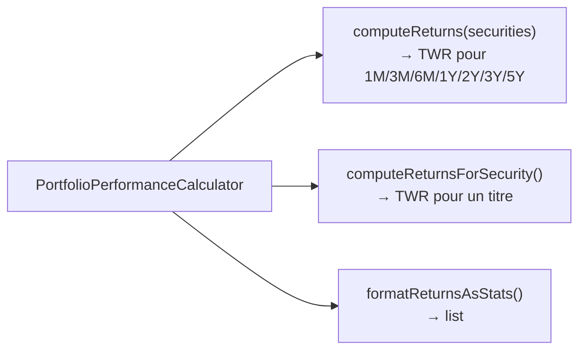
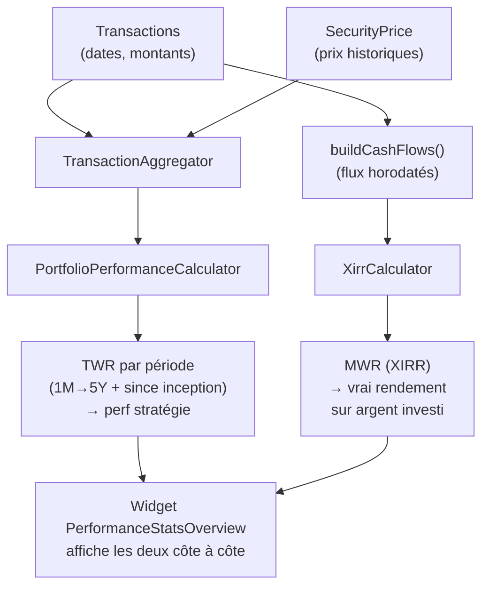

# Implémentation — CAGR, TWR depuis ouverture et MWR (XIRR)

> **Tier 1** — Manque énorme (CAGR) + Différenciateur DCA (TWR vs MWR)  
> **Prérequis :** `PortfolioPerformanceCalculator` déjà fonctionnel  
> **Nouvelles tables :** aucune

---

## Vocabulaire

| Acronyme | Nom | Question |
|---|---|---|
| **CAGR** | Compound Annual Growth Rate | "Quel est mon rendement annualisé depuis l'ouverture ?" |
| **TWR** | Time-Weighted Return | "Quelle est la perf intrinsèque de ma stratégie, indépendamment du timing de mes apports ?" |
| **MWR / XIRR** | Money-Weighted Return | "Quel est le vrai rendement sur l'argent que j'ai investi ?" |

### Différence TWR vs MWR — exemple DCA

```
Jan : investi 1 000€ → portefeuille monte +50% → vaut 1 500€
Fev : investi 10 000€ supplémentaires (mauvais timing, marché haut)
Mar : portefeuille baisse -30%

TWR  = (+50%) × (-30%) - 1 = -5%    ← perf de la stratégie
MWR  ≈ -24%                          ← ton vrai rendement (tu as beaucoup investi au plus haut)
```

---

## Ce qui existe déjà



`AccountPage::computeAnnualizedReturn()` calcule **déjà un CAGR approximatif** depuis la première transaction — mais il est uniquement utilisé pour pré-remplir la simulation Monte Carlo. Il n'est pas affiché comme stat.

---

## 1. CAGR depuis ouverture

### Formule

```
CAGR = (valeur_finale / valeur_initiale)^(1 / n_années) - 1
```

Où `valeur_initiale` = premier dépôt (ou première valorisation après la première transaction).

### Implémentation

La logique existe dans `AccountPage::computeAnnualizedReturn()` (lignes ~227–263). À extraire dans `PortfolioPerformanceCalculator` :

```php
// Ajouter dans PortfolioPerformanceCalculator
public function computeCagr(Collection $securities): ?float
{
    // 1. Date de la première transaction
    $firstTransaction = Transaction::query()
        ->whereIn('security_id', $securities->pluck('id'))
        ->orderBy('date')
        ->first();

    if ($firstTransaction === null) {
        return null;
    }

    $firstDate = Carbon::parse($firstTransaction->date);
    $years = $firstDate->diffInDays(now()) / 365.25;

    if ($years < 0.5) {
        return null;  // Pas assez d'historique
    }

    // 2. Valeur investie initiale + valorisation actuelle
    $totalInvested = $securities->sum(fn ($s) => (float) ($s->total_invested ?? 0));
    $valuation = $securities->sum(fn ($s) => $s->currentValuation()); // après S3 refactoring

    if ($totalInvested <= 0) {
        return null;
    }

    return (($valuation / $totalInvested) ** (1 / $years) - 1) * 100;
}
```

### Où afficher

Dans `PerformanceStatsOverview` — ajouter "Depuis ouverture (annualisé)" à la liste des périodes scrollables.

---

## 2. TWR depuis ouverture — PerformancePeriod manquante

`PerformancePeriod` contient : 1m, 3m, 6m, 1y, 2y, 3y, 5y. Il manque **`since_inception`** (depuis l'ouverture du portefeuille).

### Fix

```php
// app/Enums/PerformancePeriod.php
enum PerformancePeriod: string
{
    case OneMonth    = '1m';
    case ThreeMonths = '3m';
    case SixMonths   = '6m';
    case OneYear     = '1y';
    case TwoYears    = '2y';
    case ThreeYears  = '3y';
    case FiveYears   = '5y';
    case SinceInception = 'since_inception';  // ← ajouter

    public function startDate(?Collection $securities = null): ?Carbon
    {
        if ($this === self::SinceInception) {
            // Retourner la date de la première transaction
            return Transaction::query()
                ->when($securities, fn ($q) => $q->whereIn('security_id', $securities->pluck('id')))
                ->orderBy('date')
                ->value('date')
                ?->toCarbon();
        }
        // ... cases existants
    }
}
```

`PortfolioPerformanceCalculator::computeReturns()` traitera `SinceInception` automatiquement car il itère sur tous les `PerformancePeriod::cases()`.

---

## 3. MWR (XIRR)

### Formule XIRR

XIRR = IRR sur flux de trésorerie horodatés. Pas de formule fermée — résolution numérique par Newton-Raphson ou bisection.

```
Flux = [-apport_1, -apport_2, ..., +valeur_finale_aujourd'hui]
Dates = [date_1, date_2, ..., aujourd'hui]

XIRR : trouver r tel que Σ(CF_i / (1+r)^((date_i - date_0)/365)) = 0
```

### Service à créer : `XirrCalculator`

**Fichier :** `app/Services/XirrCalculator.php`

```php
namespace App\Services;

class XirrCalculator
{
    private const MAX_ITERATIONS = 1000;
    private const PRECISION = 1e-7;

    /**
     * @param list<array{date: Carbon, amount: float}> $cashFlows
     *   amount > 0 = entrée d'argent (valorisation finale)
     *   amount < 0 = sortie (investissement)
     */
    public function compute(array $cashFlows): ?float
    {
        if (count($cashFlows) < 2) {
            return null;
        }

        $rate = 0.1;  // Estimation initiale 10%
        $origin = $cashFlows[0]['date'];

        for ($i = 0; $i < self::MAX_ITERATIONS; $i++) {
            $f  = $this->npv($cashFlows, $rate, $origin);
            $df = $this->npvDerivative($cashFlows, $rate, $origin);

            if (abs($df) < self::PRECISION) {
                return null;
            }

            $newRate = $rate - $f / $df;

            if (abs($newRate - $rate) < self::PRECISION) {
                return $newRate * 100;  // En %
            }

            $rate = $newRate;
        }

        return null;  // Non convergé
    }

    private function npv(array $cashFlows, float $rate, Carbon $origin): float
    {
        $sum = 0.0;
        foreach ($cashFlows as $cf) {
            $years = $origin->diffInDays($cf['date']) / 365.0;
            $sum += $cf['amount'] / ((1 + $rate) ** $years);
        }
        return $sum;
    }

    private function npvDerivative(array $cashFlows, float $rate, Carbon $origin): float
    {
        $sum = 0.0;
        foreach ($cashFlows as $cf) {
            $years = $origin->diffInDays($cf['date']) / 365.0;
            if (abs(1 + $rate) > self::PRECISION) {
                $sum -= $years * $cf['amount'] / ((1 + $rate) ** ($years + 1));
            }
        }
        return $sum;
    }
}
```

### Construire les flux pour un wallet

```php
// Dans un service ou widget
public function buildCashFlows(Wallet $wallet): array
{
    $transactions = Transaction::query()
        ->where('wallet_id', $wallet->id)
        ->orderBy('date')
        ->get();

    $cashFlows = [];

    foreach ($transactions as $tx) {
        $amount = match ($tx->type) {
            TransactionType::Buy  => -((float) $tx->quantity * (float) $tx->unit_price + (float) $tx->fees),
            TransactionType::Sell => +((float) $tx->quantity * (float) $tx->unit_price - (float) $tx->fees),
        };
        $cashFlows[] = ['date' => Carbon::parse($tx->date), 'amount' => $amount];
    }

    // Ajouter la valorisation actuelle comme dernier flux positif
    $valuation = /* valorisation actuelle du wallet */ ;
    $cashFlows[] = ['date' => now(), 'amount' => $valuation];

    return $cashFlows;
}
```

---

## Flow complet TWR vs MWR



---

## Affichage suggéré

```
Rendement annualisé depuis ouverture
  TWR : +14.2 %    MWR : +11.8 %
  ℹ TWR = perf. de votre stratégie  |  MWR = rendement sur votre argent investi
```

Tooltip pédagogique sur chaque icône ℹ.

---

## Checklist d'implémentation

```
[ ] Ajouter PerformancePeriod::SinceInception dans app/Enums/PerformancePeriod.php
[ ] Ajouter computeCagr() dans PortfolioPerformanceCalculator
[ ] Créer XirrCalculator (app/Services/XirrCalculator.php)
[ ] Tests XirrCalculatorTest (cas simples : dépôt unique, DCA régulier)
[ ] Enrichir PerformanceStatsOverview : afficher TWR since inception + MWR
[ ] Mettre à jour vue performance-stats-overview.blade.php
[ ] Tests PortfolioPerformanceCalculatorTest::computeCagr
[ ] vendor/bin/pint --dirty
```
