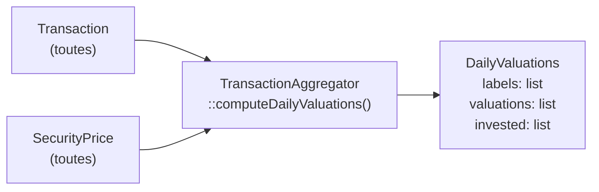
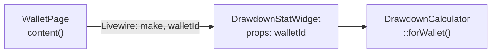

# Implémentation — Max Drawdown

> **Tier 1** — Indicateur critique absent  
> **Prérequis :** `TransactionAggregator::computeDailyValuations()` déjà fonctionnel  
> **Nouvelles tables :** aucune (optionnellement `portfolio_valuations` pour la perf)

---

## Ce qu'on veut afficher

| Indicateur | Valeur exemple | Description |
|---|---|---|
| **MDD historique** | `-34.2 %` | Pire perte peak-to-trough depuis ouverture |
| **Drawdown actuel** | `-8.7 %` | Distance entre la valorisation actuelle et l'ATH |
| **Time underwater** | `47 jours` | Depuis combien de jours sous l'ATH |
| **Peak date** | `12 Jan 2024` | Date du dernier plus haut |

---

## Données disponibles

Les valorisations journalières sont déjà calculables :



`DailyValuations` contient exactement la time series nécessaire pour calculer le drawdown.

---

## Algorithme

### Max Drawdown

```
peak = 0
mdd = 0
foreach valuation_i in daily_valuations:
    peak = max(peak, valuation_i)
    drawdown = (peak - valuation_i) / peak
    mdd = max(mdd, drawdown)
return -mdd × 100  (en %)
```

### Drawdown actuel + Time underwater

```
peak = max(daily_valuations)
peak_index = index_of_max(daily_valuations)
current = last(daily_valuations)

current_drawdown = (peak - current) / peak × 100

# Time underwater = depuis le dernier pic local (pas le pic global)
last_local_peak_index = find_last_index where valuation[i] == peak since current
time_underwater = today - date_of_last_local_peak
```

---

## Service à créer : `DrawdownCalculator`

**Fichier :** `app/Services/DrawdownCalculator.php`

```php
namespace App\Services;

use App\Data\DrawdownResult;
use App\Models\Wallet;
use App\Services\TransactionAggregator;
use App\Services\PortfolioPerformanceCalculator;

class DrawdownCalculator
{
    public function __construct(
        private readonly TransactionAggregator $aggregator,
        private readonly PortfolioPerformanceCalculator $calculator,
    ) {}

    public function forWallet(Wallet $wallet): DrawdownResult
    {
        // 1. Reconstruire la time series de valorisation
        $dailyValuations = $this->buildDailyValuations($wallet);

        if (count($dailyValuations) < 2) {
            return DrawdownResult::empty();
        }

        // 2. Calculer MDD
        $mdd = $this->computeMdd($dailyValuations['valuations']);

        // 3. Calculer drawdown actuel + ATH + time underwater
        $current = $this->computeCurrentDrawdown($dailyValuations);

        return new DrawdownResult(
            mddPercent: $mdd,
            currentDrawdownPercent: $current['drawdown'],
            peakValue: $current['peak'],
            peakDate: $current['peakDate'],
            timeUnderwaterDays: $current['daysUnderwater'],
        );
    }

    /** @return array{valuations: list<float>, labels: list<string>} */
    private function buildDailyValuations(Wallet $wallet): array { ... }

    /** @param list<float> $valuations */
    private function computeMdd(array $valuations): float { ... }

    /** @param array{valuations: list<float>, labels: list<string>} $data */
    private function computeCurrentDrawdown(array $data): array { ... }
}
```

### Data Transfer Object : `DrawdownResult`

**Fichier :** `app/Data/DrawdownResult.php`

```php
readonly class DrawdownResult
{
    public function __construct(
        public float $mddPercent,
        public float $currentDrawdownPercent,
        public float $peakValue,
        public ?string $peakDate,
        public int $timeUnderwaterDays,
    ) {}

    public static function empty(): self
    {
        return new self(0.0, 0.0, 0.0, null, 0);
    }
}
```

---

## Où afficher

### Sur la page portefeuille (AccountPage)

Nouveau widget `DrawdownStatWidget` dans la section principale :



Placement suggéré : entre `ValuationStatOverview` et `PerformanceStatsOverview`.

### Sur le dashboard (Dashboard)

Nouveau widget `DashboardDrawdownWidget` (ou enrichir un widget existant) — calcule le MDD agrégé de tous les wallets (le pire MDD parmi tous, ou le MDD du portefeuille global).

---

## Performance : table de snapshots (optionnelle)

`computeDailyValuations()` charge **toutes** les transactions + **tous** les prix historiques en mémoire. Pour un portefeuille de 5 ans avec 20 titres, cela représente potentiellement 20 × 365 × 5 = 36 500 rows.

Si les temps de réponse sont insuffisants (> 3s), créer :

```sql
CREATE TABLE portfolio_valuations (
    id          BIGINT PRIMARY KEY AUTO_INCREMENT,
    wallet_id   BIGINT NOT NULL,
    date        DATE NOT NULL,
    valuation   DECIMAL(14, 2) NOT NULL,
    invested    DECIMAL(14, 2) NOT NULL,
    UNIQUE KEY  uq_wallet_date (wallet_id, date),
    INDEX       idx_wallet_id (wallet_id),
    FOREIGN KEY (wallet_id) REFERENCES wallets(id) ON DELETE CASCADE
);
```

Ce snapshot est rempli :
- Par un job quotidien `SnapshotPortfolioValuationsJob`
- Et recalculé (pour le wallet concerné) à chaque ajout/modification de transaction via l'Observer

---

## Checklist d'implémentation

```
[ ] Créer DrawdownResult DTO (app/Data/DrawdownResult.php)
[ ] Créer DrawdownCalculator service (app/Services/DrawdownCalculator.php)
[ ] Tests : php artisan make:test --pest Services/DrawdownCalculatorTest
[ ] Créer DrawdownStatWidget (app/Filament/Widgets/Securities/DrawdownStatWidget.php)
[ ] Créer vue Blade drawdown-stat.blade.php
[ ] Monter le widget dans AccountPage::content()
[ ] Créer DashboardDrawdownWidget pour la home (optionnel MVP)
[ ] (optionnel) Migration portfolio_valuations + SnapshotJob
[ ] vendor/bin/pint --dirty
```
