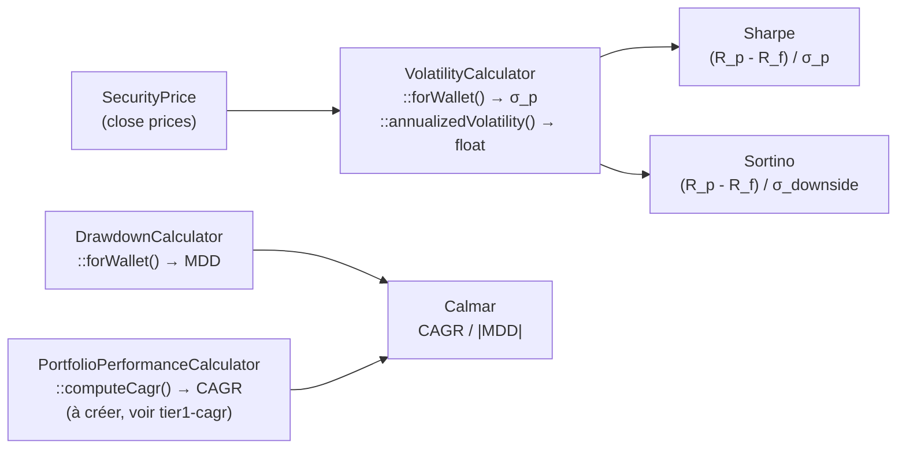
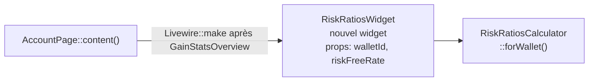

# Implémentation — Ratios de risque ajusté (Sharpe, Sortino, Calmar)

> **Tier 2** — Panel risque avancé  
> **Prérequis :** `DrawdownCalculator` (pour Calmar), `VolatilityCalculator` (pour Sharpe/Sortino)  
> **Nouvelles tables :** aucune

---

## Les trois ratios

| Ratio | Formule | Interprétation |
|---|---|---|
| **Sharpe** | `(R_p - R_f) / σ_p` | Rendement excédentaire par unité de risque total. > 1 = bon, > 2 = excellent |
| **Sortino** | `(R_p - R_f) / σ_downside` | Comme Sharpe mais pénalise seulement la volatilité baissière |
| **Calmar** | `CAGR / \|MDD\|` | Rendement annualisé par rapport à la pire perte historique |

**`R_f`** = taux sans risque (ex: €STR, OAT 10 ans, configurable par l'utilisateur).  
**`σ_p`** = volatilité annualisée (déjà dans `VolatilityCalculator`).  
**`σ_downside`** = écart-type des rendements **négatifs** seulement × √252.

---

## Données disponibles



La seule donnée non encore calculée est **σ_downside** (volatilité des rendements négatifs).

---

## Algorithme σ_downside (Sortino)

```
rendements_journaliers = [log(close_t / close_t-1) pour chaque jour]
rendements_negatifs = [r pour r in rendements si r < 0]

σ_downside = sqrt(Σ(r²) / n) × √252 × 100
```

Note : on utilise `r²` plutôt que `(r - mean)²` car la cible est 0 (on pénalise les baisses par rapport à 0).

---

## Service à créer : `RiskRatiosCalculator`

**Fichier :** `app/Services/RiskRatiosCalculator.php`

```php
namespace App\Services;

use App\Data\RiskRatiosResult;
use App\Models\Wallet;
use Illuminate\Support\Collection;

class RiskRatiosCalculator
{
    public function __construct(
        private readonly VolatilityCalculator $volatilityCalculator,
        private readonly DrawdownCalculator $drawdownCalculator,
        private readonly PortfolioPerformanceCalculator $performanceCalculator,
    ) {}

    public function forWallet(Wallet $wallet, float $riskFreeRate = 0.03): RiskRatiosResult
    {
        $securities = Security::query()->forWallet($wallet)->with('latestPrice')->get();

        $annualReturn = $this->performanceCalculator->computeCagr($securities) ?? 0.0;
        $volatility   = $this->volatilityCalculator->forWallet($wallet);   // déjà en %
        $drawdown     = $this->drawdownCalculator->forWallet($wallet);

        $excess = $annualReturn - ($riskFreeRate * 100);  // Les deux en %

        $sharpe  = $this->computeSharpe($excess, $volatility);
        $sortino = $this->computeSortino($wallet, $excess);
        $calmar  = $this->computeCalmar($annualReturn, $drawdown->mddPercent);

        return new RiskRatiosResult(
            sharpe: $sharpe,
            sortino: $sortino,
            calmar: $calmar,
            riskFreeRate: $riskFreeRate,
        );
    }

    private function computeSharpe(float $excess, float $volatility): ?float
    {
        if ($volatility <= 0) {
            return null;
        }
        return round($excess / $volatility, 2);
    }

    private function computeSortino(Wallet $wallet, float $excess): ?float
    {
        $downsideVol = $this->computeDownsideVolatility($wallet);
        if ($downsideVol === null || $downsideVol <= 0) {
            return null;
        }
        return round($excess / $downsideVol, 2);
    }

    private function computeCalmar(float $cagr, float $mdd): ?float
    {
        if ($mdd <= 0) {
            return null;
        }
        return round($cagr / $mdd, 2);
    }

    private function computeDownsideVolatility(Wallet $wallet): ?float
    {
        // Charger tous les prix historiques du portefeuille (même logique que VolatilityCalculator)
        // Calculer rendements journaliers pondérés
        // Filtrer seulement les rendements < 0
        // σ_downside = sqrt(Σ(r²) / n) × √252 × 100
        // ...
        return null; // placeholder
    }
}
```

### DTO : `RiskRatiosResult`

**Fichier :** `app/Data/RiskRatiosResult.php`

```php
readonly class RiskRatiosResult
{
    public function __construct(
        public ?float $sharpe,
        public ?float $sortino,
        public ?float $calmar,
        public float $riskFreeRate,
    ) {}

    public static function empty(): self
    {
        return new self(null, null, null, 0.03);
    }
}
```

---

## Taux sans risque configurable

Ajouter une colonne `risk_free_rate` sur `wallets` (ou au niveau `users`) :

```sql
ALTER TABLE wallets ADD COLUMN risk_free_rate DECIMAL(5,4) DEFAULT 0.03;
```

Ou gérer via `config('finance.default_risk_free_rate')` pour ne pas migrer.

---

## Interprétation — référentiels

| Sharpe | Interprétation |
|---|---|
| < 0 | Sous-performance vs taux sans risque |
| 0 – 1 | Acceptable |
| 1 – 2 | Bon |
| > 2 | Excellent |

Afficher une icône colorée selon seuil :
```
Sharpe 1.4  🟡   Sortino 1.8  🟢   Calmar 0.9  🟡
```

---

## Vue "Risque" — layout suggéré

```
┌─────────────────────────────────────────────────────┐
│  Risque ajusté              Taux sans risque : 3.0% │
│                                                      │
│  Volatilité   Max Drawdown  Sharpe  Sortino  Calmar  │
│  16.2 %       -28.4 %       1.2     1.8      0.7     │
│                             🟡       🟢        🟡     │
└─────────────────────────────────────────────────────┘
```

---

## Placement dans l'UI



Ou enrichir `GainStatsOverview` pour y inclure les ratios (section "Risque" dans la même carte).

---

## Checklist d'implémentation

```
[ ] Prérequis : DrawdownCalculator implémenté (voir tier1-drawdown.md)
[ ] Prérequis : computeCagr() dans PortfolioPerformanceCalculator (voir tier1-cagr-twr-mwr.md)
[ ] Créer RiskRatiosResult DTO (app/Data/RiskRatiosResult.php)
[ ] Créer RiskRatiosCalculator (app/Services/RiskRatiosCalculator.php)
    [ ] computeDownsideVolatility() (réutilise logique VolatilityCalculator)
    [ ] computeSharpe(), computeSortino(), computeCalmar()
[ ] Tests RiskRatiosCalculatorTest
[ ] Migration risk_free_rate sur wallets (ou config)
[ ] Créer RiskRatiosWidget (app/Filament/Widgets/Securities/RiskRatiosWidget.php)
[ ] Vue Blade risk-ratios.blade.php avec couleurs par seuil
[ ] Monter widget dans AccountPage::content()
[ ] vendor/bin/pint --dirty
```
