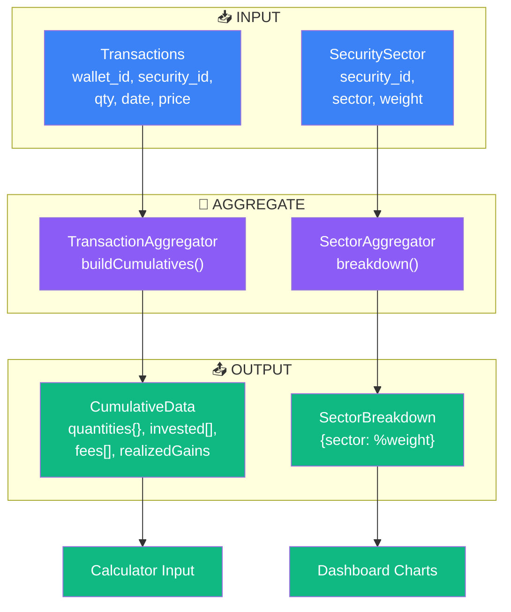

# Aggregators - Argent

Time series & breakdown services. Transform raw transactions/sectors into calculated data.

---

## 🎯 Architecture



---

## 📊 TransactionAggregator

**Purpose:** Convert raw transactions → time series of quantities + invested.

### buildCumulatives()

**Input:**
```
Transactions (ordered by date):
- 2024-01-15: Buy 10 AAPL @ 150€
- 2024-02-01: Buy 5 AAPL @ 155€
- 2024-03-15: Sell 3 AAPL @ 160€
```

**Output:**
```json
{
  "quantities": {
    "AAPL": [
      {"date": "2024-01-15", "value": 10},
      {"date": "2024-02-01", "value": 15},
      {"date": "2024-03-15", "value": 12}
    ]
  },
  "invested": [
    {"date": "2024-01-15", "value": 1500},
    {"date": "2024-02-01", "value": 2275},
    {"date": "2024-03-15", "value": 2275}
  ],
  "fees": [
    {"date": "2024-01-15", "value": 2.50},
    {"date": "2024-02-01", "value": 5.00},
    {"date": "2024-03-15", "value": 3.50}
  ],
  "realizedGains": 15.00
}
```

**Algorithm:**
1. Sort transactions by date
2. For each transaction:
   - If Buy: add quantity to running total
   - If Sell: subtract quantity; compute realized_gain
3. Build time series per security + aggregate
4. Track invested amount + fees accumulation

**Key:** Handles multiple securities, fee deduction, realized gain tracking

**Used by:**
- PortfolioPerformanceCalculator (input to returns)
- Dashboard (time series chart data)
- WalletPage (position history)

---

## 🏢 SectorAggregator

**Purpose:** Portfolio breakdown by sector. Risk analysis.

### breakdown()

**Input:**
```
Current Holdings:
- AAPL (Technology): 10 shares @ 185€
- JNJ (Healthcare): 5 shares @ 150€
- JPM (Financials): 8 shares @ 120€

SecuritySector weights:
- AAPL: {Technology: 1.0}
- JNJ: {Healthcare: 0.95, Pharma: 0.05}
- JPM: {Financials: 1.0}
```

**Output:**
```json
{
  "Technology": {
    "weight": 0.42,
    "securities": ["AAPL"],
    "value": 1850.00
  },
  "Healthcare": {
    "weight": 0.17,
    "securities": ["JNJ"],
    "value": 750.00
  },
  "Financials": {
    "weight": 0.27,
    "securities": ["JPM"],
    "value": 960.00
  }
}
```

**Algorithm:**
1. Load current holdings (qty × current_price) per security
2. For each holding, fetch SecuritySector classifications
3. Aggregate weights by sector
4. Normalize to portfolio total
5. Return sector breakdown

**Key:** Handles multi-sector securities, weight normalization

**Used by:**
- Dashboard (sector pie chart)
- RiskAnalysis (portfolio concentration)
- AllocationProfile rebalancing (sector constraints)

---

## 📊 Data Contracts

### CumulativeData
```json
{
  "quantities": {
    "[security_id]": [
      {"date": "YYYY-MM-DD", "value": number}
    ]
  },
  "invested": [
    {"date": "YYYY-MM-DD", "value": decimal(2)}
  ],
  "fees": [
    {"date": "YYYY-MM-DD", "value": decimal(2)}
  ],
  "realizedGains": decimal(2)
}
```

**When Created:** PortfolioPerformanceCalculator.computeReturns()
**Why:** Time series input for return calculation

---

### SectorBreakdown
```json
{
  "[sector_name]": {
    "weight": decimal(0-1),
    "securities": [security_ids],
    "value": decimal(2)
  }
}
```

**When Created:** SectorAggregator.breakdown()
**Why:** Dashboard sector chart + risk analysis

---

## 🔗 Integration Points

| Component | Method | Input | Output |
|-----------|--------|-------|--------|
| PortfolioPerformanceCalculator | `—` (receives as param) | CumulativeData | PerformanceMetrics |
| Dashboard | `sector()` | Holdings + SecuritySector | SectorBreakdown |
| Rebalancing | `bySektor()` | Allocation + holdings | Suggestions |

---

## ⚡ Performance Notes

- **TransactionAggregator:** O(n log n) sort + O(n) iteration = O(n log n)
- **SectorAggregator:** O(s × holdings) where s = unique sectors (typically <15)
- **Caching:** CumulativeData cached per wallet daily
- **Refresh:** On transaction create/edit, recompute that wallet's cache

---

## ✅ Edge Cases

| Case | Behavior |
|------|----------|
| No transactions | Empty quantities, invested=[0] |
| All sells (zero qty) | Position closed, tracked in realizedGains |
| Multi-sector security | Weight distributed across sectors |
| Missing SecuritySector | Default to "Other" |
| Future transaction date | Warning, aggregated from max(date) |
