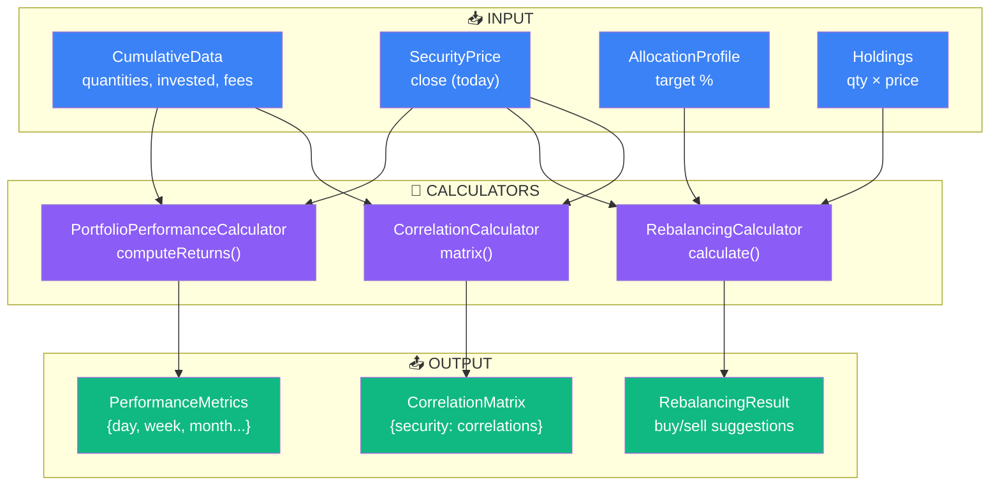

# Calculators - Argent

Business logic services. Compute returns, rebalancing, correlation.

---

## 🎯 Architecture



---

## 💰 PortfolioPerformanceCalculator

**Purpose:** Compute returns (%) by period. Valuation at multiple dates.

### computeReturns()

**Input:**
```
CumulativeData {
  quantities: {AAPL: [{date, value}]},
  invested: [{date, value}],
  fees: [{date, value}],
  realizedGains: 500.00
}

SecurityPrice: {AAPL: {2024-01-15: {close: 150}, 2024-04-30: {close: 185}}}
Current date: 2024-04-30
```

**Output:**
```json
{
  "day": 0.5,
  "week": 2.3,
  "month": 5.1,
  "quarter": 12.4,
  "year": 25.6,
  "ytd": 15.2,
  "all_time": 45.8
}
```

**Algorithm:**
```
For each period P in [day, week, month, ...]:
  date_P = today - P
  qty_P = cumulative_quantities[date_P]
  price_P = securityPrice[date_P].close
  value_P = qty_P × price_P
  invested_P = cumulative_invested[date_P]
  fees_P = cumulative_fees[date_P]
  
  current_value = qty_today × price_today
  net_invested = invested_P - fees_P
  unrealized = current_value - net_invested
  realized = realizedGains (from sold positions)
  
  return% = (unrealized + realized) / net_invested × 100
```

**Formula:**
```
Return% = ((Current_Value + Realized_Gain) - Invested) / Invested × 100
```

**Key Features:**
- Multi-period (day/week/month/quarter/year/ytd/all-time)
- Handles fees deduction (reduces invested base)
- Separates realized (sold) vs unrealized (held) gains
- Handles portfolio growth (DCA impact factored via invested)

**Used by:**
- Dashboard (main returns widget)
- WalletPage (wallet-level returns)
- Performance trend chart

---

## 🔄 RebalancingCalculator

**Purpose:** Generate buy/sell suggestions to match allocation profile.

### calculate()

**Input:**
```
Profile: {AAPL: 20%, MSFT: 30%, BND: 50%}
Holdings: {
  AAPL: 10 shares @ 185€ = 1850€ (15%),
  MSFT: 5 shares @ 420€ = 2100€ (18%),
  BND: 80 shares @ 85€ = 6800€ (57%)
}
Available cash: 1000€
Portfolio value: 10750€
```

**Output:**
```json
{
  "items": [
    {
      "security_id": 123,
      "name": "Apple",
      "price": 185.64,
      "quantity_held": 10,
      "current_value": 1856.40,
      "current_percentage": 17.3,
      "target_percentage": 20.0,
      "shortfall": 282.50,
      "shares_to_buy": 2,
      "buy_cost": 371.28,
      "new_value": 2227.68,
      "new_percentage": 20.7
    }
  ],
  "remainder": 628.72,
  "total_invested": 10750.00
}
```

**Algorithm:**
```
For each allocation item in profile:
  target_value = portfolio_value × target%
  current_value = qty_held × price_today
  shortfall = target_value - current_value
  
  If shortfall > 0:
    shares_to_buy = floor(shortfall / price)
    buy_cost = shares_to_buy × price
    add to suggestions (sort by shortfall DESC)
  Else if shortfall < 0:
    shares_to_sell = ceil(abs(shortfall) / price)
    proceeds = shares_to_sell × price

Greedy allocate:
  remaining_cash = available_cash
  for each sorted_item:
    if remaining_cash >= item.buy_cost:
      Execute buy
      remaining_cash -= buy_cost
```

**Key:**
- Greedy allocation (most underweighted first)
- Handles tie-breaking (equal shortfall → by target%)
- Respects available cash (no margin)
- Shows before/after percentages

**Used by:**
- RebalancingPage (user decision support)
- PortfolioOptimizer (systematic rebalancing)

---

## 📊 CorrelationCalculator

**Purpose:** Asset correlation matrix. Diversification analysis.

### matrix()

**Input:**
```
Holdings: [AAPL, MSFT, BND]
Period: 12 months
Price history: {security_id: [{date, close}]}
```

**Output:**
```json
{
  "correlations": [
    [1.0, 0.68, -0.12],
    [0.68, 1.0, -0.15],
    [-0.12, -0.15, 1.0]
  ],
  "securities": ["AAPL", "MSFT", "BND"],
  "period_days": 365
}
```

**Algorithm:**
```
For each pair (i, j):
  returns_i = [log(price[t] / price[t-1])]  // daily log returns
  returns_j = [log(price[t] / price[t-1])]
  
  correlation[i][j] = cov(returns_i, returns_j) / (std(returns_i) × std(returns_j))
  
correlation matrix is symmetric:
  correlation[i][j] = correlation[j][i]
  diagonal = 1.0 (self-correlation)
```

**Interpretation:**
| Correlation | Meaning |
|-------------|---------|
| +1.0 | Perfect positive (move together) |
| +0.5 | Moderate positive correlation |
| 0.0 | No correlation |
| -0.5 | Moderate negative (offset risk) |
| -1.0 | Perfect negative (true hedge) |

**Used by:**
- Dashboard (diversification widget)
- RiskAnalysis (portfolio redundancy)
- AllocationOptimizer (choose uncorrelated assets)

---

## 📈 Data Contracts

### PerformanceMetrics
```json
{
  "day": float(%),
  "week": float(%),
  "month": float(%),
  "quarter": float(%),
  "year": float(%),
  "ytd": float(%),
  "all_time": float(%)
}
```

### RebalancingResult
```json
{
  "items": [
    {
      "security_id": int,
      "name": string,
      "price": decimal(4),
      "quantity_held": int,
      "current_value": decimal(2),
      "current_percentage": decimal(2),
      "target_percentage": decimal(2),
      "shortfall": decimal(2),
      "shares_to_buy": int,
      "buy_cost": decimal(2),
      "new_value": decimal(2),
      "new_percentage": decimal(2)
    }
  ],
  "remainder": decimal(2),
  "total_invested": decimal(2)
}
```

### CorrelationMatrix
```json
{
  "correlations": [[float]],
  "securities": [string],
  "period_days": int
}
```

---

## ⚡ Performance

| Calculator | Complexity | Typical Time |
|-----------|-----------|--------------|
| PortfolioPerformanceCalculator | O(n × p) where n=securities, p=periods | <50ms |
| RebalancingCalculator | O(n log n) | <10ms |
| CorrelationCalculator | O(n² × d) where d=days | ~200ms for 10 assets, 1y |

**Caching:**
- PerformanceMetrics cached daily
- RebalancingResult cached per profile change
- CorrelationMatrix cached weekly (stable)

---

## ✅ Edge Cases

| Case | Behavior |
|------|----------|
| No price data for period start | Use oldest available price |
| Cash-only portfolio | Return = 0% |
| Single security | Correlation = [1.0] |
| Zero shortfall | No buy/sell suggested |
| Insufficient cash | List full requirement, show deficit |
