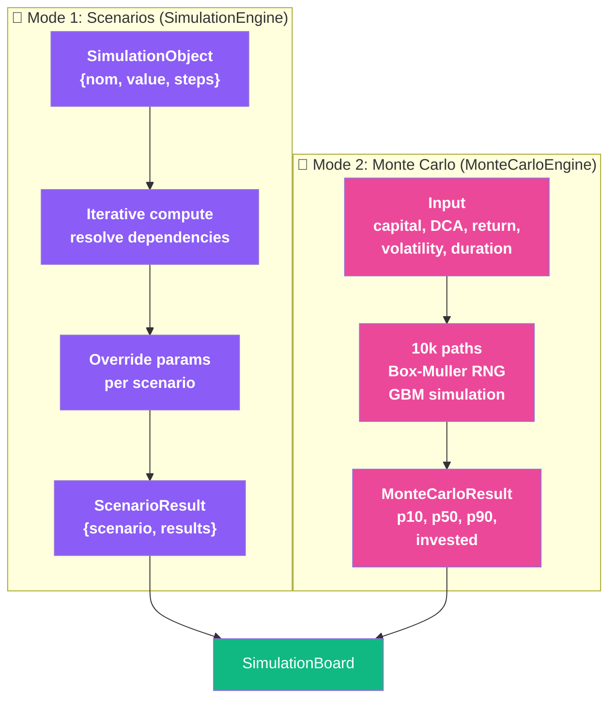
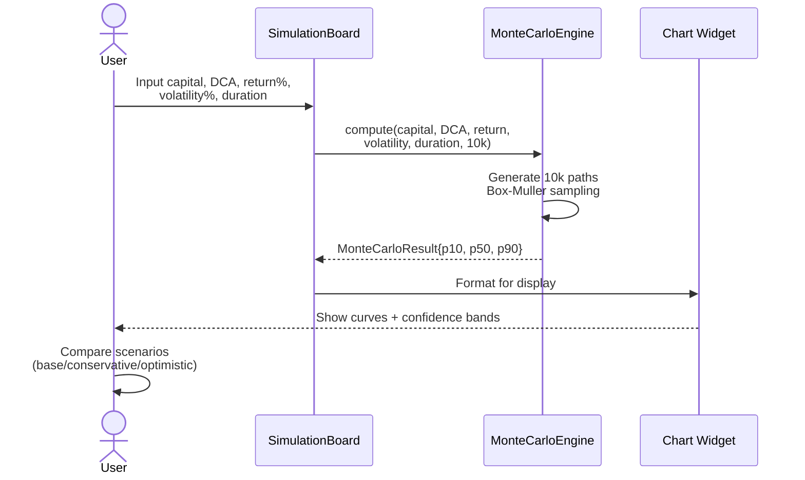

# Simulation Engines - Argent

Portfolio projections. Two modes: scenario computation + Monte Carlo stochastic.

---

## 🎯 Architecture Overview



---

## 🧮 Mode 1: SimulationEngine - Scenario Computation

**Purpose:** Financial scenario analysis (CDI vs SASU, real estate, DCA impact).

### Input

```json
{
  "nom": "future_value",
  "value": {"numeric": 100000, "currency": "EUR"},
  "steps": [
    {"operator": "*", "param": "rate", "value": 0.05},
    {"operator": "+", "param": "capital", "value": 10000}
  ]
}
```

### Algorithm

```
Iteration 1:
  future = 100000 × 0.05 = 5000

Iteration 2:
  future = 5000 + 10000 = 15000

Iteration 3:
  future = 15000 × 0.05 = 750
  
(continues until convergence)
```

**Key:** Resolves dependencies between operations, allows scenario overrides.

### Output

```json
{
  "base": {
    "future_value": 100000,
    "years": 5
  },
  "scenarios": [
    {
      "name": "optimistic",
      "capital": 15000,
      "future_value": 145000
    },
    {
      "name": "conservative",
      "capital": 5000,
      "future_value": 85000
    }
  ]
}
```

**Use case:** Explore impact of different savings rates, return assumptions, time horizons.

---

## 🎲 Mode 2: MonteCarloEngine - Portfolio Projection

**Purpose:** Stochastic simulation of portfolio growth with uncertainty.

### Input

```json
{
  "capital": 100000,
  "dca": 500,
  "return": 0.07,
  "volatility": 0.15,
  "duration": 10,
  "simulations": 10000
}
```

- **capital:** Initial investment (€)
- **dca:** Monthly Dollar Cost Averaging (€)
- **return:** Expected annual return (%)
- **volatility:** Annual standard deviation (%)
- **duration:** Projection horizon (years)
- **simulations:** Number of Monte Carlo paths

### Algorithm

```
for sim in 0..nbSimulations:
  portfolio = capitalInitial
  paths[sim][0] = portfolio
  
  for year in 1..duree:
    for month in 1..12:
      // Box-Muller transform: Uniform → Normal
      u1 = random(0,1)
      u2 = random(0,1)
      z = √(-2 × ln(u1)) × cos(2π × u2)
      
      // Monthly return ~ N(μ/12, σ/√12)
      r = (return/12) + z × (volatility/√12)
      
      // GBM: Portfolio grows + new DCA
      portfolio = (portfolio + dca) × (1 + r)
      
    paths[sim][year] = max(0, portfolio)

// Compute percentiles across all paths
for t in 0..duree:
  values = sort([paths[0][t], paths[1][t], ...])
  p10[t] = values[floor(n × 0.10)]
  p50[t] = values[floor(n × 0.50)]
  p90[t] = values[floor(n × 0.90)]
```

### Box-Muller Transformation

**Purpose:** Convert uniform RNG → normal distribution

```
u1, u2 ~ Uniform(0, 1)
z = √(-2 × ln(u1)) × cos(2π × u2)
r ~ N(μ, σ) = μ + z × σ
```

Produces independent normal samples without expensive erf() computation.

### Geometric Brownian Motion (GBM)

**Formula:**
```
dS/S = μ dt + σ dW
```

**Discretized (monthly):**
```
S(t+1) = S(t) × exp(r)
where r ~ N(μ/12, σ/√12)
```

Realistic for equity returns (log-normal, positive floor at 0).

### Output

```json
{
  "duree": 10,
  "p10": [100000, 105000, 110000, ..., 1100000],
  "p50": [100000, 110000, 125000, ..., 1950000],
  "p90": [100000, 115000, 140000, ..., 3200000],
  "capitalInvesti": [100000, 106000, 112000, ..., 160000]
}
```

**Interpretation:**
| Percentile | Meaning |
|-----------|---------|
| p10 | 10% chance of lower outcome (pessimistic) |
| p50 | Median (50/50 chance above/below) |
| p90 | 90% chance of lower outcome (optimistic) |

**Calculation:** Probability of reaching target
```
target = 2000000 € at year 10
count = Σ(paths[i][10] >= target)
probability = count / nbSimulations
```

---

## 📊 Data Contracts

### SimulationObject
```json
{
  "nom": "string",
  "value": {
    "numeric": number,
    "currency": "EUR"
  },
  "steps": [
    {
      "operator": "+|-|*|/",
      "param": "string",
      "value": number
    }
  ],
  "pipeline": "optional"
}
```

### MonteCarloResult
```json
{
  "duree": int,
  "p10": [decimal],
  "p50": [decimal],
  "p90": [decimal],
  "capitalInvesti": [decimal]
}
```

Length of each array = duree + 1 (year 0 to year duree)

---

## 🖥️ User Flow



---

## 📈 Example Scenario

**Input:**
- Capital: 100,000€
- Monthly DCA: 500€
- Expected return: 7% annual
- Volatility: 12% annual
- Duration: 10 years
- Simulations: 10,000

**Output (Year 10 Percentiles):**
| Percentile | Value | Interpretation |
|-----------|-------|-----------------|
| p10 | 1,100,000€ | 90% chance to exceed |
| p50 | 1,950,000€ | Median outcome |
| p90 | 3,200,000€ | 10% chance to exceed |

**Target Analysis:**
```
Target: 2,000,000€ (retirement goal)
Paths reaching target: 5,200 / 10,000 = 52% probability
```

---

## ⚡ Performance

| Simulations | Time | Memory |
|------------|------|--------|
| 1k | ~10ms | 5MB |
| 10k | ~100ms | 50MB |
| 100k | ~1s | 500MB |

**RNG:** MT_RAND (Mersenne Twister) - adequate for Monte Carlo, not cryptographic.

---

## ✅ Edge Cases

| Case | Behavior |
|------|----------|
| Negative portfolio | Floor at 0 (liquidation) |
| Zero volatility | Deterministic path = compound growth |
| Zero DCA | Works (no contribution) |
| Very long horizon (50y) | Linear memory growth |
| Zero duration | Returns capital (p10=p50=p90) |
