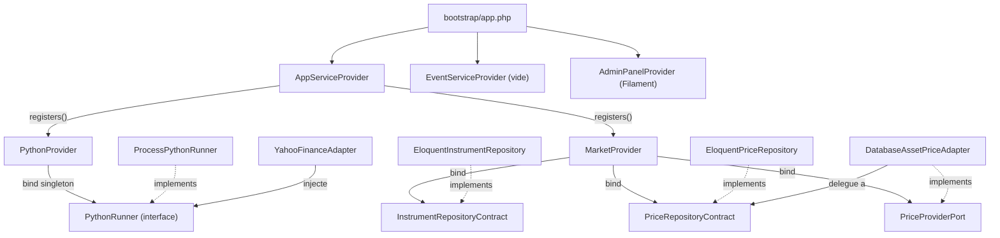
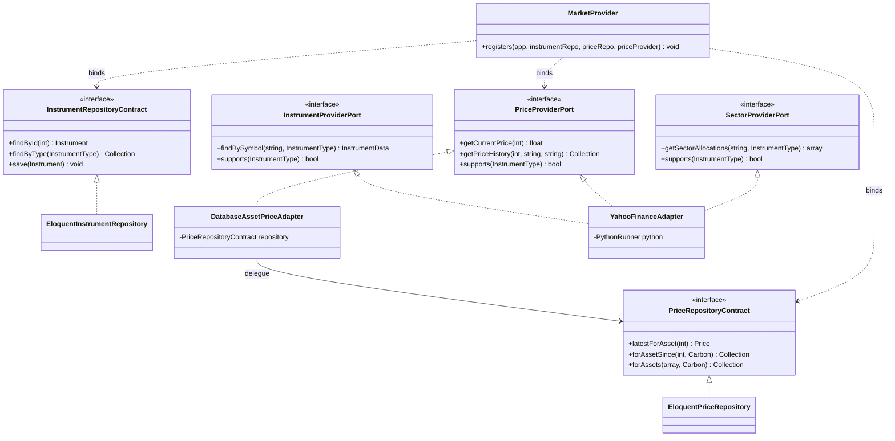

# Architecture DDD / Hexagonale

Ce document décrit l'architecture en couches de l'application : organisation en **bounded contexts**, application des principes **ports & adapters** (architecture hexagonale) et mécanisme de **wiring** de l'injection de dépendances (DI).

## 1. Principes

L'application est structurée en **contextes délimités** (bounded contexts) sous `app/Contexts/`, chacun isolé et responsable d'un sous-domaine métier. Les contextes identifiés :

| Contexte | Chemin | Statut |
| --- | --- | --- |
| Market | `app/Contexts/Market/` | Actif (instruments, prix, secteurs) |
| Identity | `app/Contexts/Identity/` | Stub (User/Role, sans contrats) |
| Portfolio | `app/Contexts/Portfolio/` | Stub (PersonalAsset, sans contrats) |

### Concepts directeurs

- **Bounded contexts** : chaque contexte expose son propre modèle métier, ses interfaces et ses implémentations. Aucune fuite de détails d'un contexte vers un autre.
- **Isolation** : la logique d'un contexte ne dépend que de ses propres abstractions (Contracts / Ports), jamais directement des implémentations d'un autre contexte.
- **Shared kernel** : le code transverse réellement partagé vit sous `app/Shared/`. Exemple actuel : `app/Shared/Python/`, noyau d'exécution de scripts Python réutilisable par n'importe quel contexte.
- **Ports & adapters** (hexagonal) : le cœur métier définit des interfaces (ports), et les détails techniques (Eloquent, API externes) sont des **adapters** qui implémentent ces interfaces. Le cœur ne connaît jamais l'implémentation concrète.
- **Inversion de dépendance** : les dépendances pointent vers les abstractions. Le wiring concret (interface → implémentation) est centralisé dans les `*Provider.php` et résolu au démarrage via le conteneur DI de Laravel.

## 2. Convention de structure d'un contexte

Un contexte suit la convention de dossiers suivante. Tous les dossiers ne sont pas systématiquement présents (selon la maturité du contexte).

| Dossier | Rôle |
| --- | --- |
| `Models/` | Entités Eloquent (persistance ORM, relations, casts, factories). Représentent le modèle de domaine persisté. |
| `Datas/` | DTO (Data Transfer Objects) readonly. Transportent les données entre adapters externes et le cœur, découplant les formats externes du modèle persisté. |
| `Enums/` | Énumérations métier (valeurs admises). Intègrent les interfaces Filament (HasLabel, HasColor, HasIcon) pour l'UI. |
| `Contracts/` | Interfaces de **persistance interne** (repositories). Définissent le contrat avec la base de données locale. |
| `Ports/` | Interfaces de **fournisseurs externes** (outbound). Définissent le contrat avec des sources externes (API Yahoo, ou la DB comme alternative). |
| `Infrastructure/` | **Adapters** : implémentations concrètes des Contracts (Eloquent) et des Ports (API / DB). |
| `Factories/` | Factories Eloquent pour générer des fixtures dans les tests. Non liées à l'hexagone, dédiées au testing. |
| `*Provider.php` | Service provider du contexte : orchestre le binding DI (interface → implémentation) via une méthode statique `registers()`. |

### Exemple : contexte Market

```
app/Contexts/Market/
├── Contracts/
│   ├── InstrumentRepositoryContract.php
│   └── PriceRepositoryContract.php
├── Ports/
│   ├── InstrumentProviderPort.php
│   ├── PriceProviderPort.php
│   └── SectorProviderPort.php
├── Infrastructure/
│   ├── EloquentInstrumentRepository.php
│   ├── EloquentPriceRepository.php
│   ├── DatabaseAssetPriceAdapter.php
│   └── YahooFinanceAdapter.php
├── Models/
│   ├── Instrument.php
│   ├── Price.php
│   └── SectorAllocation.php
├── Datas/
│   ├── InstrumentData.php
│   ├── PriceData.php
│   ├── AssetPriceData.php
│   └── SectorAllocationData.php
├── Enums/
│   ├── InstrumentType.php
│   └── Sector.php
├── Factories/
│   ├── InstrumentFactory.php
│   ├── PriceFactory.php
│   └── SectorAllocationFactory.php
└── MarketProvider.php
```

## 3. Distinction clé : Contracts vs Ports vs Adapters vs Datas vs Models

C'est la distinction structurante de l'architecture. Deux familles d'interfaces coexistent :

- **Contracts** = contrat de **persistance interne** (la base de données locale, source de vérité).
- **Ports** = contrat avec un **fournisseur externe** (outbound : API Yahoo, ou la DB exposée comme fournisseur).

| Concept | Dossier | Nature | Rôle | Exemples |
| --- | --- | --- | --- | --- |
| **Contracts** | `Contracts/` | Interface | Persistance interne (repository sur la DB locale) | `InstrumentRepositoryContract`, `PriceRepositoryContract` |
| **Ports** | `Ports/` | Interface | Fournisseur externe (outbound) | `InstrumentProviderPort`, `PriceProviderPort`, `SectorProviderPort` |
| **Adapters** | `Infrastructure/` | Classe | Implémentation concrète d'un Contract ou d'un Port | `EloquentInstrumentRepository`, `EloquentPriceRepository`, `DatabaseAssetPriceAdapter`, `YahooFinanceAdapter` |
| **Datas** | `Datas/` | DTO readonly | Transfert de données externes vers le domaine | `InstrumentData`, `PriceData`, `AssetPriceData`, `SectorAllocationData` |
| **Models** | `Models/` | Entité Eloquent | Modèle persisté (ORM, relations, casts) | `Instrument`, `Price`, `SectorAllocation` |

### Points notables

- Un adapter peut implémenter **un Contract** (`EloquentInstrumentRepository` → `InstrumentRepositoryContract`) ou **un Port** (`YahooFinanceAdapter` → 3 ports).
- `DatabaseAssetPriceAdapter` est un adapter outbound qui **implémente** `PriceProviderPort` mais **délègue** à `PriceRepositoryContract` : la base locale devient la source de vérité du fournisseur de prix par défaut.
- `YahooFinanceAdapter` implémente **trois ports** (`InstrumentProviderPort`, `PriceProviderPort`, `SectorProviderPort`) dans une seule classe : couplage réduit côté wiring, complexité concentrée dans l'adapter.
- Les **Datas** servent de pont : `AssetPriceData::fromPriceData()` adapte un `PriceData` (issu d'un fournisseur externe) pour la persistance (conversion float → string décimale, normalisation des valeurs manquantes via fallback sur `close`, ajout de timestamps).

## 4. Mécanisme de wiring DI

### Pattern `XxxProvider::registers()`

Chaque contexte expose un provider avec une méthode **statique** `registers(Application $app, ...)` au lieu du cycle `register()/boot()` standard. Cette méthode reçoit en paramètres les **class-strings** des implémentations à binder, ce qui permet de swapper les implémentations à la composition (test vs prod).

`AppServiceProvider::register()` est le point d'entrée unique : il appelle les `registers()` de chaque contexte.

| Provider | Bindings effectués |
| --- | --- |
| `PythonProvider` | `PythonRunner` → `ProcessPythonRunner` (singleton) |
| `MarketProvider` | `InstrumentRepositoryContract` → `EloquentInstrumentRepository`<br>`PriceRepositoryContract` → `EloquentPriceRepository`<br>`PriceProviderPort` → `DatabaseAssetPriceAdapter` |
| `IdentityProvider` | Stub (aucun binding) |
| `PortfolioProvider` | Stub (aucun binding) |

Ordre d'enregistrement des providers (via `bootstrap/providers.php`) : `AppServiceProvider` → `EventServiceProvider` → `AdminPanelProvider`.

Appels concrets dans `AppServiceProvider::register()` :

- `PythonProvider::registers($this->app, ProcessPythonRunner::class)`
- `MarketProvider::registers($this->app, EloquentInstrumentRepository::class, EloquentPriceRepository::class, DatabaseAssetPriceAdapter::class)`

`AppServiceProvider::boot()` force par ailleurs la locale Carbon à `fr`.

### Diagramme des bindings actuels



> Note : `PriceProviderPort` est bindé par défaut sur `DatabaseAssetPriceAdapter` (la DB est source de vérité). `YahooFinanceAdapter` reste disponible comme implémentation alternative des ports mais n'est pas bindé par défaut.

## 5. Diagramme de classes — ports, contrats et implémentations

Ce diagramme se concentre sur la structure hexagonale du contexte Market : les
interfaces (Contracts internes + Ports externes), leurs implémentations et le
binding via `MarketProvider`. Le diagramme de classes complet du domaine
(Models, Datas, Enums et leurs relations) est documenté dans
[`market-context.md`](market-context.md).



### Tables et persistance

| Model | Table | Notes |
| --- | --- | --- |
| `Instrument` | `assets` | Aggregate root. Global scope `market` filtrant sur `InstrumentType::values()`. Défaut `type = Stock`. |
| `Price` | `asset_prices` | OHLCV, décimales `decimal(4)`, volume entier. FK `asset_id`. |
| `SectorAllocation` | `security_sectors` | Poids `decimal(6)`. FK `asset_id`. |

### Casts Eloquent

| Model | Champ | Cast |
| --- | --- | --- |
| `Instrument` | `type` | `InstrumentType` |
| `Price` | `date` / `open,high,low,close` / `volume` | `Carbon` / `decimal:4` / `integer` |
| `SectorAllocation` | `sector` / `weight` | `Sector` / `decimal:6` |
