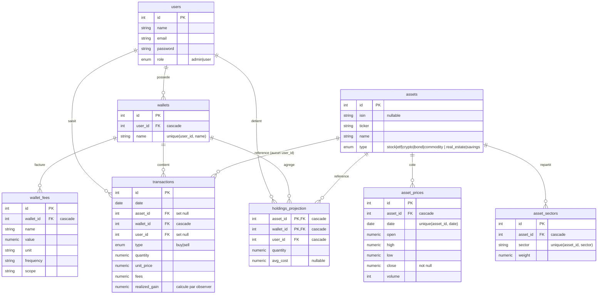
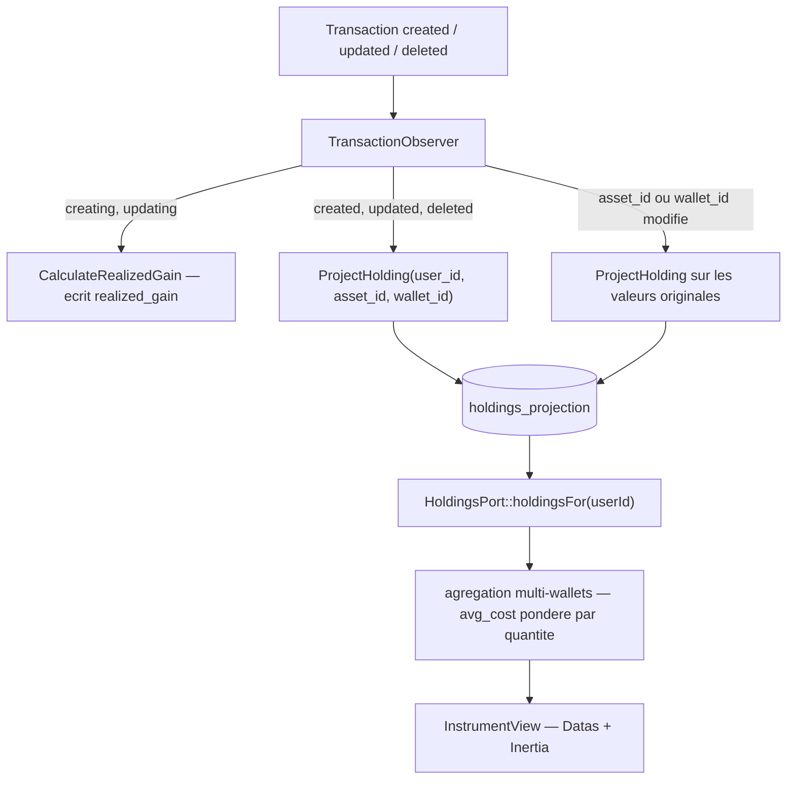

# Modèle de données

## 1. Vue d'ensemble

La base de données contient **16 tables** (la persistance par défaut est **SQLite**, fichier `database/database.sqlite`).

Elle couvre quatre grands domaines fonctionnels :

| Domaine | Tables | Rôle |
| --- | --- | --- |
| **Identity** | `users`, `sessions`, `password_reset_tokens` | Authentification et rôles |
| **Market** | `assets`, `asset_prices`, `asset_sectors` | Instruments financiers et données de marché |
| **Portfolio / Finance** | `wallets`, `wallet_fees`, `transactions`, `holdings_projection` | Comptes, mouvements, projection des positions |
| **Divers (infra Laravel)** | `cache`, `cache_locks`, `jobs`, `job_batches`, `failed_jobs`, `migrations` | Plomberie framework |

Point d'architecture central : la table `assets` est **partagée** entre deux contextes via une discrimination par colonne `type` et des global scopes Eloquent. Le modèle `Instrument` (`app/Contexts/Market/Models/Instrument.php`) y lit les instruments négociables, le modèle `PersonalAsset` (`app/Contexts/Portfolio/Models/PersonalAsset.php`) les actifs personnels.

Une partie significative des tables n'a **pas encore de modèle dans le nouveau code `app/Contexts/`** (voir section 5 : dette de migration).

## 2. Diagramme entité-relation

Les instruments (`assets`) sont **globaux** : aucune colonne `user_id`. Le lien entre un utilisateur et un instrument passe toujours par une table porteuse du triplet `user_id` / `wallet_id` / `asset_id` : `transactions` ou `holdings_projection`.

### 2.1 Table `assets` partagée entre deux modèles

Une seule table, deux modèles Eloquent séparés par un global scope sur `type` :

À la création, `Instrument` retombe sur `InstrumentType::Stock` et `PersonalAsset` sur `PersonalAssetType::Savings` si `type` est absent.

### 2.2 Flux d'écriture : la projection des positions

`holdings_projection` est une **projection dérivée**, jamais une source de vérité. Elle est reconstruite par `TransactionObserver` (`app/Contexts/Portfolio/Observers/TransactionObserver.php`) :

La clé primaire composite `(asset_id, wallet_id)` impose les surcharges `setKeysForSaveQuery()` / `setKeysForSelectQuery()` dans `Holding`.

### 2.3 Lecture côté InstrumentView

Le contexte `InstrumentView` n'accède jamais aux modèles des autres contextes en direct : il passe par `HoldingsPort`, `TransactionsPort` et `MarketDataPort`, implémentés respectivement par `PortfolioHoldings`, `PortfolioTransactions` et `MarketData`. `PortfolioHoldings::holdingsFor()` agrège les lignes de tous les wallets d'un utilisateur en un `HoldingSnapshotData` par `asset_id`, avec un `avg_cost` pondéré par les quantités (les lignes sans `avg_cost` sont exclues du calcul).

## 3. Tables par domaine

### Domaine Identity

#### `users`

| Colonne | Type | Contraintes |
| --- | --- | --- |
| `id` | integer | PK, autoincrement |
| `name` | varchar | NOT NULL |
| `email` | varchar | NOT NULL, UNIQUE |
| `email_verified_at` | datetime | nullable |
| `password` | varchar | NOT NULL |
| `remember_token` | varchar | nullable |
| `role` | varchar | NOT NULL, default `'user'` |
| `created_at` | datetime | nullable |
| `updated_at` | datetime | nullable |

Utilisateurs du système avec contrôle d'accès par rôle (`Role` enum : `admin` / `user`).

#### `sessions`

| Colonne | Type | Contraintes |
| --- | --- | --- |
| `id` | varchar | PK |
| `user_id` | integer | nullable, index |
| `ip_address` | varchar | nullable |
| `user_agent` | text | nullable |
| `payload` | text | NOT NULL |
| `last_activity` | integer | NOT NULL, index |

Sessions HTTP (driver session base de données de Laravel).

#### `password_reset_tokens`

| Colonne | Type | Contraintes |
| --- | --- | --- |
| `email` | varchar | PK |
| `token` | varchar | NOT NULL |
| `created_at` | datetime | nullable |

Jetons de réinitialisation de mot de passe (table standard Laravel).

### Domaine Market

#### `assets`

| Colonne | Type | Contraintes |
| --- | --- | --- |
| `id` | integer | PK, autoincrement |
| `isin` | varchar | nullable |
| `name` | varchar | nullable |
| `ticker` | varchar | nullable |
| `type` | varchar | NOT NULL, default `'stock'` |
| `created_at` | datetime | nullable |
| `updated_at` | datetime | nullable |

Table centrale des actifs. Partagée par les contextes Market (`Instrument`, `type ∈ InstrumentType`) et Portfolio (`PersonalAsset`, `type ∈ PersonalAssetType`), discriminés par la colonne `type` via global scope.

#### `asset_prices`

| Colonne | Type | Contraintes |
| --- | --- | --- |
| `id` | integer | PK, autoincrement |
| `asset_id` | integer | NOT NULL, FK → `assets.id` (CASCADE) |
| `date` | date | NOT NULL |
| `open` | numeric | nullable |
| `high` | numeric | nullable |
| `low` | numeric | nullable |
| `close` | numeric | NOT NULL |
| `volume` | integer | nullable |
| `created_at` | datetime | nullable |
| `updated_at` | datetime | nullable |

Données de prix OHLCV. Index : unique `(asset_id, date)` et `asset_prices_date_index` sur `date`.

#### `asset_sectors`

| Colonne | Type | Contraintes |
| --- | --- | --- |
| `id` | integer | PK, autoincrement |
| `asset_id` | integer | NOT NULL, FK → `assets.id` (CASCADE) |
| `sector` | varchar | NOT NULL |
| `weight` | numeric | NOT NULL |
| `created_at` | datetime | nullable |
| `updated_at` | datetime | nullable |

Pondération sectorielle d'un actif (`Sector` enum). Index unique `(asset_id, sector)`.

### Domaine Portfolio / Finance

#### `wallets`

| Colonne | Type | Contraintes |
| --- | --- | --- |
| `id` | integer | PK, autoincrement |
| `user_id` | integer | NOT NULL, FK → `users.id` (CASCADE) |
| `name` | varchar | NOT NULL |
| `created_at` | datetime | nullable |
| `updated_at` | datetime | nullable |

Comptes/enveloppes d'un utilisateur (PEA, CTO, Livret…). Contrainte unique `(user_id, name)`.

#### `wallet_fees`

| Colonne | Type | Contraintes |
| --- | --- | --- |
| `id` | integer | PK, autoincrement |
| `wallet_id` | integer | NOT NULL, FK → `wallets.id` (CASCADE) |
| `name` | varchar | NOT NULL |
| `value` | numeric | NOT NULL |
| `unit` | varchar | NOT NULL |
| `frequency` | varchar | nullable |
| `scope` | varchar | nullable |
| `created_at` | datetime | nullable |
| `updated_at` | datetime | nullable |

Frais associés à un wallet (courtage, gestion…).

#### `transactions`

| Colonne | Type | Contraintes |
| --- | --- | --- |
| `id` | integer | PK, autoincrement |
| `date` | date | NOT NULL, index |
| `asset_id` | integer | nullable, FK → `assets.id` (SET NULL), index |
| `broker` | varchar | nullable |
| `quantity` | numeric | nullable |
| `unit_price` | numeric | nullable |
| `fees` | numeric | NOT NULL, default `0` |
| `notes` | text | nullable |
| `type` | varchar | NOT NULL, default `'buy'`, index |
| `realized_gain` | numeric | nullable |
| `user_id` | integer | nullable, FK → `users.id` (SET NULL), index |
| `wallet_id` | integer | NOT NULL, FK → `wallets.id` (CASCADE), index |
| `created_at` | datetime | nullable |
| `updated_at` | datetime | nullable |

Mouvements (achat/vente/dépôt) rattachés à un wallet. Les FK `asset_id` et `user_id` utilisent SET NULL, autorisant des transactions orphelines.

#### `holdings_projection`

| Colonne | Type | Contraintes |
| --- | --- | --- |
| `asset_id` | integer | NOT NULL, PK composite, FK → `assets.id` (CASCADE) |
| `wallet_id` | integer | NOT NULL, PK composite, FK → `wallets.id` (CASCADE) |
| `user_id` | integer | NOT NULL, FK → `users.id` (CASCADE), index |
| `quantity` | numeric | NOT NULL |
| `avg_cost` | numeric | nullable |
| `created_at` | datetime | nullable |
| `updated_at` | datetime | nullable |

Positions calculées (quantité, coût moyen) par actif/wallet. Dénormalisé pour la performance. PK composite `(asset_id, wallet_id)`, index sur `user_id` et `(user_id, wallet_id)`.

### Domaine Divers (infrastructure)

#### `cache` / `cache_locks`

| Table | Colonnes | Description |
| --- | --- | --- |
| `cache` | `key` (PK), `value` (text), `expiration` (integer, index) | Cache applicatif (driver database). |
| `cache_locks` | `key` (PK), `owner` (varchar), `expiration` (integer, index) | Verrous de cache atomiques. |

#### `jobs` / `job_batches` / `failed_jobs`

| Table | Colonnes principales | Description |
| --- | --- | --- |
| `jobs` | `id` (PK), `queue` (index), `payload`, `attempts`, `reserved_at`, `available_at`, `created_at` | File d'attente des jobs. |
| `job_batches` | `id` (PK varchar), `name`, `total_jobs`, `pending_jobs`, `failed_jobs`, `failed_job_ids`, `options`, `cancelled_at`, `created_at`, `finished_at` | Lots de jobs. |
| `failed_jobs` | `id` (PK), `uuid` (UNIQUE), `connection`, `queue`, `payload`, `exception`, `failed_at` | Jobs en échec. |

> `migrations` (suivi des migrations Laravel) complète le décompte des 16 tables.

## 4. Migrations

L'historique des migrations a été aplati : le dossier `database/migrations/` ne contient plus que des créations de tables, une par table, dans l'ordre imposé par les clés étrangères.

| Migration | Tables |
| --- | --- |
| `0001_01_01_000000_create_users_table` | `users`, `password_reset_tokens`, `sessions` |
| `0001_01_01_000001_create_cache_table` | `cache`, `cache_locks` |
| `0001_01_01_000002_create_jobs_table` | `jobs`, `job_batches`, `failed_jobs` |
| `2026_08_19_000000_create_assets_table` | `assets` |
| `2026_08_19_000001_create_asset_prices_table` | `asset_prices` |
| `2026_08_19_000002_create_asset_sectors_table` | `asset_sectors` |
| `2026_08_19_000003_create_wallets_table` | `wallets` |
| `2026_08_19_000004_create_wallet_fees_table` | `wallet_fees` |
| `2026_08_19_000005_create_transactions_table` | `transactions` |
| `2026_08_19_000006_create_holdings_projection_table` | `holdings_projection` |

Aucune migration d'altération, de renommage ni de correction de données ne subsiste : ce qui n'est pas dans une création n'existe pas dans le schéma. Toute base existante doit donc être reconstruite (`migrate:fresh` puis `db:seed`), les anciennes lignes de la table `migrations` ne correspondant plus à aucun fichier.

Le vocabulaire hérité de l'époque `securities` a disparu du schéma : plus aucune table ni aucun index ne porte le préfixe `security_`. Seul le dump MySQL de production (`storage/database/backup.sql`, rejoué par `BackupSeeder`) précède ces renommages et expose encore les tables `securities`, `security_prices` et `security_sectors` — le lecteur de dump les cible donc sous leurs anciens noms, c'est volontaire.

## 5. Mapping tables ↔ modèles Contexts et dette de migration

### Tables disposant d'un modèle dans `app/Contexts/`

| Table | Modèle | Fichier | Note |
| --- | --- | --- | --- |
| `assets` | `Instrument` | `app/Contexts/Market/Models/Instrument.php` | Global scope `market` : `whereIn('type', InstrumentType::values())` |
| `assets` | `PersonalAsset` | `app/Contexts/Portfolio/Models/PersonalAsset.php` | Global scope `personal` : `whereIn('type', PersonalAssetType::values())` |
| `asset_prices` | `Price` | `app/Contexts/Market/Models/Price.php` | `protected $table = 'asset_prices'` |
| `asset_sectors` | `SectorAllocation` | `app/Contexts/Market/Models/SectorAllocation.php` | `protected $table = 'asset_sectors'` |
| `users` | `User` | `app/Contexts/Identity/Models/User.php` | Aucune relation Eloquent déclarée vers wallets/transactions/holdings |
| `wallets` | `Wallet` | `app/Contexts/Portfolio/Models/Wallet.php` | `belongsTo(User::class)` |
| `transactions` | `Transaction` | `app/Contexts/Portfolio/Models/Transaction.php` | Observé par `TransactionObserver`, `belongsTo` wallet et user |
| `holdings_projection` | `Holding` | `app/Contexts/Portfolio/Models/Holding.php` | PK composite `(asset_id, wallet_id)`, `$incrementing = false` |

Chaque modèle Portfolio et Market déclare sa factory par attribut `#[UseFactory(...)]`, résolue dans `app/Contexts/{Context}/Factories/`.

### Table sans modèle

| Table | Statut | Accès applicatif |
| --- | --- | --- |
| `wallet_fees` | Aucun modèle Eloquent | Query builder dans `database/seeders/BackupSeeder.php` (`seedWalletFees()`) ; aucune lecture côté application |

### Dette résiduelle

- Trois factories legacy subsistent sous `database/factories/Domains/Portfolio/Models/` (`TransactionFactory`, `WalletFactory`, `WalletFeeFactory`). Elles ciblent le namespace `App\Domains\Portfolio\...`, **qui n'existe plus** : ce sont des classes mortes, doublons des factories vivantes de `app/Contexts/Portfolio/Factories/`.
- `database/factories/Contexts/Identity/Models/UserFactory.php` est la seule factory de `database/factories/` réellement utilisée : `User` ne porte pas d'attribut `#[UseFactory]` et s'appuie sur la résolution par convention de nom.
- Aucune relation Eloquent n'est déclarée depuis `User` vers `wallets`, `transactions` ou `holdings_projection`, alors que les FK existent en base : toute lecture passe par une requête explicite sur `Wallet`, `Transaction` ou `Holding` filtrée sur `user_id`.
- `database/seeders/PriceSyncSeeder.php` n'est plus appelé par aucun seeder depuis la suppression de `DemoSeeder`.

> Tables d'infrastructure (`sessions`, `password_reset_tokens`, `cache`, `cache_locks`, `jobs`, `job_batches`, `failed_jobs`, `migrations`) : non concernées par la modélisation de domaine (gérées par le framework).
