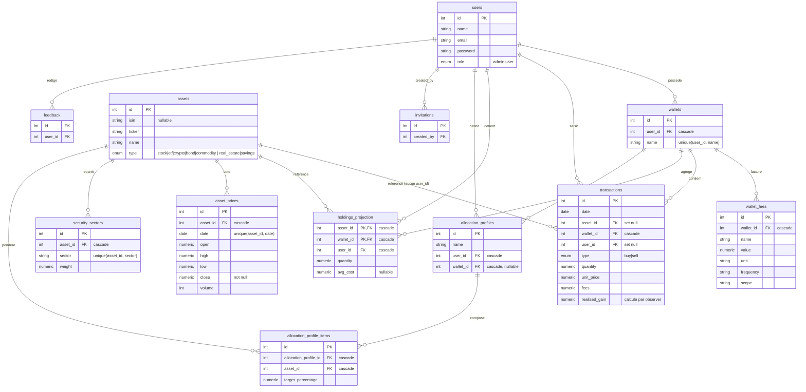
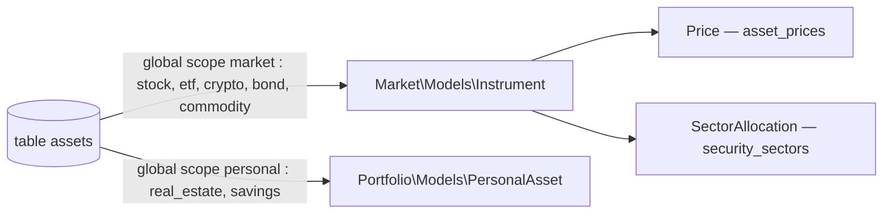
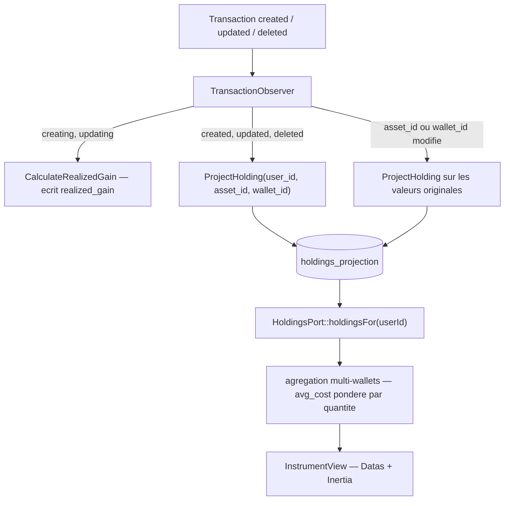

# Modèle de données

## 1. Vue d'ensemble

La base de données contient **21 tables** (la persistance par défaut est **SQLite**, fichier `database/database.sqlite`).

Elle couvre quatre grands domaines fonctionnels :

| Domaine | Tables | Rôle |
| --- | --- | --- |
| **Identity** | `users`, `invitations`, `sessions`, `password_reset_tokens` | Authentification, rôles, invitations |
| **Market** | `assets`, `asset_prices`, `security_sectors` | Instruments financiers et données de marché |
| **Portfolio / Finance** | `wallets`, `wallet_fees`, `transactions`, `allocation_profiles`, `allocation_profile_items`, `holdings_projection` | Comptes, mouvements, allocations cibles, projection des positions |
| **Divers (infra Laravel)** | `feedback`, `cache`, `cache_locks`, `jobs`, `job_batches`, `failed_jobs`, `migrations` | Retours utilisateurs et plomberie framework |

Point d'architecture central : la table `assets` est **partagée** entre deux contextes via une discrimination par colonne `type` et des global scopes Eloquent. Le modèle `Instrument` (`app/Contexts/Market/Models/Instrument.php`) y lit les instruments négociables, le modèle `PersonalAsset` (`app/Contexts/Portfolio/Models/PersonalAsset.php`) les actifs personnels.

Une partie significative des tables n'a **pas encore de modèle dans le nouveau code `app/Contexts/`** (voir section 5 : dette de migration).

## 2. Diagramme entité-relation

Les instruments (`assets`) sont **globaux** : aucune colonne `user_id`. Le lien entre un utilisateur et un instrument passe toujours par une table porteuse du triplet `user_id` / `wallet_id` / `asset_id` — `transactions`, `holdings_projection` — ou par le couple `allocation_profiles` / `allocation_profile_items`.

### 2.1 Table `assets` partagée entre deux modèles

Une seule table, deux modèles Eloquent séparés par un global scope sur `type` :

À la création, `Instrument` retombe sur `InstrumentType::Stock` et `PersonalAsset` sur `PersonalAssetType::Savings` si `type` est absent.

### 2.2 Flux d'écriture : la projection des positions

`holdings_projection` est une **projection dérivée**, jamais une source de vérité. Elle est reconstruite par `TransactionObserver` (`app/Contexts/Portfolio/Observers/TransactionObserver.php`) :

La clé primaire composite `(asset_id, wallet_id)` impose les surcharges `setKeysForSaveQuery()` / `setKeysForSelectQuery()` dans `Holding`.

### 2.3 Lecture côté InstrumentView

Le contexte `InstrumentView` n'accède jamais aux modèles des autres contextes en direct : il passe par `HoldingsPort`, `TransactionsPort` et `MarketDataPort`, implémentés respectivement par `PortfolioHoldings`, `PortfolioTransactions` et `MarketData`. `PortfolioHoldings::holdingsFor()` agrège les lignes de tous les wallets d'un utilisateur en un `HoldingSnapshotData` par `asset_id`, avec un `avg_cost` pondéré par les quantités (les lignes sans `avg_cost` sont exclues du calcul).

## 3. Tables par domaine

### Domaine Identity

#### `users`

| Colonne | Type | Contraintes |
| --- | --- | --- |
| `id` | integer | PK, autoincrement |
| `name` | varchar | NOT NULL |
| `email` | varchar | NOT NULL, UNIQUE |
| `email_verified_at` | datetime | nullable |
| `password` | varchar | NOT NULL |
| `remember_token` | varchar | nullable |
| `role` | varchar | NOT NULL, default `'user'` |
| `created_at` | datetime | nullable |
| `updated_at` | datetime | nullable |

Utilisateurs du système avec contrôle d'accès par rôle (`Role` enum : `admin` / `user`).

#### `invitations`

| Colonne | Type | Contraintes |
| --- | --- | --- |
| `id` | integer | PK, autoincrement |
| `token` | varchar | NOT NULL, UNIQUE |
| `created_by` | integer | NOT NULL, FK → `users.id` (CASCADE) |
| `expires_at` | datetime | NOT NULL |
| `used_at` | datetime | nullable |
| `created_at` | datetime | nullable |
| `updated_at` | datetime | nullable |

Jetons d'invitation à l'inscription, avec expiration et trace d'utilisation.

#### `sessions`

| Colonne | Type | Contraintes |
| --- | --- | --- |
| `id` | varchar | PK |
| `user_id` | integer | nullable, index |
| `ip_address` | varchar | nullable |
| `user_agent` | text | nullable |
| `payload` | text | NOT NULL |
| `last_activity` | integer | NOT NULL, index |

Sessions HTTP (driver session base de données de Laravel).

#### `password_reset_tokens`

| Colonne | Type | Contraintes |
| --- | --- | --- |
| `email` | varchar | PK |
| `token` | varchar | NOT NULL |
| `created_at` | datetime | nullable |

Jetons de réinitialisation de mot de passe (table standard Laravel).

### Domaine Market

#### `assets`

| Colonne | Type | Contraintes |
| --- | --- | --- |
| `id` | integer | PK, autoincrement |
| `isin` | varchar | nullable |
| `name` | varchar | nullable |
| `ticker` | varchar | nullable |
| `type` | varchar | NOT NULL, default `'stock'` |
| `created_at` | datetime | nullable |
| `updated_at` | datetime | nullable |

Table centrale des actifs. Partagée par les contextes Market (`Instrument`, `type ∈ InstrumentType`) et Portfolio (`PersonalAsset`, `type ∈ PersonalAssetType`), discriminés par la colonne `type` via global scope.

#### `asset_prices`

| Colonne | Type | Contraintes |
| --- | --- | --- |
| `id` | integer | PK, autoincrement |
| `asset_id` | integer | NOT NULL, FK → `assets.id` (CASCADE) |
| `date` | date | NOT NULL |
| `open` | numeric | nullable |
| `high` | numeric | nullable |
| `low` | numeric | nullable |
| `close` | numeric | NOT NULL |
| `volume` | integer | nullable |
| `created_at` | datetime | nullable |
| `updated_at` | datetime | nullable |

Données de prix OHLCV. Index unique `(asset_id, date)`. Renommée depuis `security_prices` ; les index portent encore des noms hérités (`security_prices_date_index`, `security_prices_security_id_date_index`, `security_prices_security_id_date_unique`) en plus de `asset_prices_asset_id_date_index` (redondant avec l'ancien index sur `(asset_id, date)`).

#### `security_sectors`

| Colonne | Type | Contraintes |
| --- | --- | --- |
| `id` | integer | PK, autoincrement |
| `asset_id` | integer | NOT NULL, FK → `assets.id` (CASCADE) |
| `sector` | varchar | NOT NULL |
| `weight` | numeric | NOT NULL |
| `created_at` | datetime | nullable |
| `updated_at` | datetime | nullable |

Pondération sectorielle d'un actif (`Sector` enum). Index unique `(asset_id, sector)`. Le nom de table conserve le préfixe `security_` malgré le renommage `securities → assets`.

### Domaine Portfolio / Finance

#### `wallets`

| Colonne | Type | Contraintes |
| --- | --- | --- |
| `id` | integer | PK, autoincrement |
| `user_id` | integer | NOT NULL, FK → `users.id` (CASCADE) |
| `name` | varchar | NOT NULL |
| `created_at` | datetime | nullable |
| `updated_at` | datetime | nullable |

Comptes/enveloppes d'un utilisateur (PEA, CTO, Livret…). Contrainte unique `(user_id, name)`.

#### `wallet_fees`

| Colonne | Type | Contraintes |
| --- | --- | --- |
| `id` | integer | PK, autoincrement |
| `wallet_id` | integer | NOT NULL, FK → `wallets.id` (CASCADE) |
| `name` | varchar | NOT NULL |
| `value` | numeric | NOT NULL |
| `unit` | varchar | NOT NULL |
| `frequency` | varchar | nullable |
| `scope` | varchar | nullable |
| `created_at` | datetime | nullable |
| `updated_at` | datetime | nullable |

Frais associés à un wallet (courtage, gestion…).

#### `transactions`

| Colonne | Type | Contraintes |
| --- | --- | --- |
| `id` | integer | PK, autoincrement |
| `date` | date | NOT NULL, index |
| `asset_id` | integer | nullable, FK → `assets.id` (SET NULL), index |
| `broker` | varchar | nullable |
| `quantity` | numeric | nullable |
| `unit_price` | numeric | nullable |
| `fees` | numeric | NOT NULL, default `0` |
| `notes` | text | nullable |
| `type` | varchar | NOT NULL, default `'buy'`, index |
| `realized_gain` | numeric | nullable |
| `user_id` | integer | nullable, FK → `users.id` (SET NULL), index |
| `wallet_id` | integer | NOT NULL, FK → `wallets.id` (CASCADE), index |
| `created_at` | datetime | nullable |
| `updated_at` | datetime | nullable |

Mouvements (achat/vente/dépôt) rattachés à un wallet. Les FK `asset_id` et `user_id` utilisent SET NULL, autorisant des transactions orphelines.

#### `allocation_profiles`

| Colonne | Type | Contraintes |
| --- | --- | --- |
| `id` | integer | PK, autoincrement |
| `name` | varchar | NOT NULL |
| `user_id` | integer | NOT NULL, FK → `users.id` (CASCADE) |
| `wallet_id` | integer | nullable, FK → `wallets.id` (CASCADE) |
| `created_at` | datetime | nullable |
| `updated_at` | datetime | nullable |

Allocations cibles d'un portefeuille (globales si `wallet_id` nul, sinon spécifiques à un wallet).

#### `allocation_profile_items`

| Colonne | Type | Contraintes |
| --- | --- | --- |
| `id` | integer | PK, autoincrement |
| `allocation_profile_id` | integer | NOT NULL, FK → `allocation_profiles.id` (CASCADE) |
| `asset_id` | integer | NOT NULL, FK → `assets.id` (CASCADE) |
| `target_percentage` | numeric | NOT NULL |
| `created_at` | datetime | nullable |
| `updated_at` | datetime | nullable |

Pourcentage cible par actif au sein d'une allocation.

#### `holdings_projection`

| Colonne | Type | Contraintes |
| --- | --- | --- |
| `asset_id` | integer | NOT NULL, PK composite, FK → `assets.id` (CASCADE) |
| `wallet_id` | integer | NOT NULL, PK composite, FK → `wallets.id` (CASCADE) |
| `user_id` | integer | NOT NULL, FK → `users.id` (CASCADE), index |
| `quantity` | numeric | NOT NULL |
| `avg_cost` | numeric | nullable |
| `created_at` | datetime | nullable |
| `updated_at` | datetime | nullable |

Positions calculées (quantité, coût moyen) par actif/wallet. Dénormalisé pour la performance. PK composite `(asset_id, wallet_id)`, index sur `user_id` et `(user_id, wallet_id)`.

### Domaine Divers (infrastructure)

#### `feedback`

| Colonne | Type | Contraintes |
| --- | --- | --- |
| `id` | integer | PK, autoincrement |
| `user_id` | integer | NOT NULL, FK → `users.id` (CASCADE) |
| `subject` | varchar | NOT NULL |
| `body` | text | NOT NULL |
| `created_at` | datetime | nullable |
| `updated_at` | datetime | nullable |

Retours / tickets de support utilisateur.

#### `cache` / `cache_locks`

| Table | Colonnes | Description |
| --- | --- | --- |
| `cache` | `key` (PK), `value` (text), `expiration` (integer, index) | Cache applicatif (driver database). |
| `cache_locks` | `key` (PK), `owner` (varchar), `expiration` (integer, index) | Verrous de cache atomiques. |

#### `jobs` / `job_batches` / `failed_jobs`

| Table | Colonnes principales | Description |
| --- | --- | --- |
| `jobs` | `id` (PK), `queue` (index), `payload`, `attempts`, `reserved_at`, `available_at`, `created_at` | File d'attente des jobs. |
| `job_batches` | `id` (PK varchar), `name`, `total_jobs`, `pending_jobs`, `failed_jobs`, `failed_job_ids`, `options`, `cancelled_at`, `created_at`, `finished_at` | Lots de jobs. |
| `failed_jobs` | `id` (PK), `uuid` (UNIQUE), `connection`, `queue`, `payload`, `exception`, `failed_at` | Jobs en échec. |

> `migrations` (suivi des migrations Laravel) complète le décompte des 21 tables.

## 4. Historique des renommages

| Avant | Après | Migration |
| --- | --- | --- |
| table `securities` | table `assets` | `2026_05_18_170716_rename_securities_table_to_assets` |
| table `security_prices` | table `asset_prices` | `2026_05_08_012537_rename_security_prices_to_asset_prices_table` |
| `transactions.security_id` | `transactions.asset_id` | `2026_05_08_020000_rename_security_id_to_asset_id_in_transactions_table` |
| `asset_prices.security_id` | `asset_prices.asset_id` | `2026_05_09_150000_rename_security_id_to_asset_id_in_asset_prices_table` |
| `allocation_profile_items.security_id` | `allocation_profile_items.asset_id` | `2026_05_09_142207_rename_security_id_to_asset_id_in_allocation_profile_items_table` |
| `security_sectors.security_id` | `security_sectors.asset_id` | `2026_05_09_153040_rename_security_id_to_asset_id_in_security_sectors_table` |

Autres migrations structurelles notables :

| Changement | Migration |
| --- | --- |
| `transactions.account_type` (string) → `wallet_id` (FK) | `2026_03_16_011334_migrate_transactions_account_type_to_wallet_id` |
| `allocation_profiles.account_type` (string) → `wallet_id` (FK) | `2026_03_16_124844_migrate_allocation_profiles_account_type_to_wallet_id` |

**Empreintes résiduelles** des renommages encore présentes en base :
- La table `security_sectors` n'a pas été renommée.
- Index hérités sur `asset_prices` : `security_prices_date_index`, `security_prices_security_id_date_index`, `security_prices_security_id_date_unique`.
- Index hérité sur `security_sectors` : `security_sectors_security_id_sector_unique`.

## 5. Mapping tables ↔ modèles Contexts et dette de migration

### Tables disposant d'un modèle dans `app/Contexts/`

| Table | Modèle | Fichier | Note |
| --- | --- | --- | --- |
| `assets` | `Instrument` | `app/Contexts/Market/Models/Instrument.php` | Global scope `market` : `whereIn('type', InstrumentType::values())` |
| `assets` | `PersonalAsset` | `app/Contexts/Portfolio/Models/PersonalAsset.php` | Global scope `personal` : `whereIn('type', PersonalAssetType::values())` |
| `asset_prices` | `Price` | `app/Contexts/Market/Models/Price.php` | `protected $table = 'asset_prices'` |
| `security_sectors` | `SectorAllocation` | `app/Contexts/Market/Models/SectorAllocation.php` | `protected $table = 'security_sectors'` |
| `users` | `User` | `app/Contexts/Identity/Models/User.php` | Aucune relation Eloquent définie vers wallets/transactions/etc. |

### Tables ORPHELINES (dette de migration)

Tables existant en base sans aucune classe modèle correspondante dans `app/Contexts/` :

| Table | Statut modèle | Factory existante |
| --- | --- | --- |
| `wallets` | Aucun modèle Contexts | `database/factories/Domains/Portfolio/Models/WalletFactory.php` |
| `wallet_fees` | Aucun modèle Contexts | `database/factories/Domains/Portfolio/Models/WalletFeeFactory.php` |
| `transactions` | Aucun modèle Contexts | `database/factories/Domains/Portfolio/Models/TransactionFactory.php` |
| `allocation_profiles` | Aucun modèle Contexts | `database/factories/Domains/Portfolio/Models/AllocationProfileFactory.php` |
| `allocation_profile_items` | Aucun modèle Contexts | `database/factories/Domains/Portfolio/Models/AllocationProfileItemFactory.php` |
| `holdings_projection` | Aucun modèle Contexts | — |
| `invitations` | Aucun modèle Contexts | `database/factories/Domains/User/Models/InvitationFactory.php` |
| `feedback` | Aucun modèle Contexts | `database/factories/Domains/User/Models/FeedbackFactory.php` |

**Observations sur la dette :**
- Les factories de ces tables vivent encore sous `database/factories/Domains/...` (ancienne arborescence `Domains`), alors que les modèles migrés sont sous `app/Contexts/...`. Aucun modèle `app/Domains/` ni `app/Contexts/` ne leur correspond.
- Le modèle `User` (Identity) ne déclare aucune relation Eloquent (`hasMany`/`belongsTo`) vers `wallets`, `transactions`, `allocation_profiles`, `feedback`, `invitations`, `holdings_projection`, bien que les FK existent en base.
- La migration vers l'architecture `Contexts` est donc **partielle** : seul le cœur Market (`Instrument`/`Price`/`SectorAllocation`), l'Identity (`User`) et un fragment Portfolio (`PersonalAsset`) sont modélisés ; toute la couche transactionnelle/wallet reste non modélisée.

> Tables d'infrastructure (`sessions`, `password_reset_tokens`, `cache`, `cache_locks`, `jobs`, `job_batches`, `failed_jobs`, `migrations`) : non concernées par la modélisation de domaine (gérées par le framework).
