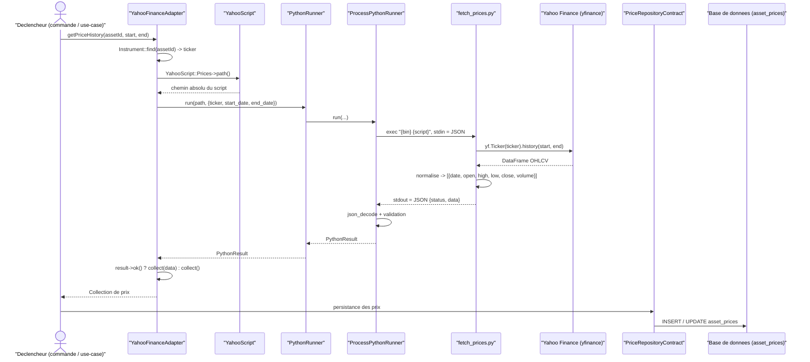
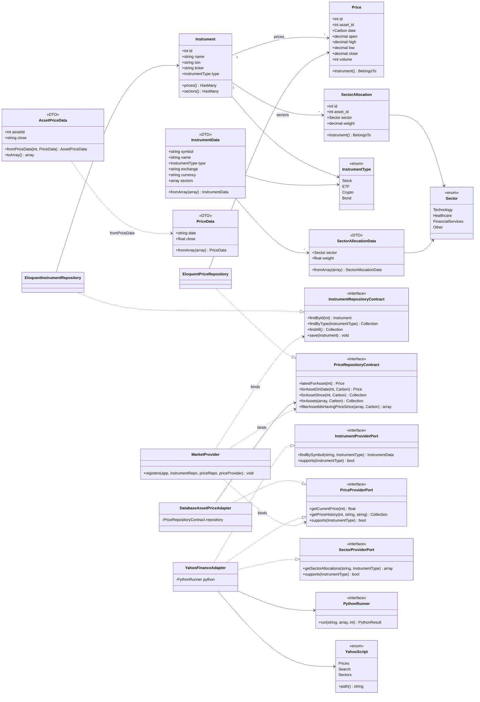

# Contexte Market

Le contexte `Market` (`app/Contexts/Market/`) est le bounded context le plus abouti de l'application. Il modélise les **instruments financiers cotés**, leur **historique de prix** et leur **allocation sectorielle**, et intègre une source de données externe (Yahoo Finance) via un pont PHP↔Python.

## 1. Responsabilité

Le contexte Market est responsable de :

- **Référencer les instruments financiers cotés** (actions, ETF, cryptomonnaies, obligations) avec leurs métadonnées identifiantes (nom, ISIN, ticker, type).
- **Stocker l'historique des prix** OHLCV (Open, High, Low, Close, Volume) par instrument et par date.
- **Décrire la composition sectorielle** d'un instrument (poids par secteur économique).
- **Fournir un accès aux prix** depuis deux sources interchangeables : la base de données locale (source de vérité) ou Yahoo Finance (récupération distante).

L'architecture sépare strictement les **Models** Eloquent (persistance) des **Datas** (DTOs de transfert), et applique le pattern **ports & adapters** (hexagonal) pour découpler le domaine des sources externes.

## 2. Modèle de domaine

### Models Eloquent

| Classe | Rôle | Table | Membres clés |
|---|---|---|---|
| `Instrument` | Aggregate root. Instrument financier coté. Applique un global scope filtrant sur `InstrumentType::values()`. Type par défaut : `Stock`. | `assets` | `id`, `name`, `?isin`, `?ticker`, `type: InstrumentType`, `prices(): HasMany`, `sectors(): HasMany` |
| `Price` | Donnée OHLCV pour une date et un instrument. Précision 4 décimales sur les prix, volume entier. | `asset_prices` | `id`, `asset_id`, `date: Carbon`, `open/high/low/close: decimal(4)`, `volume: int`, `instrument(): BelongsTo` |
| `SectorAllocation` | Pondération d'un instrument dans un secteur. Précision 6 décimales sur le poids (ex. `0.125000` = 12,5 %). | `asset_sectors` | `id`, `asset_id`, `sector: Sector`, `weight: decimal(6)`, `instrument(): BelongsTo` |

Fichiers : `app/Contexts/Market/Models/Instrument.php`, `app/Contexts/Market/Models/Price.php`, `app/Contexts/Market/Models/SectorAllocation.php`.

**Casts Eloquent.** `Instrument.type` → `InstrumentType`, `SectorAllocation.sector` → `Sector` : l'enum string est stockée en base et désérialisée en objet à la lecture. Les `decimal` garantissent la précision financière sans perte liée aux floats.

### Enum `InstrumentType`

`app/Contexts/Market/Enums/InstrumentType.php` — enum string pur (sans dépendance framework). Méthodes de présentation `getLabel()`/`getColor()`/`getIcon()` retournant des primitives, et `values(): list<string>` pour les requêtes du global scope.

| Case | Valeur | Label | Couleur | Icône |
|---|---|---|---|---|
| `Stock` | `stock` | Stock | `blue` | `heroicon-o-chart-bar` |
| `ETF` | `etf` | ETF | `cyan` | `heroicon-o-squares-2x2` |
| `Crypto` | `crypto` | Cryptocurrency | `yellow` | `heroicon-o-currency-bitcoin` |
| `Bond` | `bond` | Bond | `violet` | `heroicon-o-document-text` |

### Enum `Sector`

`app/Contexts/Market/Enums/Sector.php` — enum string pur (sans dépendance framework). Classification d'inspiration GICS, 12 secteurs, labels en français et couleurs RGB via `getLabel()`/`getColor()`.

| Case | Valeur | Label | Couleur |
|---|---|---|---|
| `Technology` | `technology` | Technologie | `rgb(59, 130, 246)` |
| `Healthcare` | `healthcare` | Santé | `rgb(16, 185, 129)` |
| `FinancialServices` | `financial_services` | Services financiers | `rgb(245, 158, 11)` |
| `CommunicationServices` | `communication_services` | Services de communication | `rgb(239, 68, 68)` |
| `ConsumerCyclical` | `consumer_cyclical` | Consommation cyclique | `rgb(139, 92, 246)` |
| `ConsumerDefensive` | `consumer_defensive` | Consommation défensive | `rgb(236, 72, 153)` |
| `Industrials` | `industrials` | Industrie | `rgb(107, 114, 128)` |
| `Energy` | `energy` | Énergie | `rgb(249, 115, 22)` |
| `Utilities` | `utilities` | Services publics | `rgb(20, 184, 166)` |
| `RealEstate` | `realestate` | Immobilier | `rgb(99, 102, 241)` |
| `BasicMaterials` | `basic_materials` | Matériaux de base | `rgb(34, 197, 94)` |
| `Other` | `other` | Autre | `rgb(156, 163, 175)` |

### DTOs (Datas)

DTOs `readonly` situés dans `app/Contexts/Market/Datas/`. Ils servent de pont entre les adapters externes et le domaine ; ils ne portent pas de comportement métier.

| DTO | Rôle | Membres clés |
|---|---|---|
| `InstrumentData` | Instrument retourné par une source externe (Yahoo). | `symbol`, `name`, `type: InstrumentType`, `?exchange`, `?currency`, `sectors: array<SectorAllocationData>`, `static fromArray(array): self` |
| `PriceData` | Prix brut depuis un adapter. `date` et `close` obligatoires, OHLV optionnels. | `date: string`, `close: float`, `?open`, `?high`, `?low`, `?volume`, `static fromArray(array): self` |
| `AssetPriceData` | Adaptation de `PriceData` pour la persistance : conversion float→string (précision DB), fallback `open/high/low → close` si absent, ajout des timestamps. | `assetId`, `date`, `open/high/low/close: string`, `volume: int`, `createdAt/updatedAt: Carbon`, `static fromPriceData(int, PriceData): self`, `toArray(): array` |
| `SectorAllocationData` | Allocation sectorielle depuis une source externe. | `sector: Sector`, `weight: float`, `static fromArray(array): self` |

> Note : `InstrumentData` accepte `?currency` mais `YahooFinanceAdapter::findBySymbol()` ne le renseigne pas (laissé `null`).

## 3. Persistance

Le contexte définit deux **contracts** de persistance (`app/Contexts/Market/Contracts/`) implémentés par des repositories Eloquent (`app/Contexts/Market/Infrastructure/`).

### `InstrumentRepositoryContract` → `EloquentInstrumentRepository`

Accès à la table `assets`.

| Méthode | Signature |
|---|---|
| `findById` | `findById(int): ?Instrument` |
| `findByType` | `findByType(InstrumentType): Collection` |
| `findAll` | `findAll(): Collection` |
| `save` | `save(Instrument): void` |

### `PriceRepositoryContract` → `EloquentPriceRepository`

Accès à la table `asset_prices`.

| Méthode | Signature |
|---|---|
| `latestForAsset` | `latestForAsset(int): ?Price` |
| `forAssetOnDate` | `forAssetOnDate(int, Carbon): ?Price` |
| `forAssetSince` | `forAssetSince(int, Carbon): Collection` |
| `forAssets` | `forAssets(array, Carbon): Collection` |
| `filterAssetIdsHavingPriceSince` | `filterAssetIdsHavingPriceSince(array, Carbon): array` |

### Bindings DI

`MarketProvider::registers()` (`app/Contexts/Market/MarketProvider.php`) lie les contrats à leurs implémentations. Les classes concrètes sont passées en paramètres, ce qui permet de les substituer (test vs prod). `AppServiceProvider` (`app/Providers/AppServiceProvider.php`) configure le wiring par défaut :

```php
MarketProvider::registers(
    $this->app,
    instrumentRepository: EloquentInstrumentRepository::class,
    priceRepository: EloquentPriceRepository::class,
    priceProvider: DatabaseAssetPriceAdapter::class,
);
```

Le `PriceProviderPort` est par défaut lié à `DatabaseAssetPriceAdapter` (la base locale est la source de vérité). `YahooFinanceAdapter` peut être substitué à cet endroit pour utiliser Yahoo comme fournisseur de prix.

## 4. Intégration Yahoo Finance (pont PHP↔Python)

L'accès à Yahoo Finance passe par la bibliothèque Python `yfinance`. Le PHP n'appelle jamais `yfinance` directement : il exécute des scripts Python via un **process** et échange du **JSON sur stdin/stdout**.

### Ports & adapter

- `YahooFinanceAdapter` (`app/Contexts/Market/Infrastructure/YahooFinanceAdapter.php`) implémente trois ports outbound : `InstrumentProviderPort`, `PriceProviderPort`, `SectorProviderPort`. Il ne supporte que `InstrumentType::Stock` et `InstrumentType::ETF` (`supports()`).
- `YahooScript` (`app/Contexts/Market/Infrastructure/Python/YahooScript.php`) est une enum string résolvant le chemin absolu de chaque script via `__DIR__` (scripts co-localisés). Cases : `Prices = fetch_prices.py`, `Search = search_ticker.py`, `Sectors = fetch_sectors.py`.
- `PythonRunner` (`app/Shared/Python/PythonRunner.php`) est le contrat d'exécution ; `ProcessPythonRunner` (`app/Shared/Python/ProcessPythonRunner.php`) l'implémente via `Illuminate\Process`. La réponse est encapsulée dans `PythonResult` (`status`, `?data`, `?error`, `ok()`).

`ProcessPythonRunner` valide l'existence du script (sinon `PythonProcessException::scriptNotFound`), lance `{bin} {script}` avec `PYTHONUNBUFFERED=1`, injecte l'input encodé JSON sur stdin, vérifie le succès du process (sinon `processFailed`), décode le stdout (sinon `invalidJson`) puis construit le `PythonResult`. Le binaire (`PYTHON_BIN`, défaut `.venv/bin/python`) et le timeout (`PYTHON_TIMEOUT`, défaut 30 s) proviennent de `config/python.php`.

### Méthodes de l'adapter et scripts appelés

| Méthode de `YahooFinanceAdapter` | Script appelé | Comportement |
|---|---|---|
| `getCurrentPrice(int): ?float` | `fetch_prices.py` | Récupère 1 an d'historique, retourne le `close` de la dernière entrée. |
| `getPriceHistory(int, ?string, ?string): Collection` | `fetch_prices.py` | Récupère l'historique entre `start`/`end` (défaut : 1 an glissant). |
| `findBySymbol(string, InstrumentType): ?InstrumentData` | `search_ticker.py` puis `getSectorAllocations()` | Recherche le ticker, prend le premier résultat, empile les secteurs. |
| `getSectorAllocations(string, InstrumentType): array` | `fetch_sectors.py` | Mappe chaque clé via `Sector::tryFrom()` (clés non mappables ignorées). |

Toutes les méthodes encadrent l'appel d'un `try/catch` : en cas d'erreur (process, JSON, exception Python remontée), elles retournent `null`, `collect()` ou `[]` selon le type.

### Scripts Python (contrat JSON)

Tous les scripts lisent un objet JSON sur stdin et émettent sur stdout `{"status": "ok", "data": ...}` ou `{"status": "error", "error": "..."}`. Toute exception Python est convertie en JSON `error` et sort en code 1.

#### `fetch_prices.py`

`app/Contexts/Market/Infrastructure/Python/fetch_prices.py` — historique de prix d'un ticker via `yf.Ticker(ticker).history()`.

- **Entrée** : `{"ticker": string, "start_date": "Y-m-d", "end_date": "Y-m-d"}` (les trois obligatoires).
- **Sortie** : `{"status": "ok", "data": [{"date", "open", "high", "low", "close", "volume"}]}`. Prix arrondis à 4 décimales, volume entier.

#### `fetch_prices_bulk.py`

`app/Contexts/Market/Infrastructure/Python/fetch_prices_bulk.py` — récupération multi-tickers groupée par plage temporelle (un seul ticker → `Ticker().history()`, plusieurs → `yf.download(threads=True)`).

- **Entrée** : `{"tickers": [{"ticker", "start_date", "end_date"}]}`.
- **Sortie** : `{"status": "ok", "data": {"<ticker>": [prices]}}`.

> Note : ce script n'est référencé ni par l'enum `YahooScript` ni par `YahooFinanceAdapter`. Il n'est pas appelé par le code PHP actuel.

#### `fetch_sectors.py`

`app/Contexts/Market/Infrastructure/Python/fetch_sectors.py` — allocation sectorielle d'un ticker.

- **Entrée** : `{"ticker": string}` (obligatoire).
- **Sortie** : `{"status": "ok", "data": {"<sector_name>": weight}}`. Stratégie : d'abord `funds_data.sector_weightings` (poids > 0, arrondis à 6 décimales) ; à défaut, fallback sur `info["sector"]` avec poids `1.0`. `normalize_key()` convertit camelCase et espaces en `snake_case`, alignant les clés sur les valeurs de l'enum `Sector`.

#### `search_ticker.py`

`app/Contexts/Market/Infrastructure/Python/search_ticker.py` — recherche d'instruments via `yf.Search(query)`.

- **Entrée** : `{"query": string, "fallback_query"?: string}` (`query` obligatoire ; `fallback_query` utilisé si la recherche principale ne renvoie rien).
- **Sortie** : `{"status": "ok", "data": [{"symbol", "name", "exchange", "type"}]}`.

> Note : `YahooFinanceAdapter::findBySymbol()` n'envoie que `query` (pas de `fallback_query`).

## 5. Diagramme de séquence — synchronisation des prix



## 6. Diagramme de classes — domaine + infrastructure


