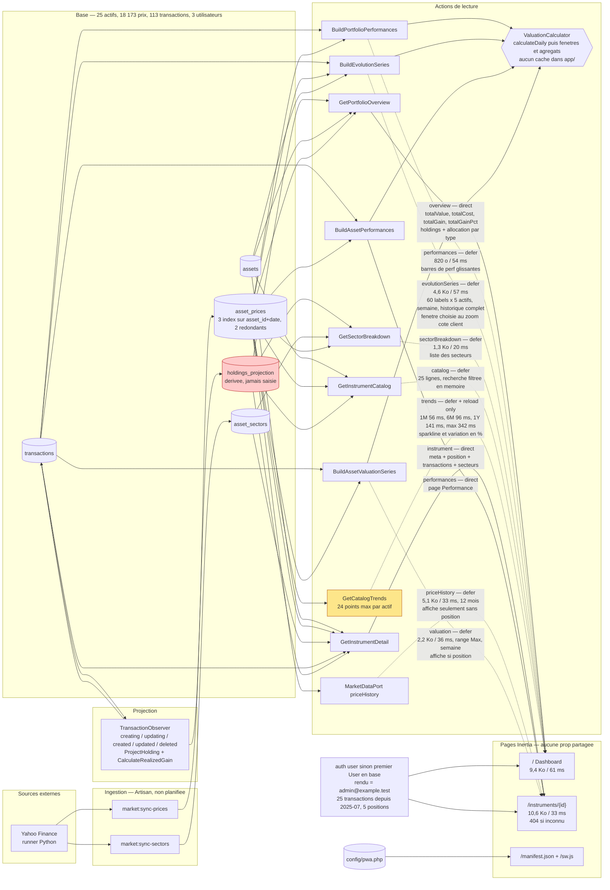
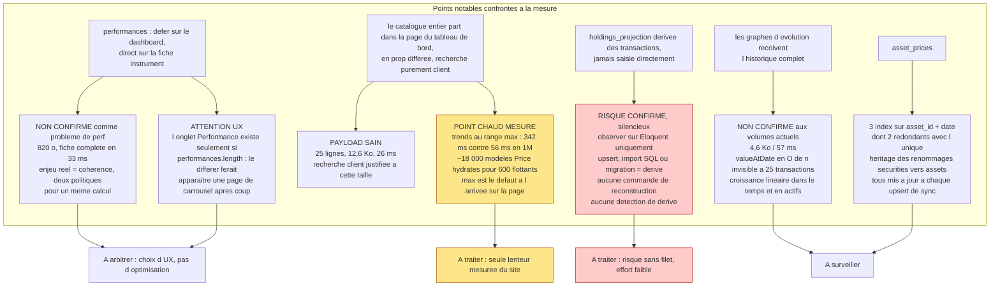

```mermaid
flowchart LR
    subgraph EXT["Sources externes"]
        YF["Yahoo Finance<br/>runner Python"]
    end

    subgraph CMD["Ingestion — Artisan, non planifiee"]
        SP["market:sync-prices"]
        SS["market:sync-sectors"]
    end

    subgraph DB["Base — 25 actifs, 18 173 prix, 113 transactions, 3 utilisateurs"]
        A[("assets")]
        AP[("asset_prices<br/>3 index sur asset_id+date, 2 redondants")]
        SEC[("asset_sectors")]
        TX[("transactions")]
        HP[("holdings_projection<br/>derivee, jamais saisie")]
    end

    subgraph PROJ["Projection"]
        OBS["TransactionObserver<br/>creating / updating / created / updated / deleted<br/>ProjectHolding + CalculateRealizedGain"]
    end

    subgraph ACT["Actions de lecture"]
        GPO["GetPortfolioOverview"]
        GSB["GetSectorBreakdown"]
        BPP["BuildPortfolioPerformances"]
        BES["BuildEvolutionSeries"]
        GIC["GetInstrumentCatalog"]
        GCT["GetCatalogTrends<br/>24 points max par actif"]
        GID["GetInstrumentDetail"]
        BAP["BuildAssetPerformances"]
        BAV["BuildAssetValuationSeries"]
        MDP["MarketDataPort priceHistory"]
        VC{{"ValuationCalculator<br/>calculateDaily puis fenetres et agregats<br/>aucun cache dans app/"}}
    end

    subgraph PAGES["Pages Inertia — aucune prop partagee"]
        D["/ Dashboard<br/>9,4 Ko / 61 ms"]
        S["/instruments/{id}<br/>10,6 Ko / 33 ms<br/>404 si inconnu"]
        PWA["/manifest.json + /sw.js"]
    end

    AUTH["auth user sinon premier User en base<br/>rendu = admin@example.test<br/>25 transactions depuis 2025-07, 5 positions"]

    YF --> SP --> AP
    YF --> SS --> SEC
    TX --> OBS --> HP
    OBS --> TX

    AUTH --> D
    AUTH --> S

    HP --> GPO
    A --> GPO
    AP --> GPO
    HP --> GSB
    SEC --> GSB
    AP --> GSB
    TX --> BPP
    AP --> BPP
    TX --> BES
    AP --> BES
    A --> BES
    A --> GIC
    AP --> GIC
    HP --> GIC
    AP --> GCT
    A --> GID
    AP --> GID
    SEC --> GID
    TX --> GID
    HP --> GID
    TX --> BAP
    AP --> BAP
    TX --> BAV
    AP --> BAV
    AP --> MDP

    BPP --> VC
    BES --> VC
    BAP --> VC
    BAV --> VC

    GPO -->|"overview — direct<br/>totalValue, totalCost, totalGain, totalGainPct<br/>holdings + allocation par type"| D
    BPP -.->|"performances — defer<br/>820 o / 54 ms<br/>barres de perf glissantes"| D
    BES -.->|"evolutionSeries — defer<br/>4,6 Ko / 57 ms<br/>60 labels x 5 actifs, semaine, historique complet<br/>fenetre choisie au zoom cote client"| D
    GSB -.->|"sectorBreakdown — defer<br/>1,3 Ko / 20 ms<br/>liste des secteurs"| D

    GIC -.->|"catalog — defer<br/>25 lignes, recherche filtree en memoire"| D
    GCT -.->|"trends — defer + reload only<br/>1M 56 ms, 6M 96 ms, 1Y 141 ms, max 342 ms<br/>sparkline et variation en %"| D

    GID -->|"instrument — direct<br/>meta + position + transactions + secteurs"| S
    BAP -->|"performances — direct<br/>page Performance"| S
    MDP -.->|"priceHistory — defer<br/>5,1 Ko / 33 ms, 12 mois<br/>affiche seulement sans position"| S
    BAV -.->|"valuation — defer<br/>2,2 Ko / 36 ms, range Max, semaine<br/>affiche si position"| S

    CFG[("config/pwa.php")] --> PWA

    style GCT fill:#fde68a,stroke:#b45309
    style HP fill:#fecaca,stroke:#b91c1c
```

```mermaid
flowchart TD
    subgraph OBS_P["Points notables confrontes a la mesure"]
        direction TB

        P1["performances : defer sur le dashboard,<br/>direct sur la fiche instrument"]
        P2["le catalogue entier part dans la page du tableau de bord,<br/>en prop differee, recherche purement client"]
        P3["holdings_projection derivee des transactions,<br/>jamais saisie directement"]
        P4["les graphes d evolution recoivent<br/>l historique complet"]
        P5["asset_prices"]

        V1["NON CONFIRME comme probleme de perf<br/>820 o, fiche complete en 33 ms<br/>enjeu reel = coherence, deux politiques<br/>pour un meme calcul"]
        V1B["ATTENTION UX<br/>l onglet Performance existe seulement si<br/>performances.length : le differer ferait<br/>apparaitre une page de carrousel apres coup"]

        V2["PAYLOAD SAIN<br/>25 lignes, 12,6 Ko, 26 ms<br/>recherche client justifiee a cette taille"]
        V2B["POINT CHAUD MESURE<br/>trends au range max : 342 ms contre 56 ms en 1M<br/>~18 000 modeles Price hydrates pour 600 flottants<br/>max est le defaut a l arrivee sur la page"]

        V3["RISQUE CONFIRME, silencieux<br/>observer sur Eloquent uniquement<br/>upsert, import SQL ou migration = derive<br/>aucune commande de reconstruction<br/>aucune detection de derive"]

        V4["NON CONFIRME aux volumes actuels<br/>4,6 Ko / 57 ms<br/>valueAtDate en O de n invisible a 25 transactions<br/>croissance lineaire dans le temps et en actifs"]

        V5["3 index sur asset_id + date<br/>dont 2 redondants avec l unique<br/>heritage des renommages securities vers assets<br/>tous mis a jour a chaque upsert de sync"]

        P1 --> V1
        P1 --> V1B
        P2 --> V2
        P2 --> V2B
        P3 --> V3
        P4 --> V4
        P5 --> V5
    end

    V2B --> ACTION1["A traiter : seule lenteur mesuree du site"]
    V3 --> ACTION2["A traiter : risque sans filet, effort faible"]
    V1 --> ACTION3["A arbitrer : choix d UX, pas d optimisation"]
    V1B --> ACTION3
    V4 --> ACTION4["A surveiller"]
    V5 --> ACTION4

    style V2B fill:#fde68a,stroke:#b45309
    style V3 fill:#fecaca,stroke:#b91c1c
    style ACTION1 fill:#fde68a,stroke:#b45309
    style ACTION2 fill:#fecaca,stroke:#b91c1c
```
