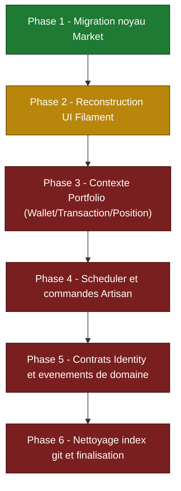

# Etat de la refonte DDD — branche `vendredi-soir`

> Document technique de suivi. Etat constate sur disque a la date du document.

## 1. Contexte

Migration d'une architecture par domaines (`app/Domains/*`, **supprime du disque**) vers une
architecture hexagonale par contextes bornes (`app/Contexts/*`) + un noyau partage (`app/Shared/*`).

### Ancien modele (supprime)

Hierarchie d'actifs avec une classe par nature financiere et des informations polymorphes :

| Element ancien | Role |
| --- | --- |
| `Asset` (classe de base) | Racine de la hierarchie |
| `Stock`, `Bond`, `Crypto`, `ETF`, `RealEstate`, `Savings` | Sous-classes specialisees par type |
| `AssetInfos/*` (polymorphes) | Metadonnees attachees a chaque type d'actif |
| `AssetType`, `Sector` (enums) | Classification |

### Nouveau modele (cible)

| Element nouveau | Role |
| --- | --- |
| `Instrument` | Concept unifie remplacant les 6 sous-classes d'actifs financiers |
| `InstrumentType` (enum) | Classification : `Stock`, `Bond`, `Crypto`, `ETF`, `RealEstate` |
| `Price` | Historique de prix par instrument |
| `SectorAllocation` | Composition sectorielle par instrument |
| `Sector` (enum) | 12 secteurs |
| `PersonalAsset` / `PersonalAssetType` (contexte Portfolio) | Actifs personnels (immobilier, epargne), partage la table `assets` |

`Instrument` (Market) et `PersonalAsset` (Portfolio) partagent la table `assets` (single table
inheritance) avec discrimination par colonne `type` et global scope.

---

## 2. Etat par contexte et par couche

Legende : Fait / En cours / A faire.

### Market (`app/Contexts/Market`)

| Couche | Element | Etat |
| --- | --- | --- |
| Domaine — Models | `Models/Instrument.php`, `Models/Price.php`, `Models/SectorAllocation.php` (+ tests) | Fait |
| Domaine — Enums | `Enums/InstrumentType.php`, `Enums/Sector.php` (+ tests) | Fait |
| Domaine — Datas | `Datas/InstrumentData.php`, `Datas/PriceData.php`, `Datas/AssetPriceData.php`, `Datas/SectorAllocationData.php` (+ tests) | Fait |
| Application — Contracts | `Contracts/InstrumentRepositoryContract.php`, `Contracts/PriceRepositoryContract.php` | Fait |
| Application — Ports | `Ports/InstrumentProviderPort.php`, `Ports/PriceProviderPort.php`, `Ports/SectorProviderPort.php` | Fait |
| Infrastructure — Repositories | `Infrastructure/EloquentInstrumentRepository.php`, `Infrastructure/EloquentPriceRepository.php` (+ tests) | Fait |
| Infrastructure — Adapters | `Infrastructure/YahooFinanceAdapter.php`, `Infrastructure/DatabaseAssetPriceAdapter.php` (+ tests) | Fait |
| Infrastructure — Python | `Infrastructure/Python/*.py` (4 scripts) + `Infrastructure/Python/YahooScript.php` | Fait |
| Factories | `Factories/InstrumentFactory.php`, `Factories/PriceFactory.php`, `Factories/SectorAllocationFactory.php` | Fait |
| DI | `MarketProvider.php` (bind 3 contrats/ports) | Fait |
| Couche UI (Filament/HTTP) | aucune ressource cablee | A faire |
| Couche tache planifiee (commande `securities:*`) | aucune commande Artisan | A faire |

### Identity (`app/Contexts/Identity`)

| Couche | Element | Etat |
| --- | --- | --- |
| Domaine — Models | `Models/User.php` (+ test) | Fait |
| Domaine — Enums | `Enums/Role.php` (`admin`, `user`, + test) | Fait |
| Application — Contracts | aucun contrat | A faire |
| DI | `IdentityProvider.php` (stub, aucun binding) | En cours (stub) |
| Couche UI / auth Filament | non cablee | A faire |

### Portfolio (`app/Contexts/Portfolio`)

| Couche | Element | Etat |
| --- | --- | --- |
| Domaine — Models | `Models/PersonalAsset.php` (+ test) | Fait |
| Domaine — Enums | `Enums/PersonalAssetType.php` (`RealEstate`, `Savings`, + test) | Fait |
| Factories | `Factories/PersonalAssetFactory.php` | Fait |
| Application — Contracts / Repositories | aucun (pas de `PersonalAssetRepository`) | A faire |
| Application — Data objects / Actions / Services | aucun | A faire |
| Relations Eloquent | aucune relation sur `PersonalAsset` | A faire |
| DI | `PortfolioProvider.php` (stub, aucun binding) | En cours (stub) |
| Modeles Wallet / Transaction / Position | inexistants | A faire |

### Shared (`app/Shared`)

| Couche | Element | Etat |
| --- | --- | --- |
| Python — Port | `Python/PythonRunner.php` | Fait |
| Python — Adapter | `Python/ProcessPythonRunner.php` (+ test) | Fait |
| Python — Value object | `Python/PythonResult.php` (+ test) | Fait |
| Python — Exception | `Python/PythonProcessException.php` | Fait |
| Python — Fake (tests) | `Python/FakePythonRunner.php` | Fait |
| Python — DI | `Python/PythonProvider.php` | Fait |

### Cablage applicatif (`app/Providers`, `bootstrap`)

| Element | Etat |
| --- | --- |
| `app/Providers/AppServiceProvider.php` (appelle `PythonProvider::registers` + `MarketProvider::registers`, locale Carbon `fr`) | Fait |
| `bootstrap/providers.php` (ordre : `AppServiceProvider` → `EventServiceProvider` → `AdminPanelProvider`) | Fait |
| `app/Providers/EventServiceProvider.php` (`$listen = []`, vide) | A faire |
| `app/Providers/AdminPanelProvider.php` (panel Filament, `->resources([])`, `->pages([...])` non peuples) | En cours (casse) |
| `bootstrap/app.php` — scheduler (`securities:fetch-prices`, `securities:fetch-sectors`) | En cours (references mortes) |

---

## 3. Roadmap

Etat des phases :

| Phase | Statut | Resume |
| --- | --- | --- |
| 1 — Migration noyau Market | Fait | `Instrument`/`Price`/`SectorAllocation`, contrats, ports, adapters, factories, tests. |
| 2 — UI Filament | En cours | `AdminPanelProvider` configure mais sans ressources ni pages. |
| 3 — Portfolio | A faire | Contrats, relations, actions, modeles Wallet/Transaction/Position. |
| 4 — Scheduler / commandes | A faire | Creer ou retirer `securities:fetch-prices` / `securities:fetch-sectors`. |
| 5 — Identity / evenements | A faire | Contrats Identity, peuplement `EventServiceProvider`. |
| 6 — Nettoyage | A faire | Vider l'index git des suppressions en attente, finaliser seeders. |

---

## 4. GAPS concrets (references mortes et trous de cablage)

- **Scheduler vers commandes inexistantes.** `bootstrap/app.php` (`withSchedule`) planifie
  `securities:fetch-prices` et `securities:fetch-sectors` en `daily()`, mais le repertoire
  `app/Console/Commands` n'existe pas sur disque et aucune commande de ce nom n'est enregistree.
  Le scheduler echoue donc a la resolution de ces commandes.
- **UI Filament non cablee.** `app/Providers/AdminPanelProvider.php` definit `->resources([])`
  (vide) et un `->pages([...])` non peuple par des pages metier. Aucune ressource Filament n'expose
  `Instrument`, `Price` ou `PersonalAsset`. Aucun repertoire `app/Filament` ni
  `app/Http/Controllers` sur disque : il n'existe plus aucune UI cablee.
- **`EventServiceProvider` vide.** `$listen = []` : aucun evenement de domaine n'est propage.
- **Contexte Portfolio non finalise.** `app/Contexts/Portfolio` ne contient que `PersonalAsset` +
  `PersonalAssetType` + factory + `PortfolioProvider` (stub sans binding). Manquent : contrat de
  repository, relations Eloquent, data objects, actions/services, et les modeles Wallet/Transaction/Position.
- **Contexte Identity minimal.** `User` + `Role` presents, mais aucun contrat ; `IdentityProvider`
  est un stub sans binding. Aucune integration auth cote panel Filament.
- **Providers de contexte stubs non invoques.** `IdentityProvider::registers()` et
  `PortfolioProvider::registers()` ne font rien et ne sont appeles par aucun site (seuls
  `PythonProvider` et `MarketProvider` sont cables dans `AppServiceProvider`).
- **PWA sous-implementee.** `start_url` du manifest pointe vers `/admin` (panel Filament non
  fonctionnel) ; les vues `service-worker`/`meta-tags` sont vides.
- **Index git non nettoye.** Des suppressions restent stagees (constatees uniquement sous `docs/`).
  L'index n'est pas aligne tant qu'un commit n'a pas ete realise. Note : les anciens repertoires
  `app/Domains/*` ne sont plus presents sur disque.

---

## 5. Recommandations — prochaines etapes priorisees

1. **Resoudre la reference morte du scheduler (P0, bloquant runtime).** Soit creer les commandes
   `securities:fetch-prices` / `securities:fetch-sectors` (consommant `YahooFinanceAdapter` +
   `EloquentPriceRepository` du contexte Market), soit retirer les deux lignes de `bootstrap/app.php`.
2. **Reconstruire l'UI Filament (P0, bloquant fonctionnel).** Creer les ressources Filament pour
   `Instrument`, `Price` et `PersonalAsset`, puis les declarer dans `AdminPanelProvider` (`->resources([...])`).
   Sans cela, le panel sert une page vide a la racine.
3. **Finaliser le contexte Portfolio (P1).** Definir un contrat de repository + implementation
   Eloquent, ajouter les relations Eloquent, les data objects et les actions CRUD ; cabler les
   bindings dans `PortfolioProvider`. Specifier ensuite Wallet/Transaction/Position.
4. **Cabler Identity (P1).** Introduire un contrat pour `User`, brancher l'auth du panel Filament,
   et activer le binding dans `IdentityProvider`.
5. **Peupler `EventServiceProvider` (P2).** Definir et enregistrer les ecouteurs des evenements de
   domaine necessaires une fois Portfolio en place.
6. **Nettoyer l'index git et les seeders (P2).** Committer pour purger les suppressions stagees ;
   completer `DatabaseSeeder` (TODO Wallet/Portfolio) une fois le contexte Portfolio finalise.
