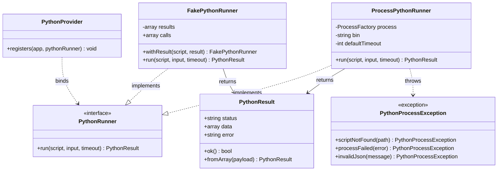
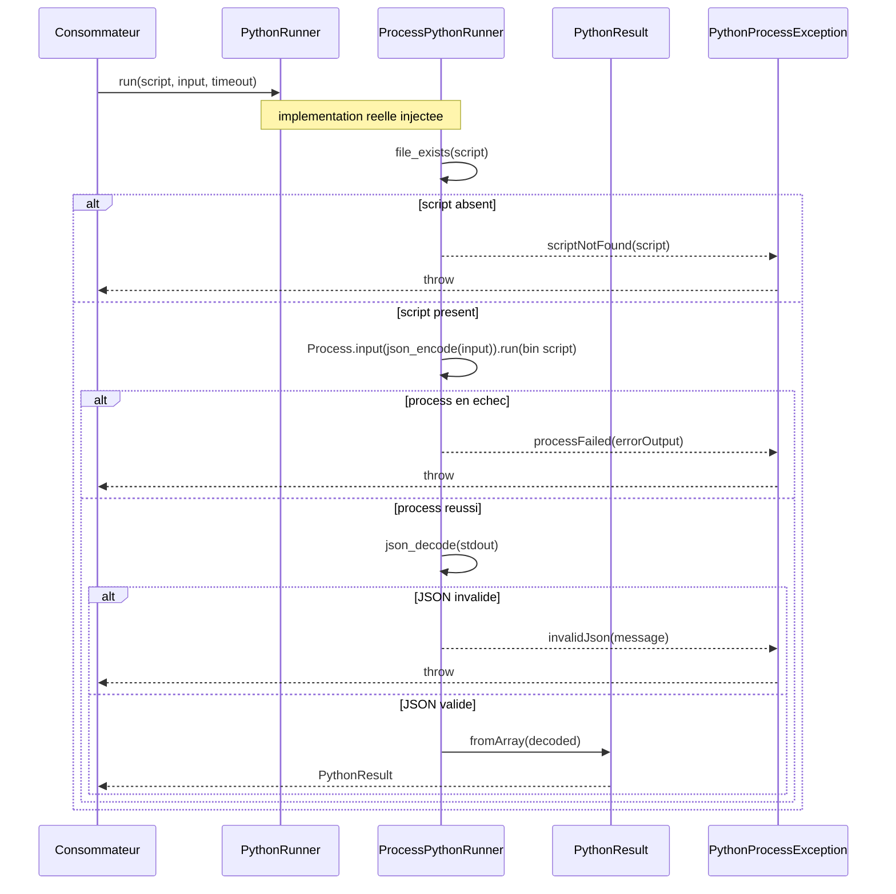

# Shared Kernel — Exécution Python

## 1. Rôle

Le shared kernel Python permet d'exécuter des scripts Python depuis PHP de façon **testable** et **injectable**. Il fournit une abstraction unique (`PythonRunner`) que les contexts consomment via injection de dépendances, avec une implémentation réelle pour la production et une implémentation factice pour les tests. Le kernel ne contient aucune logique métier : il coordonne le lancement de process, la sérialisation JSON (stdin/stdout) et la gestion d'erreur.

## 2. Le pattern

Pattern Strategy reposant sur le contrat `PythonRunner` :

- **`ProcessPythonRunner`** — implémentation production basée sur `Illuminate\Process` (Symfony Process). Encode l'input en JSON sur stdin, lance l'interpréteur avec timeout, décode le stdout JSON.
- **`FakePythonRunner`** — implémentation de test. Enregistre les appels et retourne des résultats pré-configurés sans exécuter Python.
- **`PythonResult`** — value object immuable (`readonly`) encapsulant la réponse (`status`, `data`, `error`).
- **`PythonProcessException`** — exception typée pour les trois cas d'échec : script absent, process en échec, JSON invalide.
- **`PythonProvider::registers()`** — point de binding statique enregistrant l'implémentation de `PythonRunner` en singleton dans le conteneur, avec injection de `ProcessFactory`, du binaire et du timeout depuis la config.

Le contrat stdin/stdout est uniforme : l'input array est encodé en JSON et envoyé sur stdin ; le script émet un JSON `{status, data?, error?}` sur stdout, décodé en `PythonResult`.

## 3. Classes

| Classe | Type | Fichier | Responsabilité | Membres clés |
|---|---|---|---|---|
| `PythonRunner` | interface | `app/Shared/Python/PythonRunner.php` | Contrat d'exécution d'un script Python (input JSON sur stdin, output JSON décodé) | `run(string $script, array $input = [], ?int $timeout = null): PythonResult` |
| `ProcessPythonRunner` | implémentation (prod) | `app/Shared/Python/ProcessPythonRunner.php` | Exécute réellement via `Illuminate\Process` : valide l'existence du script, lance le process avec timeout, décode et valide le JSON | `__construct(ProcessFactory $process, string $bin, int $defaultTimeout)`, `run()` |
| `FakePythonRunner` | implémentation (test) | `app/Shared/Python/FakePythonRunner.php` | Stub de test : enregistre les appels, retourne des résultats pré-configurés | `withResult(string $script, PythonResult): self`, `public array $calls`, `run()` |
| `PythonResult` | value object | `app/Shared/Python/PythonResult.php` | DTO immuable de la réponse d'un script | `readonly string $status`, `readonly ?array $data`, `readonly ?string $error`, `ok(): bool`, `fromArray(array $payload): self` |
| `PythonProcessException` | exception | `app/Shared/Python/PythonProcessException.php` | Exception typée (`RuntimeException`) couvrant les trois cas d'échec | `scriptNotFound(string $path): self`, `processFailed(string $error): self`, `invalidJson(string $message): self` |
| `PythonProvider` | service provider | `app/Shared/Python/PythonProvider.php` | Enregistre le binding singleton de `PythonRunner` avec ses dépendances | `static registers(Application $app, string $pythonRunner): void` |

### Détails de comportement

- **`ProcessPythonRunner::run()`** : lève `scriptNotFound` si `file_exists()` échoue ; pose la variable d'env `PYTHONUNBUFFERED=1` ; lève `processFailed($result->errorOutput())` si le process échoue ; lève `invalidJson()` si `json_decode()` produit une erreur. Le timeout par appel (`?int $timeout`) prime sur `$defaultTimeout`.
- **`PythonResult::fromArray()`** : `status` par défaut à `'error'` si absent ; `data` retenu uniquement si c'est un array, sinon `null`.
- **`FakePythonRunner::run()`** : empile chaque appel dans `$calls` (`['script' => ..., 'input' => ...]`), puis retourne le résultat enregistré ou, à défaut, `new PythonResult(status: 'ok', data: [])`.
- **`PythonProvider::registers()`** : binding `singleton` ; l'implémentation concrète (`class-string<PythonRunner>`) est passée en argument, ce qui rend le point d'intégration flexible.

## 4. Configuration

Fichier `config/python.php` :

| Clé | Valeur par défaut | Source env | Rôle |
|---|---|---|---|
| `bin` | `base_path('.venv/bin/python')` | `PYTHON_BIN` | Chemin de l'interpréteur Python |
| `timeout` | `30` (secondes) | `PYTHON_TIMEOUT` | Durée maximale d'exécution d'un script |

> **Note sur la résolution de chemin** : les scripts Python sont **co-localisés dans chaque context** (ex. `app/Contexts/Market/Infrastructure/Python/`), pas dans le shared kernel. La résolution de chemin est **path-agnostic** : le kernel reçoit un chemin de script en argument de `run()` et ne connaît aucun emplacement. Chaque context résout ses propres chemins (ex. l'enum `YahooScript::path()` utilise `__DIR__`).

## 5. Diagramme de classes

## 6. Diagramme de séquence — un appel

